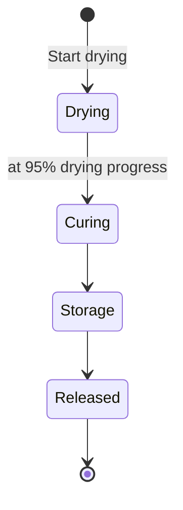

# Post-Harvest

Post-harvest processing guides a harvest batch through the stages **Drying**, **Curing**, and **Storage** up to **Released**. You track drying progress by weight, get concrete next-step recommendations, and see automatic mold warnings as soon as a batch gets too moist.

---

## Prerequisites

- At least one [harvest batch](harvest.md) to start a post-harvest batch from.
- Starting drying, recording progress, and advancing the stage requires the **Grower** or **Admin** role in your tenant (see [Tenants & Gardens: Roles and Permissions](tenants.md#roles-and-permissions)). As a **Viewer**, you can view batches but not change them.

---

## The post-harvest batch lifecycle

A post-harvest batch moves through four stages — always forward, with no skipping or going back:

| Stage | What happens |
|-------|--------------|
| Drying | The batch is drying until the target moisture is reached. You record the weight regularly to track progress. |
| Curing | In airtight containers the batch cures further: residual moisture evens out, and aroma and potency continue to develop. Briefly open the containers daily at first (**burping**). |
| Storage | The batch is in storage. Monitor storage conditions and act promptly on mold warnings. |
| Released | Post-harvest processing is complete — the batch has been released. |

**Curing** refers to letting the already-dried harvest mature further inside an airtight container (e.g. a mason jar). During this process, residual moisture equalizes between stem and flower, chlorophyll keeps breaking down, and aroma and potency continue to develop — a process that typically takes several weeks.

A stage change **cannot be undone** and **cannot skip a stage**: from drying you can only move to curing, from curing only to storage, and from storage only to released.

!!! danger "Drying → Curing: only from 95% progress"
    Kamerplanter blocks the transition from drying to curing while drying progress is below 95%. Record more weight measurements until the batch is ready.

<!-- Source: src/backend/app/domain/engines/post_harvest_stage_engine.py, src/backend/app/domain/services/post_harvest_service.py -->

---

## Start drying

### Step 1: Take a batch into post-harvest processing

1. Open **Post-Harvest** in the navigation, under **Harvest** (`/ernte/nachernte`).
2. Click **Start drying**.
3. Select the **harvest batch** you want to dry.

### Step 2: Enter drying details

| Field | Description |
|-------|-------------|
| Harvest batch | The harvest batch to be dried |
| Produce type | Coarse classification — flower, herb, root/tuber, fruit, or mushroom |
| Drying method | **Hang dry** (gentlest), **Rack dry**, **Dehydrator** (fastest), or **Air cure** |
| Start weight (g) | Optional. If omitted, Kamerplanter automatically uses the harvest batch's wet weight. |
| Target moisture (%) | Typical target: about 10% residual moisture (range 5–15%) |
| Notes | Free text |

Once saved, the batch appears in the list at the **Drying** stage.

---

## Track drying progress

Open the batch in the list to open its detail view. While the batch is at the **Drying** stage, you can **record the current weight** there: enter the weight and click **Record**. Kamerplanter then automatically calculates:

- the **drying progress** (0–100%, shown as a progress bar)
- a **recommendation** for the next step
- the **estimated days remaining** until fully dry

Progress is derived from weight loss relative to the chosen target moisture. The estimated days remaining additionally depends on the drying method you selected.

### Recommendations

| Progress | Recommendation |
|----------|-----------------|
| Below 40% | Ensure adequate airflow |
| 40% up to 70% | Keep an eye on temperature and humidity |
| 70% up to 95% | Run the snap test: a stem should snap, not bend |
| From 95% | Ready for curing |
| Weight loss above 85% (regardless of progress) | Over-dried — start curing promptly |

!!! warning "Over-dried"
    If a batch loses more than 85% of its starting weight, Kamerplanter shows a "Over-dried" warning instead of the usual recommendation. In this case, start curing promptly to avoid further loss of aroma and potency.

The **snap test** is a simple manual check that requires no equipment: bend a thin stem — if it snaps cleanly, the batch is usually dry enough; if it just bends, moisture remains.

<!-- Source: src/backend/app/domain/calculators/drying_calculator.py -->

---

## Water activity (a_w)

**Water activity** (short: **a_w**, scale 0–1) indicates how much of the water in the batch is actually available to microorganisms such as mold — unlike raw moisture content in percent. Above an a_w value of 0.65, mold risk rises sharply, even if the batch already feels dry. For storage, a range of about 0.55–0.65 is considered safe.

!!! info "Water activity via API only"
    The drying-progress form in the interface currently accepts only the **weight**. Water activity, CO₂ concentration, and the snap-test result can additionally be submitted via the API (e.g. from a connected meter) and will then be shown in the detail view once available — there's no input field for them in the interface yet.

---

## Mold alerts

Kamerplanter automatically raises a mold alert when a recorded environmental observation indicates mold risk — primarily based on water activity, falling back to relative humidity. An open alert appears as a banner at the top of the batch detail view, at two severity levels:

| Severity | Meaning | What to do |
|----------|---------|------------|
| **Warning** | Elevated risk (a_w above 0.60, or relative humidity above 62%) | Watch the batch closely, ensure adequate airflow, and lower the humidity at the storage location where possible. |
| **Critical** | High risk (a_w above 0.65, or relative humidity above 65%) | Check the batch for visible mold immediately, increase airflow, and lower the humidity. Remove and, if needed, discard affected areas. |

!!! danger "Visible mold"
    A software alert does not replace a visual check. Mold (e.g. botrytis, gray mold) appears as a gray or white fuzz and smells musty. Remove any affected material immediately and separately from the rest of the batch at the first sign — when in doubt, act early rather than late.

!!! info "Environmental observations via API only"
    Mold alerts are calculated from structured environmental observations (temperature, relative humidity, water activity, CO₂, visual and aroma condition). These observations can currently only be recorded via the API — there's no form for them in the interface yet. Alerts that have already been raised still appear in the detail view regardless of how they were recorded.

<!-- Source: src/backend/app/domain/calculators/drying_calculator.py (assess_mold_risk), src/backend/app/domain/services/post_harvest_service.py (record_observation) -->

---

## Advance the stage

In the batch detail view, Kamerplanter shows a button **Advance to: <next stage>** at the bottom, as long as the batch is not already at the final stage (**Released**). Clicking it immediately moves the batch to the next stage — there's no confirmation dialog, but also no way back.

While the batch is at the **Drying** stage and drying progress is still below 95%, the button is disabled; a note explains that more weight measurements are needed first.

---

## For Technical Users / Self-Hosters

A batch cannot currently be deleted through the interface. The API provides a delete endpoint for this, available exclusively to members with the **Administrator** role — see [API Reference: Post-Harvest](../reference/api-reference.md#post-harvest).

---

## Frequently Asked Questions

??? question "Can I delete a batch I created by mistake?"
    Not through the interface — there's no button for that yet. An administrator of your tenant can delete the batch via the API.

??? question "Why don't I see a water activity value even though I've recorded weight several times?"
    The interface only records weight when you weigh a batch. Water activity only appears once it has additionally been submitted via the API, e.g. from a connected meter.

??? question "What happens if I try to skip a stage or move backward?"
    That's not possible. Kamerplanter only ever allows the next step in the fixed order Drying → Curing → Storage → Released.

??? question "I received a mold alert but don't see anything unusual — what now?"
    Check the batch carefully anyway, ideally with a magnifying glass and by smell — early mold isn't always visible to the naked eye. As a precaution, lower the humidity at the storage location and improve airflow, even if nothing is visible yet.

---

## See Also

- [Harvest](harvest.md)
- [Post-Harvest: Drying, Curing & Storage — domain guide](../guides/post-harvest.md)
- [Sensors](sensors.md)
- [Tenants & Gardens](tenants.md)
