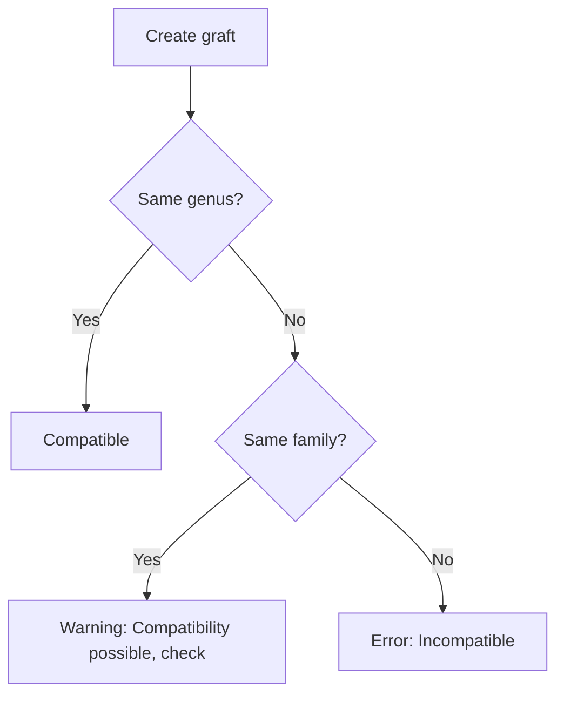
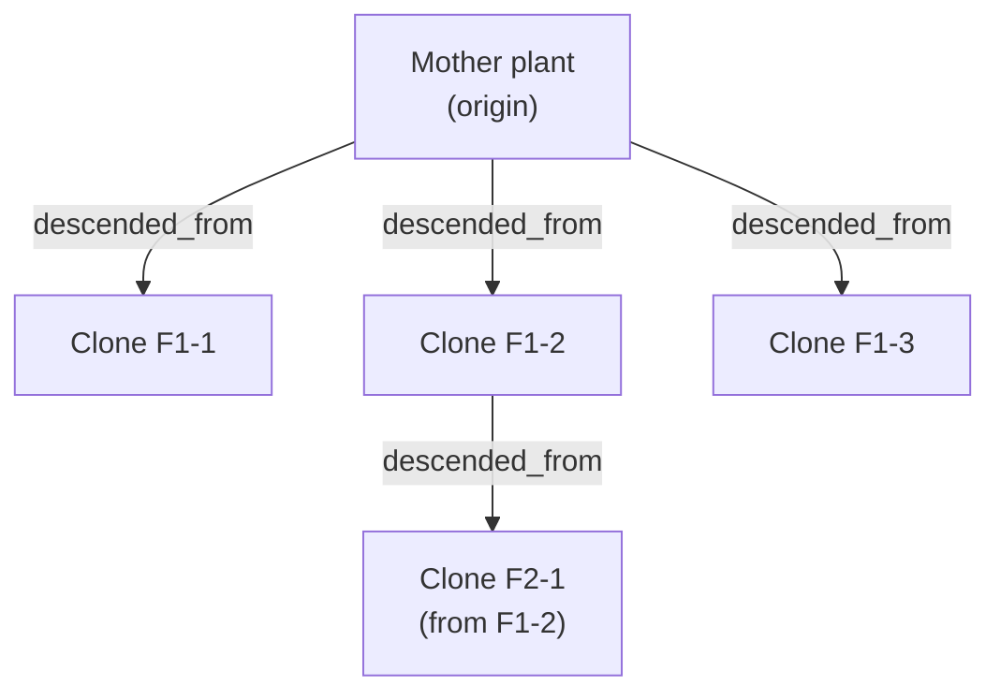

# Propagation Management

Kamerplanter tracks the genetic lineage of your plants completely: which mother plant provided the cutting? Which two parent plants were crossed? Which rootstock was a variety grafted onto? The **lineage graph** makes these relationships visible and automatically checks graft compatibility.

---

## Prerequisites

- At least one plant instance (mother plant) is created
- The species and variety are captured in the master data

---

## Propagation Methods Overview

| Method | Description | Genetic relationship |
|--------|-------------|---------------------|
| **Cutting (clone)** | Rooted shoot from the mother plant | Genetically identical |
| **Seed cross** | Seeds from controlled pollination | 50% genetics from each parent |
| **Grafting** | Scion applied to rootstock | Scion remains genetically unchanged |
| **Division** | Plant divided into several parts | Genetically identical (like clone) |

---

## Taking Cuttings (Clones)

Cuttings are the most common propagation method for houseplants and in the grow tent. The system tracks every clone generation.

### Creating a New Cutting

1. Navigate to **Plants** > mother plant
2. Click **Propagate** > **Take Cutting**
3. Fill in the form:

    | Field | Description | Example |
    |-------|-------------|---------|
    | **Number of cuttings** | How many cuttings are taken | 4 |
    | **Date** | Date of taking | 2026-03-28 |
    | **Location** | Where the cuttings will root | Propagation tent |
    | **Substrate** | Rooting substrate | Rockwool plugs |
    | **Notes** | Method, rooting hormone, etc. | Auxin powder, 45° cut |

4. Click **Create Cuttings**

The system automatically creates new plant instances with the `descended_from` edge to the mother plant.

!!! tip "Tracking clone generations"
    When a cutting is itself used as a mother plant, a clone chain is created: Mother → F1 clone → F2 clone. This chain is visible in the lineage view as a graph.

### Tracking Rooting Status

1. Navigate to **Plants** > desired cutting
2. The **Growth Phases** tab shows the current phase (Germination/Propagation)
3. When roots are visible: execute the phase transition to **Seedling**

---

## Documenting Seed Crosses

For controlled pollination — e.g. for breeding new varieties:

### Creating a Cross

1. Navigate to **Master Data** > **Varieties** > **New Variety**
2. Under the **Genetic Origin** section:
    - Select the **Mother plant** (seed plant)
    - Select the **Father plant** (pollen plant)
    - Enter the **crossing date**
3. Save

The system creates `descended_from` edges to both parent plants and marks the new variety as F1 hybrid.

!!! example "Example: Tomato breeding"
    You cross "San Marzano" (mother) with "Sungold" (father). The system creates a new variety "San Marzano × Sungold (F1)" with both ancestry edges in the graph.

---

## Grafting

Grafting is used to place a valuable variety (scion) onto a robust rootstock.

### Creating a Graft

1. Navigate to **Plants** > scion plant > **Propagate** > **Graft**
2. Choose the **rootstock** (must be compatible)
3. Document method (whip and tongue, budding, etc.) and date

### Compatibility Check

The system automatically checks genus and family compatibility:

!!! warning "Compatibility rules"
    Compatibility is checked at genus and family level. Tomato on potato rootstock (both Solanum) is compatible. Tomato on apple rootstock (Solanaceae / Rosaceae) is incompatible.

---

## Plant Division

For perennials, bulbous plants and bushy houseplants:

1. Navigate to **Plants** > desired plant > **Propagate** > **Divide**
2. Specify into how many parts the plant is divided
3. The system creates new plant instances with `descended_from` edge

---

## The Lineage Graph

The lineage view shows all parent, sibling and descendant plants in an interactive graphic.

### Opening the Graph

1. Navigate to **Plants** > desired plant
2. Click the **Lineage** tab

The graph shows:
- **Mother plant** (source of the cutting)
- **Sibling clones** (other cuttings from the same mother)
- **Descendants** (cuttings from this clone)
- **Crossing partners** for seed crosses
- **Rootstock** for grafts

!!! tip "Clone lines in the grow tent"
    In professional cultivation, the clone line is crucial: a clone from generation F3 can show weaker characteristics than F1. The graph makes such lines transparent.

---

## Frequently Asked Questions

??? question "I took a cutting but forgot to enter it in the app — can I add it retrospectively?"
    Yes. When creating a new plant instance you can always enter a mother plant and a historical taking date. The lineage graph will then be built correctly.

??? question "Can a plant have multiple mother plants?"
    For seed crosses, yes — a plant has exactly two parents (mother + father). For cuttings and divisions it has exactly one. Grafts have scion + rootstock, where the genetics come from the scion.

??? question "How do I know whether a variety comes from a cutting or from seed?"
    In the plant instance profile under the **Lineage** tab you can see the propagation method of the `descended_from` edge (cutting, seed, graft, division).

??? question "The compatibility check fails even though I know it works."
    The system checks by botanical family/genus. You can override the check and manually add a compatibility note. Record the observed compatibility as a note in the plant instance.

---

## See Also

- [Planting Runs](planting-runs.md)
- [Plant Master Data](plant-management.md)
- [Growth Phases](growth-phases.md)
