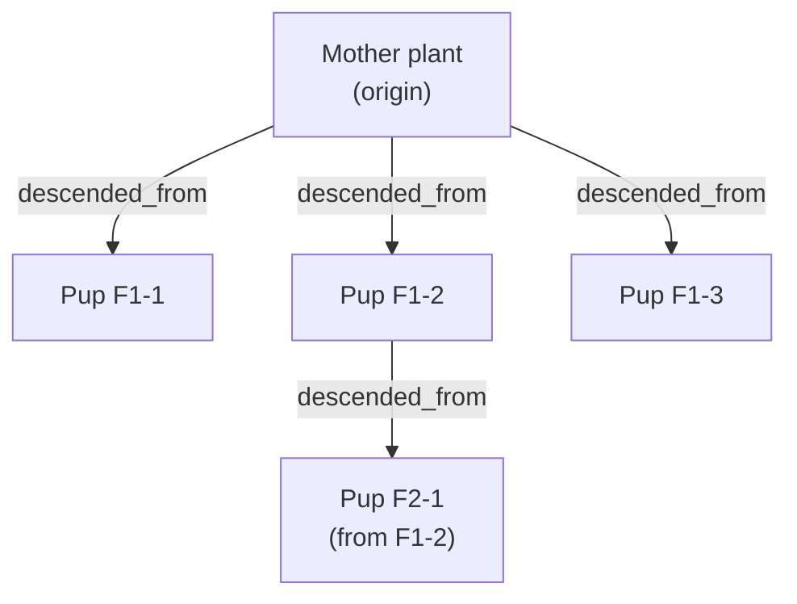
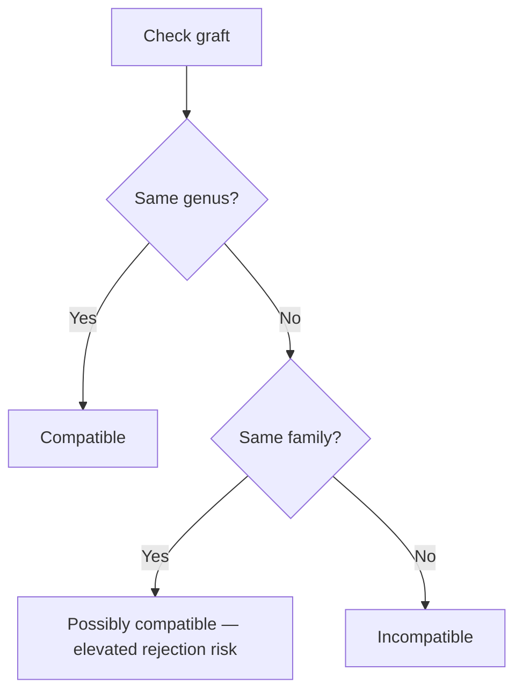

# Propagation Management

Kamerplanter helps you keep a traceable record of every propagation action — from a single cutting to grafting — and shows which plant descended from which mother plant. It also automatically checks whether two plants are taxonomically suited for grafting.

---

## Prerequisites

- At least one plant instance is created
- The plant species is captured in the master data
- The "Grower" role or higher to create propagation events — the "Viewer" role is enough to view them

---

## What Is Propagation? {#was-ist-vermehrung}

Propagation covers all the methods you can use to grow new plants from an existing one — from cuttings to sowing to grafting. Kamerplanter distinguishes eight methods:

| Method | Description | Genetic relationship to the source plant |
|---------|-------------|------|
| **Sowing** (seed) | Grown from seed | New genetic combination for crosses, true-to-type otherwise |
| **Cutting** (cutting) | Rooted stem, leaf or root piece from the mother plant | Genetically identical (a clone) |
| **Clone** (clone) | Umbrella term for vegetative propagation, including the automatic pup continuation (see below) | Genetically identical |
| **Graft** (graft) | A scion (shoot of a variety) is applied to a rootstock (root system of another plant) | The scion stays genetically unchanged; the rootstock only supplies the root system |
| **Division** (division) | The plant or root ball is split into several independent parts | Genetically identical |
| **Layering** (layering) | A stem is rooted while still attached to the mother plant, and only separated afterwards | Genetically identical |
| **Offset** (offset) | A natural side shoot that detaches from the mother plant on its own | Genetically identical |
| **Other** (other) | All remaining propagation types, e.g. tissue culture | Depends on the method |

!!! note "Difference from the \"Propagation Methods\" in the species profile"
    The **species profile** (Master Data > Species) also has a **Propagation Methods** field (`propagation_methods`) — it records which methods are *typically used* for a species (e.g. tomato: seed + cutting), independent of any specific propagation event. Details: [Managing Master Data — Propagation Methods](plant-management.md#propagation-methods-propagation_methods).

---

## Automatic Pup Continuation for Monocarpic Plants {#automatische-kindel-fortfuehrung}

For **monocarpic** plant species — they flower exactly once in their lifetime and then die, e.g. many agaves, bromeliads, and guzmanias — propagation works differently from the self-documented methods described below: as soon as such a mother plant automatically transitions into its final flowering phase, Kamerplanter **automatically** creates a new plant instance — the **pup** (the clonal offset) — and links it to the mother plant via a `descended_from` ancestry record, in addition to a recorded propagation event of type "clone".

The pup inherits the tenant, plant species, cultivar, and location of the mother plant, but no fixed slot — the mother plant keeps occupying its slot while it senesces. For this reason, the pup's detail view shows an ancestry link **"Descended from …"** to the mother plant.

Full description: [Growth Phases — Monocarpic Plants](growth-phases.md#monokarpische-pflanzen). <!-- REQ-003 D10 / REQ-017 -->

!!! tip "Difference from self-documented propagation"
    For monocarpic species, this automatic continuation replaces the documentation via a propagation event described below — you don't need to trigger anything on the **Propagation & Lineage** page. For all other propagation types (cutting, sowing, division, layering, grafting, offset for repeatedly-flowering/polycarpic plants), you document the action yourself via a propagation event — see below.

---

## Recording a Propagation Event

### Step 1: Navigate to the Propagation Page

Click **Propagation & Lineage** in the **Plants** section of the navigation.

### Step 2: Create a New Event

Click **Record Propagation**. A dialog opens.

### Step 3: What Was Propagated?

| Field | Description | Example |
|-------|-------------|---------|
| Method | One of the eight propagation methods (see above) | Cutting |
| Quantity | How many plants/attempts this action started with | 4 |
| Species (optional) | Which plant species this success statistic is tracked against | Tomato |

### Step 4: Plants Involved (Optional)

Enter the **plant keys** of the plants involved — type a key and press Enter to add it as a chip. For the **Graft** method, the fields are relabeled accordingly:

| Field (default) | For grafting | Meaning |
|------|------|------|
| Source plants | Rootstock(s) | The plant(s) the action starts from |
| Result plants | Scion | The plant(s) produced or used in the action |

!!! tip "Where do I find the plant key?"
    Open the detail page of the plant in question under **Plants > Plant Instances** — the key appears at the end of your browser's address bar (e.g. `.../plant-instances/abc123`).

### Step 5: Add Notes and Save

Optionally enter notes (e.g. substrate, rooting hormone, cutting technique) and click **Save**. The event then appears on the **Events** tab with the status **"In progress"**.

!!! tip "Tracking clone generations"
    If you enter the plant that just resulted from a cutting as the source plant for the next one, a traceable chain builds up across several events in the event list — this is not, however, yet an automatic link in the lineage graph (see below).

<!-- Source: src/frontend/src/pages/propagation/PropagationEventDialog.tsx, PropagationPage.tsx, src/backend/app/api/v1/propagation/tenant_router.py, src/backend/app/domain/services/propagation_service.py -->

---

## The Event List — Status & Success Rate

The **Events** tab lists all propagation events documented for your tenant:

| Column | Description |
|--------|-------------|
| Method | The chosen propagation method |
| Status | "In progress", "Rooted", "Transplanted", "Completed" or "Failed" |
| Quantity | How many plants/attempts were started |
| Survived | Number of plants that successfully established (if recorded) |
| Success rate | Survived ⁄ Quantity as a percentage (if recorded) |
| Date | When the action took place |

!!! info "API only: Recording outcome & progress"
    A newly created event always starts in status "In progress", with empty "Survived" and "Success rate" columns. Progress milestones (callus formation, visible roots, ready to transplant) and the final outcome (survived count, failure reasons) can already be recorded and are reflected in "Status"/"Success rate" — but there is no button for this in the interface yet. This update is currently only possible via the technical API. <!-- REQ-017 -->

<!-- Endpoints: PATCH /propagation/events/{event_key}/progress, PATCH /propagation/events/{event_key}/outcome -->

---

## Exploring Lineage (Tab "Lineage & Grafting")

On the **Lineage & Grafting** tab you can look up the ancestors and descendants of any plant:

1. Enter the **plant key** of the plant you're interested in (see tip above).
2. Click **Show Lineage**.
3. Kamerplanter shows you two lists: **Ancestors** (which mother plant — and its mother plant, and so on — the plant descended from) and **Descendants** (which plants in turn descended from it).

<!-- diagram-source: user-described — plant lineage graph: mother plant with F1 clones and an F2 clone via descended_from edges -->

```mermaid
flowchart TB
    M["Mother plant<br/>(origin)"]
    K1["Pup F1-1"]
    K2["Pup F1-2"]
    K3["Pup F1-3"]
    K2_1["Pup F2-1<br/>(from F1-2)"]
    M -->|descended_from| K1
    M -->|descended_from| K2
    M -->|descended_from| K3
    K2 -->|descended_from| K2_1
```

!!! note "Partially available: Linking to a documented propagation event"
    The plant keys you enter under "Plants involved" on a propagation event currently serve only your own propagation record and the success statistics (see above) — they do **not yet** automatically create a link in this lineage graph. So far, the only fully automatic link is the [pup continuation for monocarpic plants](#automatische-kindel-fortfuehrung). For all other methods, the event list is your propagation record; a direct link in the lineage graph is planned. <!-- REQ-017 -->

---

## Checking Graft Compatibility

The **Graft Compatibility** card on the same tab checks whether two plants are taxonomically suited for grafting:

1. Enter the plant key of the **scion** (the variety you want to propagate).
2. Enter the plant key of the **rootstock** (the root base).
3. Click **Check Compatibility**.

Kamerplanter compares the genus and family of the two plants' species:

<!-- diagram-source: user-described — graft compatibility check decision tree (genus, then family) -->

```mermaid
flowchart TD
    A[Check graft] --> B{Same genus?}
    B -->|Yes| OK[Compatible]
    B -->|No| C{Same family?}
    C -->|Yes| W[Possibly compatible — elevated rejection risk]
    C -->|No| E[Incompatible]
```

| Result | Meaning |
|--------|---------|
| **Compatible** | Same genus — grafting usually succeeds |
| **Possibly compatible** | Same family but different genus — possible, with elevated rejection risk |
| **Incompatible** | Different families — grafting is not recommended |

!!! example "Example: Tomato on potato rootstock"
    Tomato and potato share the same genus (*Solanum*) — grafting between them is possible (known as the "TomTato"). Grafting a tomato onto an apple rootstock, on the other hand, would be incompatible, since nightshades (Solanaceae) and roses (Rosaceae) are different families.

!!! warning "A taxonomy heuristic, not a guarantee"
    The check only evaluates genus and family from the master data of the species involved. There is currently no way to manually override the result — instead, record any deviating real-world experience in the notes of the associated propagation event.

<!-- Source: src/backend/app/domain/engines/lineage_engine.py (check_graft_compatibility), src/frontend/src/pages/propagation/LineagePanel.tsx -->

---

## Batches, Rooting Protocols & Mother Plants (API Only for Now) {#erweiterte-funktionen}

!!! info "For Technical Users"
    Beyond the features described above, Kamerplanter already supports further propagation building blocks that don't have an interface yet:

    - **Batches** group several propagation events that were started together, and can be finalized into an existing [Planting Run](planting-runs.md).
    - **Rooting protocols** are reusable templates (substrate, hormone, expected rooting time, instructions) with their own success statistics.
    - **Mother plants** can be designated as such, including priority, health score, and retirement.
    - **Phenotype notes** document breeding observations (growth habit, aroma, yield, resistance, etc.) per plant.

    These features are currently only available through the technical API. <!-- REQ-017 -->

<!-- Source: src/backend/app/api/v1/propagation/tenant_router.py, src/backend/app/domain/services/propagation_service.py, src/backend/app/domain/models/propagation.py -->

---

## Frequently Asked Questions

??? question "Do I have to create a propagation event for every cutting?"
    No. Propagation events are an optional record-keeping and statistics tool — you can continue to create plants without an accompanying event. Documenting them is useful when you want to compare success rates over time (e.g. which substrate roots better).

??? question "Does a propagation event automatically link the plants involved in the lineage graph?"
    No, not yet. The plant keys entered on the event currently serve only your own record. So far, the only method that links automatically in the lineage graph is the pup continuation for monocarpic plants. See [above](#automatische-kindel-fortfuehrung) for details.

??? question "Can I record the outcome (survived/discarded) of an event afterwards?"
    Yes, the data model already supports this — but currently only through the technical API, not yet via a button in the interface.

??? question "Is the automatic pup continuation the same as a manually documented cutting?"
    No. The automatic pup continuation for monocarpic plants runs without any action from you as soon as the mother plant automatically transitions into its final flowering phase — including an automatic link in the lineage graph. For all other propagation methods, you document the action yourself via **Record Propagation**.

??? question "How do I find the plant key for the lineage search or the compatibility check?"
    Open the plant's detail page under **Plants > Plant Instances** — the key appears at the end of your browser's address bar.

---

## See Also

- [Growth Phases](growth-phases.md)
- [Plant Master Data](plant-management.md)
- [Planting Runs](planting-runs.md)
