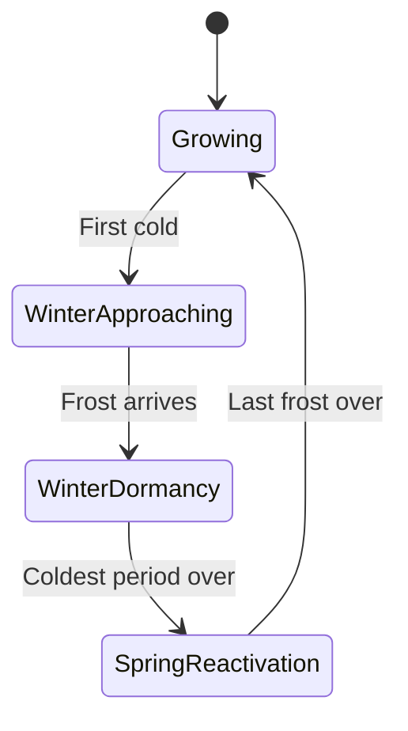

# Season Automation: When Does Winter Arrive?

For all your outdoor, greenhouse, and balcony sites — as well as any other site with at least one location manually marked as frost-exposed — Kamerplanter automatically detects when winter is approaching, when winter dormancy begins, and when it's time to bring your plants back in spring. You don't need to configure anything — the system automatically uses the best available data source for your site. <!-- REQ-047 -->

---

## Prerequisites

- At least one site of type **Outdoor**, **Greenhouse**, or **Balcony** — or a site of another type where at least one location is manually set to **"Outdoor – frost-exposed"** (see [Setting Frost Exposure for a Location](locations-substrates.md#setting-frost-exposure-for-a-location)). A site with no frost-exposed location at all — e.g. a pure indoor site with no override — has no season automation; the simple, hemisphere-based winter watering adjustment from [Care Reminders](care-reminders.md#seasonal-adjustment) still applies there.
- No further setup needed — the evaluation runs automatically in the background every day.

---

## The Four Season Phases

Each outdoor, greenhouse, or balcony site goes through exactly one cycle of four states per winter:

<!-- diagram-source: user-described — the four-phase season state machine (REQ-047 §2.2), one cycle per winter -->

| Phase | Meaning |
|-------|---------|
| **Growing** | Everything runs normally, no winter measures needed. |
| **Winter approaching** | Preparation window: add protection, bring pots indoors, dig up tubers. |
| **Winter dormancy** | Your plants rest under protection — much less watering, no fertilizing. |
| **Spring reactivation** | Time to uncover, pre-sprout and gradually harden off before moving plants back outside. |

!!! tip "No going backward mid-winter"
    A single mild day in January does not bring a plant back out of winter dormancy — the system needs several consecutive mild days before it switches to the next phase. This prevents a short warm spell from triggering a premature spring action.

You can see the current state of each site directly in the **Winter Protection** dashboard widget (see [Personalizing the Dashboard](dashboard-personalization.md)), as well as — for an individual plant — in the [Overwintering](overwintering.md) section.

!!! note "Mixed site: only the frost-exposed location is affected"
    If you've overridden the frost exposure of a single location within an otherwise indoor, windowsill, or grow-tent site to **"Outdoor – frost-exposed"**, the entire site goes through the four season phases like an outdoor site. The winter-dormancy care plan (reduced watering, reminders) only reaches the plants at that frost-exposed location, though — plants at the site's other, protected locations are **not** put into winter dormancy. See [Setting Frost Exposure for a Location](locations-substrates.md#setting-frost-exposure-for-a-location) for more on the classification. <!-- REQ-047 -->

---

## Where the Assessment Comes From: the Three Data Sources

Kamerplanter automatically uses the best available source for each site. This source is shown to you as a small badge next to the season state:

| Badge | Data Source | When Active |
|-------|-------------|-------------|
| **Live weather** | Your configured [weather source](weather-sources.md) (public service or Home Assistant) provides a frost/minimum-temperature forecast. | As soon as your site has a working weather source. |
| **Climate estimate** | The site's stored average frost dates (last frost in spring, first frost in autumn) — or, if those are missing, dates automatically derived from your site's [climate normals](weather-sources.md#climate-at-the-site). | Without live weather data, but with stored frost dates or fetched climate normals for your site. |
| **Calendar** | A rough estimate based on the season and hemisphere (northern or southern hemisphere of your site). | Without live weather data and without stored frost dates or climate normals. |
<!-- REQ-047 -->
<!-- REQ-041 -->

!!! info "The source keeps improving"
    If you later set up a weather source for a site that previously only used the calendar estimate, Kamerplanter automatically switches to the more accurate live tier starting the next day — without you having to change anything.

With **live weather**, Kamerplanter also shows you a frost countdown ("First frost in 4 days") as soon as a concrete frost forecast is available. Without live data, you instead see the typical date from your site's climate data ("First frost typically around 25 October").

!!! note "Frost dates for your site"
    The average frost dates (last frost in spring, first frost in autumn) are part of the site data. If you don't enter them yourself, Kamerplanter automatically derives them from your site's [climate normals](weather-sources.md#climate-at-the-site), provided GPS coordinates are set — with no action needed from you. Only when that isn't possible either does the rough seasonal calendar estimate apply. The separate sowing calendar uses its own fixed defaults when data is missing, see the [Calendar](calendar.md). <!-- REQ-047 -->
    <!-- REQ-041 -->

---

## What Changes During Winter Dormancy

As soon as a site switches into winter dormancy, Kamerplanter automatically activates a dedicated care plan for all affected plants:

- **Watering** follows the watering setting from the plant's [overwintering plan](overwintering.md) — from "none" (dry-stored tubers) to "normal" (plants in a bright, frost-free winter quarter).
- **Fertilizing** pauses completely.
- Two new control reminders appear as needed, alongside your other [tasks](tasks.md) (source "Care"):

| Reminder | When It Appears |
|----------|------------------|
| Dormancy check | Regularly during winter dormancy — reminds you to check for rot, mold, or drying out. |
| Winter-quarter climate check | Only if your winter quarter provides live temperature readings via a sensor or Home Assistant: Kamerplanter compares the measured temperature hourly against the range stored for the plant (see [Overwintering](overwintering.md#adjusting-the-plan)) and, on a real breach above or below it, immediately creates a "High"-priority reminder — handy for a heating failure or an overheated winter quarter on a sunny day. |

<!-- REQ-047 -->

When the site leaves winter dormancy again (transitioning into spring reactivation), Kamerplanter automatically switches off the winter-dormancy care plan and returns to the normal seasonal watering rhythm.

---

## Spring Reactivation

When a site reaches the "spring reactivation" phase, a **"Remove winter protection"** reminder appears for each affected plant — once the spring month recorded in its [overwintering plan](overwintering.md) is reached — alongside your other [tasks](tasks.md) (source "Care"). Which concrete action applies to your plant is shown in the **Spring action** field of its overwintering plan:

- **Remove cover** — take off winter protection (mulch, fleece).
- **Pre-sprout** — bring stored tubers back into active growth.
- **Harden off** — gradually acclimatise sensitive plants to sun, wind and cold before they stay outside all day.
- **Move outdoors / plant out** — return the plant to its summer spot for good.
- **Prune** — remove dead or frost-damaged growth.

!!! example "Hardening off in three steps"
    "Hardening off" means not putting an overwintered plant straight back outside permanently, but acclimatising it gradually:

    - Days 1–3: 2–3 hours in a semi-shaded, wind-sheltered spot.
    - Days 4–6: extend the time outdoors each day, gradually allowing more sun.
    - From day 7: leave outdoors all day — bring back in at night if late frost threatens.

!!! note "Partially available: late-frost warning"
    An automatic warning that would stop you from putting sensitive plants out too early when a late frost night is forecast again already exists as a feature, but is not yet reachable through the interface. During this transition period, check your site's [weather forecast](weather-sources.md#test-the-source) yourself before the final move outdoors, to be safe.

---

## Frequently Asked Questions

??? question "Do I have to set up when winter begins for every plant myself?"
    No. Season automation runs per site, but only affects plants at frost-exposed locations of that site — plants at protected locations on the same site are unaffected (see [Setting Frost Exposure for a Location](locations-substrates.md#setting-frost-exposure-for-a-location)). You don't need to configure anything — for the per-plant result, see [Overwintering](overwintering.md).

??? question "I marked a location of my indoor site as frost-exposed — do the plants there now also get winter-protection reminders?"
    Yes. As soon as at least one location of a site is classified as "Outdoor – frost-exposed", the entire site goes through the season phases — including the winter-dormancy care plan and reminders for the plants at that location. Plants at the site's other, protected locations continue to not be put into winter dormancy.

??? question "What happens if my weather source fails?"
    In that case, Kamerplanter automatically falls back to the next-best source — your site's stored frost dates, or, failing that, the rough calendar estimate. Season automation stays functional in every case, even without any weather connection at all.

??? question "Why do I see the calendar estimate instead of live weather for a site?"
    Either you haven't set up a [weather source](weather-sources.md) for this site yet, or no average frost dates are stored. Set up a weather source to get more accurate, day-fresh estimates.

??? question "Does season automation also affect winter-hardy plants?"
    No. For plants considered hardy at your site (green traffic light), Kamerplanter deliberately does not create an overwintering plan or a winter-protection reminder — they don't need protection. See [Overwintering](overwintering.md) for details.

---

## See Also

- [Overwintering](overwintering.md) — the automatically created plan per plant
- [Locations and Substrates — Setting Frost Exposure for a Location](locations-substrates.md#setting-frost-exposure-for-a-location) — how to override the frost exposure of individual locations
- [Care Reminders](care-reminders.md) — watering and care plans in general
- [Weather Sources](weather-sources.md) — set up live weather data per site
- [Climate Zones & Winter Hardiness](../guides/climate-zones.md) — how the winter-hardiness traffic light is derived
- [Calendar](calendar.md) — frost dates and sowing calendar
