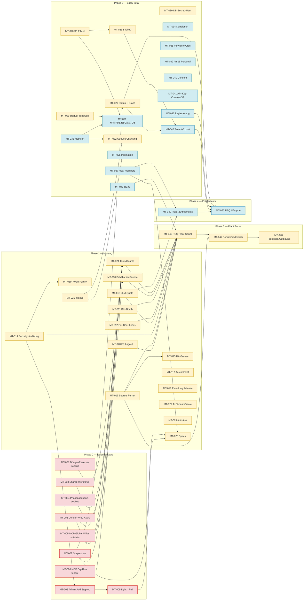

# Audit: Multi-User-, Multi-Tenant- und SaaS-Readiness von Kamerplanter

| Feld | Wert |
|---|---|
| Datum | 2026-10-04 |
| Stand | `develop` @ `cb26b6265` (Worktree `chore/saas-permissions-audit`) |
| Methode | Read-only Code-Audit (keine Änderung am Quellcode, kein Testlauf, kein Cluster-Zugriff). 8 parallele Teil-Audits (Identity/Tenant, Repositories A–M + ArangoDB, Repositories N–Z + Ownership, API/IDOR/Tests, Jobs/Cache/MCP/Integrationen, Frontend/Storage/Observability/Rate-Limits, Privacy/Lifecycle/Requirements, Infrastruktur/Backup/Skalierung), anschließend eigenhändige Gegenprüfung aller P0-Befunde am Code. |
| Status-Vokabular | `CONFIRMED` = Codepfad gelesen und nachvollzogen · `LIKELY` = aus Konfiguration/Struktur abgeleitet · `POTENTIAL` = bedingt (hängt von Daten oder künftigem Aufrufer ab) · `UNKNOWN`/`AUDIT-GAP` = nicht klärbar ohne Laufzeit |
| Korrektur zum Auftragstext | Der Auftrag nennt „Go Backend, Vue.js“. Der tatsächliche Stack ist **Python 3.14 / FastAPI / Celery** (Backend), **React 19 / TypeScript / MUI 9 / Redux Toolkit** (Frontend), **ArangoDB** (primär, Graph), **TimescaleDB** (Sensor-Zeitreihen), **Valkey** (Cache/Broker), Helm-Chart auf bjw-s/common. Das Audit folgt — wie vom Auftrag verlangt — dem Code. |

Alle Pfade sind relativ zu `src/backend/app/` (Backend), `src/frontend/src/` (Frontend), `helm/kamerplanter/` (Chart), `spec/` (Anforderungen), sofern nicht anders angegeben.

---

## 1. Executive Summary

### Zentrale Antwort

> **Ist Kamerplanter heute technisch und sicherheitstechnisch für mehrere Benutzer geeignet?** — **Ja, für Multi-User und in weiten Teilen für Multi-Tenant.** Die Mandantenfähigkeit ist kein nachträglicher Anbau, sondern durchgängig im Code verankert: ein einziger Tenant-Resolver (`common/auth.py::_membership_for_slug`), orakelfreie 403-Refusals, Row-Level-Isolation per `tenant_key` in ~80 Collections, TimescaleDB mit `tenant_key NOT NULL`, ein per Konstruktion vollständiges Mandanten-Löschinventar, API-Key-Tenant-Scope, >100 AST-Guard-Tests, die Isolationsregeln maschinell über die ganze App-Oberfläche durchsetzen.
>
> **Welche Änderungen sind für ein echtes Multi-Tenant-SaaS nötig?** — Gezielte Maßnahmen an **vier Rändern**, kein Umbau: (1) die **Hybrid-Kataloge** (global ∪ tenant) haben drei Stellen, an denen Lese-Zulassung mit Schreib-Erlaubnis verwechselt wird oder ein Reverse-Lookup den Tenant-Filter verliert; (2) **MCP** admittiert globale Schreib-Tools über die stärkste Rolle irgendwo — und jeder Nutzer ist `lead` seines Personal-Tenants; (3) die **Tenant-Suspension ist inert** und der **Light→Full-Moduswechsel nicht implementiert**; (4) die **Infrastruktur ist Single-Tenant-förmig** (kein Backup im Repo, RWO-PVC, eine Celery-Queue, fehlende `tenant_key`-Indizes auf Kern-Collections, keine Metriken, eine Home-Assistant-Instanz für alle).

### Reifegrad

| Zielzustand | Score | Kurzbegründung |
|---|---:|---|
| Level 1 — Single User | **5/5** | Light-Modus (REQ-027) ist genau dieser Fall; funktioniert, bewusst abgegrenzt (`refuse_in_light_mode`). |
| Level 2 — Multi User | **4/5** | Identity stabil (`_key`, OIDC-Unique-Index, Refresh-Rotation, Lockout, Enumerationsschutz). Lücken: Token-Family-Replay fehlt, Access-Token überleben Logout-all 15 min, E-Mail-Einladung nicht adressgebunden, Frontend-Store wird beim Logout nicht geleert. |
| Level 3 — Multi Tenant | **3/5** | Kern-Isolation stark; aber **5 bestätigte Cross-Tenant-Defekte** (3 Lecks, 2 Schreibrechte auf geteilte Stammdaten), Suspension inert, HA instanzweit, Ownership-Guard als Opt-in pro Handler. |
| Level 4 — SaaS | **1/5** | Kein Backup, kein Tenant-Export, keine Quoten/Entitlements, keine Metriken, Single-Replica-Chart, keine Grace-Period, kein Audit-Trail für Rechteänderungen, kein Registrierungsmodus. |

**SaaS Readiness Score: 44 / 100** (Isolation 7, Autorisierung 7, Identity 8, Privacy 7, Testing 7, Tenant-Lifecycle 3, Observability 3, Infrastruktur/DR 2 — je /10, gewichtet gleich).

### Die größten Risiken (alle CONFIRMED)

| # | Risiko | Beleg | Maßnahme |
|---|---|---|---|
| 1 | **Cross-Tenant-Leak**: `GET /t/{slug}/fertilizers/{key}/nutrient-plans` liefert Nährstoffplan-Namen, -Keys und Dosierungen **aller Mandanten**, die einen globalen Dünger verwenden. | `data_access/arango/fertilizer_repository.py:241-277` (kein Tenant-Prädikat), `domain/services/fertilizer_service.py:242-244`, `api/v1/fertilizers/tenant_router.py:218-226` | MT-001 |
| 2 | **Schreibrecht auf geteilte Stammdaten**: Jeder Grower jedes Tenants kann globale Seed-Dünger (NPK, `mixing_priority`, EC) ändern oder löschen. | `fertilizer_service.py:30-33` lässt `tenant_key == ""` durch; `update_fertilizer`/`delete_fertilizer` (`:39-80`) prüfen weder Owner noch Platform-Admin | MT-002 |
| 3 | **Schreibrecht auf geteilte Aktivitätspläne**: Auto-generierte Workflow-Templates werden mit `tenant_key=""`, `is_system=False` persistiert; Write-Guards prüfen nur `is_system`. | `domain/services/activity_plan_service.py:190-211`, `task_service.py:269-291`, `api/v1/tasks/tenant_router.py:150-175` | MT-003 |
| 4 | **MCP-Privilegieneskalation**: `assign_species_phase_sequence` (Permission `setup` ≙ `lead`) ist über `_strongest_role` für **jeden** `kp_`-Key-Inhaber erreichbar, weil jeder Nutzer `lead` seines Personal-Tenants ist. REST-Pendant verlangt Platform-Admin. | `mcp_server/dispatcher.py:107,310-320`, `mcp_server/tools/phases.py:628-661`, `core/permissions.py:224-228`, `domain/services/tenant_service.py:175` | MT-005 |
| 5 | **Cross-Tenant-Leak privater Species-Namen**: `GET /phase-sequences/{key}/species` traversiert `has_phase_sequence` ohne Tenant-Filter, nur `get_current_user`. | `api/v1/phase_sequences/router.py:290-300`, `data_access/arango/phase_sequence_repository.py:161-170` | MT-004 |
| 6 | **Tenant-Suspension inert**: `Tenant.is_active=false` entfernt den Mandanten nur aus dem Switcher; `_membership_for_slug` prüft ausschließlich `membership.is_active`. Docstring behauptet „locks every member out“. | `common/auth.py:209-220`, `domain/services/tenant_service.py:280-288, 1504-1507` | MT-007 |
| 7 | **Light→Full nicht implementiert**: System-User bleibt aktiv, im Light-Modus ohne Authentifizierung geminte API-Keys (lead + management + technical) bleiben nach dem Wechsel gültig. | `domain/services/onboarding_service.py:358` (`TODO: REQ-027`), `api/v1/auth/router.py:817-818`, `auth_service.py:2192` | MT-009 |
| 8 | **Kein Backup im Repo**; NFR-002 §8 referenziert `k8s/backup/*`, das nicht existiert. Tenant-Löschung ist sofort und irreversibel. | `helm/` (0 Treffer `CronJob|arangodump|velero`), `tenant_service.py:382-441` | MT-026, MT-027 |
| 9 | **Eine Home-Assistant-Instanz für alle Tenants**; jedes Mitglied (auch Viewer) listet die komplette HA-Entity-Inventur und kann beliebige Entity-Zustände mit dem Betreiber-Token lesen. | `common/dependencies.py:1656-1677`, `api/v1/tenant_scoped/weather/tenant_router.py:236-252`, `api/v1/tanks/tenant_router.py:102-108`, `api/v1/locations/tenant_router.py:132-149` | MT-015 |
| 10 | **Memory-DoS** über Upload: Bild-Decode ohne Pixel-Obergrenze (`putdata(list(src.getdata()))`), während die Geschwister `cv_diagnosis`/`recognition` 40 MPx begrenzen. | `domain/engines/storage/exif_stripper.py:~95-105`, `thumbnail_generator.py:127,190` vs. `api/v1/tenant_scoped/cv_diagnosis/tenant_router.py:45,82` | MT-011 |

### Wichtigste Erkenntnisse

1. **Die Isolationsarchitektur ist richtig gebaut**: ein Resolver, ein Prädikat-Helfer (`tenant_scope.py`), ein Ownership-Verifier (`tenant_ownership.py`), Guards auf Router-Ebene statt pro Handler, Rolle aus der Membership im *aufgelösten* Tenant. Die Fehlerklasse der gefundenen Defekte ist durchgängig **„Rand des Hybrid-Katalogs“** (global ∪ tenant) und **„Reverse-Lookup vom globalen Anker“** — nicht „Tenant-Filter vergessen“.
2. **Das Messwerkzeug hat die Lücke, nicht der Guard**: Die drei AST-Guards (`test_keyed_writes_resolve_a_tenant`, `test_tenant_reference_keys_are_resolved`, `test_tenant_scoped_reads_are_derived`) prüfen *dass* ein Key mit Tenant übergeben wird, nicht *was* die Übergabe bedeutet. Check-then-Act mit Hybrid-Lese-Zulassung vor ungescoptem Write (MT-002/003) und Traversals, deren Rückgabe-Collection nicht als „touched“ zählt (MT-004), passieren sie.
3. **„Implementiert, aber inert“** kommt viermal vor: Tenant-Suspension, `max_members`, Light→Full-Übernahme, `has_permission`/`assert_permission` (toter Code neben dem echten Gate). Alle vier sind in Spec/Docstring als wirksam beschrieben.
4. **Anwendungsschicht ≠ Infrastrukturschicht**: Die App ist (bis auf einen RWO-PVC) replica-sicher; Daten-, Backup-, Scheduling- und Observability-Schicht sind Single-Tenant-förmig.
5. **Specs decken SaaS nicht ab**: kein Requirement für Tenant-Zustände, Suspension-Semantik, Quoten, Registrierungsmodus, Tenant-Export; NFR-012 behandelt nur Infrastruktur-Dimensionierung.

### Empfehlung

**Kategorie B — Ja, mit gezielten Architekturmaßnahmen.** Phase 0 (9 Maßnahmen, alle S–M) schließt die Isolations- und Autorisierungsdefekte; Phase 1 (17 Maßnahmen) härtet strukturell (Prädikat in den Service, Indizes, Audit-Trail, Rate-Limits); erst danach **Plant Identity / Plant Social**; Phase 2 (SaaS-Infrastruktur) und Phase 4 (Entitlements) können parallel bzw. später laufen. Details §21–§26.

---

## 2. Architekturübersicht (Ist)

```mermaid
flowchart TB
  subgraph Client
    FE[React 19 SPA<br/>Access-Token im Memory<br/>X-Active-Tenant / /t/slug]
    MCPC[MCP-Client<br/>kp_ API-Key]
    HAI[Home Assistant<br/>Custom Integration]
  end
  subgraph Edge
    NG[nginx frontend]
  end
  subgraph API["FastAPI app/api/v1 (696 Routen)"]
    AUTH[common/auth.py<br/>get_current_user · _membership_for_slug<br/>require_permission · require_admin_scope<br/>require_platform_admin]
    TS["/t/{tenant_slug}/… (50 Router)"]
    GL["global tenant-aware<br/>species · cultivars · substrates …<br/>(Header X-Active-Tenant)"]
    ADM["admin/* (require_platform_admin)"]
    MCP[mcp_server<br/>dispatcher · _resolve_membership<br/>assert_mcp_permission]
  end
  subgraph Domain["domain/services + engines"]
    SVC[Services: Ownership-Checks<br/>verify_tenant_ownership<br/>tenant_key kw-only (teils)]
    ENG[MembershipEngine · ErasureEngine<br/>TenantErasureEngine · ConsentGuard]
  end
  subgraph Data["data_access"]
    REPO[Arango-Repositories<br/>tenant_union_predicate<br/>verify_entity_ownership<br/>_require_tenant_key]
    TSDB[timescale/observation_repository<br/>tenant_key NOT NULL]
    STO[storage: local-fs | S3<br/>t/{tenant_key}/…]
  end
  subgraph Infra
    AR[(ArangoDB single<br/>~133 doc + ~130 edge coll.<br/>Named Graph)]
    PG[(TimescaleDB<br/>optional)]
    VK[(Valkey<br/>Broker · Rate-Limit · Sessions)]
    S3[(Object Store<br/>PVC RWO default)]
    CW[Celery worker ×1<br/>eine Queue]
    CB[Celery beat ×1<br/>Recreate]
    HA[(Home Assistant<br/>EINE Instanz, Token in system_settings)]
    KS[knowledge-service<br/>LLM-Credentials]
  end
  FE --> NG --> API
  MCPC --> MCP
  HAI --> API
  TS & GL & ADM --> AUTH --> SVC
  MCP --> SVC
  SVC --> ENG
  SVC --> REPO --> AR
  SVC --> TSDB --> PG
  SVC --> STO --> S3
  CW & CB --> SVC
  CW --> VK
  SVC --> HA
  SVC --> KS
```

**Autorisierungskette pro Request** (verifiziert in `common/auth.py`):

```
Bearer (JWT 15 min | kp_ API-Key)  → get_current_user (DB-Lookup, is_active, IP-Allowlist, Key-Budget)
  → Tenant: Pfad /t/{slug}/ (get_current_tenant)  ODER  Header X-Active-Tenant (get_active_tenant_*), Fallback Personal-Tenant, "" = nur global
  → _membership_for_slug: slug→tenant→membership.is_active, API-Key-Scope; 403 einheitlich (kein Existenz-Orakel)
  → TenantContext(role, admin_scopes)  → require_permission (MembershipEngine: edit=lead|grower, delete=lead) | require_admin_scope | require_platform_admin
  → Service: Ownership (verify_tenant_ownership / get_X(key, tenant_key)) → Repository: FILTER tenant_key == @tenant_key (strikt) | tenant_union_predicate (Hybrid)
```

---

## 3. Multi-User Maturity

| Level | Score | Erfüllt (Beleg) | Nicht erfüllt (→ Maßnahme) |
|---|---:|---|---|
| **Single User** | 5/5 | Light-Modus: `LightAuthProvider` liefert den `system-user` (`domain/engines/light_auth_provider.py:23-27`), Seed `seed_light_mode.py`; Credential-/Einladungsrouten gesperrt (`common/auth.py:556-574`). | Light→Full-Übergang fehlt (MT-009) — betrifft den *Übergang*, nicht Level 1 selbst. |
| **Multi User** | 4/5 | Stabile ID `_key`; `users.email` unique (`collections.py:2230`); OIDC `(provider, oidc_config_slug, provider_user_id)` unique (`:2237`); Auto-Link nur bei beidseitig bewiesener Adresse (`auth_service.py:1835`); Refresh-Rotation + Revocation (`:797-840`); Logout-all (`:1147`); Session-Liste (`:1279-1300`); Lockout + Enumerationsschutz (`:530-568, 746-793`); Deaktivierung wirkt sofort (`full_auth_provider.py:51-53`). | Keine Token-Family/Replay-Detection (MT-019); Access-Token überleben Logout-all (MT-019); E-Mail-Einladung nicht adressgebunden (MT-018); Frontend-Store nach Logout gefüllt, Push-Subscription geteilt (MT-020). |
| **Multi Tenant** | 3/5 | Ein Resolver, 403-Oracle-Schutz (`auth.py:169-220`); Rolle aus Membership im aufgelösten Tenant (`:486-494`); `require_permission` auf 151 Schreibrouten; IDOR-Pfade für Plant/Site/Location/Slot/Task/Tank/Run/Harvest/Diary/Attachment/Import/Nutrient-Plan/Notification sauber (404); `verify_entity_ownership` für Body-Fremdschlüssel; TimescaleDB tenant-gebunden; Propagation-Traversals mit `PRUNE`; Attachment-Keys `t/{tenant}/…`; Tenant-Löschinventar vollständig per Guard. | 3 Lecks + 2 Schreibrechte auf geteilte Daten (MT-001..006); Suspension inert (MT-007); Platform-Admin-Self-Add ohne Step-up (MT-008); HA instanzweit (MT-015); Ownership-Guard Opt-in pro Handler (MT-010); kein Audit-Trail (MT-014); `max_members` inert (MT-037). |
| **SaaS** | 1/5 | Rate-Limits in Valkey (`settings.py:640-674`); Migrationslock cross-replica; Beat-Singleton (`values.yaml:610-613`); Storage-Quota 2 GB/Tenant; Retention per Beat erzwungen. | Kein Backup (MT-026), keine Grace-Period (MT-027), RWO-PVC (MT-028), 1 Replica/kein HPA/PDB (MT-031), keine Metriken (MT-033), eine Queue (MT-032), keine Indizes auf Kern-Collections (MT-021), keine Quoten/Pläne (MT-049), kein Tenant-Export (MT-042), kein Registrierungsmodus (MT-036), keine LLM-Quote (MT-013). |

---

## 4. Identity Audit

**Ist-Zustand.** `User` (`domain/models/user.py`) ist eigenständige Entität mit `_key`, `account_type: human|service`, Request-State `_api_key_tenant_scope` als `PrivateAttr` (nicht persistierbar). Registrierung (`auth_service.py:464-610`) legt User, lokalen `AuthProvider` und Personal-Tenant an — drei nicht-transaktionale Writes (`:572-595`). Externe Identitäten liegen in `auth_providers` mit Unique-Index; Login-Link zusätzlich an `oidc_config_key`/`issuer` gebunden (`:1894-1946`). Sessions: Refresh-Token-Rotation mit Revocation des Vorgängers, `get_by_hash` filtert `revoked == false` (`refresh_token_repository.py:27-31`). Löschung: `DELETE /users/me` → Art.-17-Antrag mit Step-up, Soft-Delete, Hard-Delete nach 90 Tagen per Beat; deklariertes Inventar (`domain/engines/erasure_engine.py:385-530`).

**User ≠ Tenant**: ja. `get_personal_tenant` wird einzig vom Header-Resolver als Fallback genutzt (`auth.py:359`). User-globale Daten (nur `user_key`): `user_preferences` inkl. `dashboard_layout`, `NotificationPreferences`, `OnboardingState`, Favoriten-Kanten. Tenant-spezifisch: alles Fachliche. **Inkonsistenz**: Dashboard-Layout und Notification-Channels sind user-global, die Daten darunter tenant-spezifisch; die Route liegt trotzdem unter `/t/{slug}/user-preferences` (MT-055, P3).

| ID | Status | Prio | Beleg | Befund | → |
|---|---|---|---|---|---|
| ID-01 | CONFIRMED | P1 | `auth.py:209-220`, `tenant_service.py:280-288` | Tenant-Suspension inert (nur `membership.is_active` geprüft) | MT-007 |
| ID-02 | CONFIRMED | P1 | `api/v1/admin/platform/router.py:466-496`, `tenant_service.py:1569-1598` | Platform-Admin fügt beliebigen User (sich selbst) als beliebige Rolle in beliebigen Tenant inkl. `platform` ein — ohne Step-up, ohne Log, asymmetrisch zu `admin_change_membership_role` (Step-up) | MT-008 |
| ID-03 | CONFIRMED | P2 | `tenant_service.py:2014-2069`, `invitation_engine.py:38-50` | E-Mail-Einladung von jedem Konto mit Token annehmbar; `invitation.email` nie verglichen | MT-018 |
| ID-06 | CONFIRMED | P2 | `domain/models/auth.py:156-160`; keine Schreib-API | `ip_allowlist`, `rate_limit_per_minute`, `expires_at` werden durchgesetzt (`api_key_controls.py:93-110`), sind aber von keinem Endpunkt setzbar; keine Service-Account-Erstellung, keine Rotation | MT-041 |
| ID-07 | CONFIRMED | P2 | `auth_service.py:797-840` | Keine Token-Family/Replay-Detection (REQ-023 §3.2a) | MT-019 |
| ID-08 | CONFIRMED | P2 | `auth_service.py:1147-1151, 1295-1300`, `token_engine.py:24-35` | Access-Token (15 min) überleben Logout-all, Session-Revoke, Passwortwechsel; kein `iat`-Cutoff | MT-019 |
| ID-10 | CONFIRMED | P3 | `admin/platform/router.py:216-279`, `user_service.py:118-149` | Kein Schutz vor Selbst-Deaktivierung / Deaktivierung des letzten Platform-Admins | MT-045 |
| ID-11 | CONFIRMED | P3 | `auth_service.py:572-595` | Registrierung = 3 nicht-atomare Writes → User ohne Personal-Tenant möglich | MT-022 |
| ID-14 | CONFIRMED | P3 | `api/v1/tenants/router.py:81-95, 372-381` | Service-Account (ungescopter Key) kann Organisationen gründen und Einladungen annehmen | MT-045 |
| MIG-01 | CONFIRMED | P1 | `onboarding_service.py:358`, `auth/router.py:817-818`, `auth_service.py:2192` | Light→Full: System-User bleibt aktiv; Light-geminte API-Keys bleiben gültig | MT-009 |

**Positiv verifiziert**: API-Key-Scope als `PrivateAttr` + kanonischer Tenant-Key + keyword-only `key_scope` ohne Default (`auth.py:174`) + Guard `test_api_key_scope_binds_every_tenant_resolution.py`; gescopte Keys auf Account-Routen abgewiesen (`require_account_principal`, `auth.py:61-78`); `address_proven` als eigener Trust-Anker (`user.py:98-106`); Step-ups an Zielobjekt gebunden (Guard `test_step_up_targets_are_bound.py`); Autorisierung liest Mitgliedschaften zur Laufzeit, nicht aus dem JWT (`tenant_roles` im Token ist rein informativ).

---

## 5. Tenant Audit

**Modell** (`domain/models/tenant.py`): `key`, `name`, `slug` (unique, `collections.py:2253`), `tenant_type: personal|organization`, `owner_user_key` (rechtefrei, REQ-049), `is_active: bool`, `is_platform`, `max_members: int ≥1` (Default 1), `settings: dict[str, Any]` (schemalos), Zeitstempel. Kein `status`-Enum, kein `plan_key`, keine Quoten außer `max_members` (inert).

**Lifecycle**:

| Schritt | Ist | Bewertung |
|---|---|---|
| Personal-Tenant | automatisch bei Registrierung (`tenant_service.py:155-183`), Slug aus `display_name` | ✓; nicht transaktional (MT-022) |
| Organisation | `POST /tenants`, Quota 10 je Owner (`tenant_engine.py:59-61`) | ✓ |
| Einladung | Token `token_urlsafe(32)` als SHA-256, 7 Tage, atomares `mark_accepted_if_pending`, Erasure-Freeze-Gates per Guard | ✓; nicht adressgebunden (MT-018); `max_uses`/`expires_at`/`admin_scopes` aus REQ-024 AK-07/08 fehlen |
| Rollenwechsel | MANAGEMENT-Scope, Eskalationsschutz (AST-Guard `test_membership_role_grants_check_for_escalation.py`, 8 Grant-Stellen), Step-up | ✓; `change_member_scopes` ohne Step-up (MT-045) |
| Entfernen/Leave | INV-1 (letzte Verwaltung bleibt) an Scope-Entzug/Remove/Leave (`tenant_service.py:1851-1919`); Edges + LocationAssignments gelöscht | ✓; `tasks.assigned_to_user_key` bleibt → Ex-Mitglied bekommt weiter Notifications (MT-017) |
| Suspension | `is_active=false` via Platform-Admin mit Step-up (#2009) | **inert** im Resolver (MT-007) |
| Owner-Transfer | existiert nicht | Business-Entscheidung; relevant für Billing (MT-050) |
| Löschung | Service-Autorisierung lead ∧ management, nie per API-Key; Step-up mit Slug-Echo; Freeze + Record + Celery; Inventar vollständig per Guard | ✓; **sofort und irreversibel**, keine Grace-Period (MT-027) |
| Export/Restore | nicht vorhanden (`AttachmentCategory.TENANT_EXPORT` ungenutzt) | MT-042 |

**`User = Tenant`-Annahmen**: nicht gefunden. Der Personal-Tenant ist nur Header-Fallback; alle Fachrouten binden den Tenant explizit. Einzige strukturelle Annahme: *jeder* Nutzer ist `lead` seines Personal-Tenants — das ist korrekt für den Tenant, wird aber vom MCP-Dispatcher als globale Berechtigung fehlinterpretiert (MT-005).

---

## 6. Authorization Audit

**Zwei Achsen (REQ-049)**: Achse 1 Domänenrolle `viewer < grower < lead` (Delete lead-only = Irreversibilitätsgrenze); Achse 2 `admin_scopes ⊆ {management, technical}` unabhängig von der Rolle. Platform-Admin = `lead`-Membership im technischen Tenant `platform` (`auth.py:535-553`); im Light-Modus pauschal `True`.

**Drei Gate-Familien** (`auth.py`): `require_permission(resource, action)` → `MembershipEngine.can_edit_resource/can_delete_resource` (151 Schreibrouten); `require_tenant_role`/`require_active_tenant_role` (71); `require_admin_scope` (20: actuators 4, inventree 6, tenants 10); `require_platform_admin` (56 admin-Routen); lokale Wrapper (`require_attachment_permission` über `core/permissions.has_permission`, Service-Flag `is_platform_admin` in species/cultivars/substrates/ipm/phase_sequences/imports).

| ID | Status | Prio | Beleg | Befund | → |
|---|---|---|---|---|---|
| OWN-01 / API-01 | CONFIRMED | **P0** | `fertilizer_service.py:30-80`, `fertilizers/tenant_router.py:87-108` | Globaler Dünger für jeden Grower schreib-/löschbar | MT-002 |
| OWN-02 / API-02 | CONFIRMED | **P0** | `activity_plan_service.py:190-211`, `task_service.py:269-291`, `tasks/tenant_router.py:150-175`; Test `test_a_global_standalone_template_is_left_editable` zertifiziert das Verhalten | Geteilter Aktivitätsplan (`tenant_key=""`, `is_system=False`) für jeden Tenant schreib-/löschbar | MT-003 |
| MCP-01 | CONFIRMED | **P0** | `dispatcher.py:107,310-320`, `tools/phases.py:628` | Globale Setup-Tools über stärkste Rolle irgendwo | MT-005 |
| ID-02 | CONFIRMED | P1 | s. §4 | Platform-Admin-Self-Add ohne Step-up/Log | MT-008 |
| OWN-04 | LIKELY | P1 | `site_service.py:35-49,70-81,139-181`; `planting_run_service.py`, `tank_service.py`, `nutrient_plan_service.py`, 35 Signaturen `tenant_key: str = ""`/`None` | Ownership-Guard ist Opt-in pro Router-Handler (`service.get_X(key, tenant_key=ctx)` vor ungescoptem `service.update_X(key)`); Service-Writes laden intern ohne Tenant. Heute ~60 Handler konsistent, aber kein mechanischer Schutz (Drift-Klasse #948/#1402) | MT-010 |
| OWN-05 | LIKELY | P1 | `common/tenant_guard.py:9,23` | `verify_tenant_ownership` No-op ohne `tenant_key`-Attribut; `verify_tenant_read_access` kehrt bei leerem Tenant ohne Prüfung zurück | MT-010 |
| API-03 | CONFIRMED | P3 | `substrates/router.py:284-300` | `POST /substrates/batches/{key}/prepare-reuse` verwirft Rolle → Viewer schreibt | MT-045 |
| API-07 / ID-13 | CONFIRMED | P3 | `core/permissions.py:184-197` vs. `MembershipEngine` | Zwei Matrizen; `has_permission` nur von `require_attachment_permission` konsumiert, `require_permission` ignoriert `resource` | MT-045 |
| ID-09 | CONFIRMED | P3 | `tenant_service.py:1831-1861` | `change_member_scopes` ohne Step-up | MT-045 |
| ID-14 | CONFIRMED | P3 | `tenants/router.py:81-95,372-381` | Service-Account kann Organisation gründen | MT-045 |

**Authorization Matrix (Ist, abgeleitet aus `core/permissions.py`, `MembershipEngine`, `require_admin_scope`-Stellen; Soll-Abweichungen fett).** Legende: R = lesen, W = anlegen/ändern, D = löschen, C = bestätigen (confirm), `+mgmt`/`+tech` = zusätzlich Admin-Scope nötig, PA = Platform-Admin (`lead` in `platform`), Public = unauthentifiziert.

| Resource | viewer | grower | lead | +mgmt | +tech | PA | Public | Anmerkung / Soll |
|---|---|---|---|---|---|---|---|---|
| Tenant (Name, Beschreibung) | R | R | R | W | – | W (inkl. `is_active`, Step-up) | – | Delete: lead ∧ mgmt + Step-up; **Soll: Suspension wirksam (MT-007)** |
| Membership / Invitation | R | R | R | W D (Rolle: Step-up; **Scopes: Soll Step-up**) | – | W D (**Soll: Step-up + Audit**, MT-008) | – | Eskalationsschutz ✓, INV-1 ✓ |
| LocationAssignment | R | R | R | W D | – | – | – | Zuständigkeitsanzeige, keine Berechtigung (REQ-049 §3.5) |
| Plant, Site, Location, Slot, PlantingRun, Task, Observation, Harvest, Tank, NutrientPlan (eigen), Diary, Attachment, Note, CareProfile, OverwinteringProfile, IPM-Treatment, SuccessionPlan, CalendarFeed | R (Task/Care: +C) | R W (+C) | R W D | – | – | – | – | `require_permission`: W = lead\|grower, D = lead ✓ |
| Sensor, Actuator, ControlRule/Schedule, HA-Publish, InvenTree-Connection, WeatherSourceConfig | R | R | R | – | W D | – | – | Achse 2 TECHNICAL ✓; **Soll: HA-Entity-Listing nur +tech (MT-015)** |
| Fertilizer (eigen) | R | R W | R W D | – | – | – | – | ✓ |
| **Fertilizer (global, `tenant_key=""`)** | R | **Ist: W** | **Ist: W D** | – | – | W D | – | **Soll: nur PA (MT-002)** |
| **WorkflowTemplate / TaskTemplate (shared `""`)** | R | **Ist: W** | **Ist: W D** | – | – | W D | – | **Soll: nur PA, PUT forkt (MT-003)** |
| Species / Cultivar / Substrate (eigen) | R | R W | R W D | – | – | – | – | ✓ (`_authorize_tenant_owned_write`) |
| Species / Cultivar / Substrate (global) | R | R | R | – | – | W D | – | ✓; **Soll: Reverse-Lookups gefiltert (MT-004)** |
| Substrate-Batch `prepare-reuse` | **Ist: W** | W | W | – | – | – | – | **Soll: grower+ (MT-045.1)** |
| Activities (hybrid) | R (**Ist: alle Tenants**) | R | R | – | – | W D | – | **Soll: own ∪ global (MT-023)** |
| Globale Kataloge (BotanicalFamily, Pests, HardinessZone, Glossary, PhaseSequence, StarterKit, LocationType …) | R | R | R | – | – | W D | Glossary: R (rate-limited) | ✓ |
| **Phasensequenz-Zuweisung an Species (REST)** | – | – | – | – | – | W | – | ✓ |
| **Phasensequenz-Zuweisung an Species (MCP `setup`)** | – | – | **Ist: W (jeder lead irgendwo)** | – | – | W | – | **Soll: nur PA (MT-005)** |
| MCP-Tools (tenant-gebunden) | read | read+write | read+write+setup | – | – | – | – | ✓ Dispatcher; Dry-Run Nährstoffplan **Soll tenant-gebunden (MT-006)** |
| Notification, Favorites, UserPreferences, Onboarding, AI-Conversation | R W (eigen) | R W | R W | – | – | – | – | user-eigen; AI **Soll: Quote (MT-013)** |
| Privacy (Art. 15–21) | selbst | selbst | selbst | – | – | – | – | Step-up ✓; **Soll: Personal-Tenant im Export (MT-039)** |
| API-Keys | selbst (Step-up) | selbst | selbst | – | – | – | – | **Soll: Controls setzbar, SA-Erstellung lead ∧ tech (MT-041)** |
| Admin-Panel (Tenants, Users, Settings, OIDC, Pests, Recognition) | – | – | – | – | – | R W D | – | ✓ gegated; **Soll: Audit-Log (MT-014)**; `platform_viewer` (R) laut Spec, nicht implementiert |
| Social (zukünftig) | R | R W (Opt-in Autor) | R W D | – | Credentials W | – | R (PUBLIC-Stufe) | MT-046..048 |

**LocationAssignment**: laut REQ-024 AK-15/41/43 und REQ-049 §3.5 bewusst *keine* Berechtigung, sondern Zuständigkeitsanzeige; Code konsistent (kein Consumer außer CRUD/Export/Erasure). Die CLAUDE.md-Formulierung „Assignment-based write control“ ist veraltet (MT-025).

**Positiv verifiziert**: Write-Gate ist verdrahtet (Tests `tests/api/test_require_permission_enforcement.py`); Delete lead-only über eine Engine-Quelle; Reads offen für jedes Mitglied; Species/Cultivar/Substrat-Writes auf globalen Routen korrekt dreigeteilt (fremd → 404, global → Platform-Admin, eigen → Rolle; `species_service.py:109-117`, `substrate_service.py:194-216` als **Referenzimplementierung** für MT-002/003).

---

## 7. Resource Ownership Matrix

Scope-Legende: **GLOBAL** = Systemkatalog, kein Tenant · **HYBRID** = `tenant_key == ""` global ∪ tenant-eigene Zeilen · **SHARED** = zusätzlich per `tenant_has_access`-Grant lesbar · **TENANT** = strikt tenant-privat · **TENANT⇐** = tenant-privat, Tenant abgeleitet über Parent (kein eigenes Feld) · **USER** = kontogebunden · **SYSTEM** = Plattform.

| Resource | Collection | Scope | Owner | Shared | Read Rule | Write Rule | Delete Rule | Tenant Key im Modell | Current State |
|---|---|---|---|---|---|---|---|---|---|
| Tenant | tenants | ROOT | owner_user_key (rechtefrei) | – | Mitglied | lead∧management (PATCH) | lead∧management + Step-up | – | ✓; Suspension inert (MT-007) |
| User | users | ROOT | – | – | selbst / Platform-Admin | selbst (Step-up) | Art. 17 | – | ✓ |
| Membership | memberships | TENANT+USER | – | – | Mitglied | management (+Step-up Rolle) | management; INV-1 | Pflicht | ✓; Scopes ohne Step-up (MT-045) |
| Invitation | invitations | TENANT | – | – | management | management | management | Pflicht | nicht adressgebunden (MT-018) |
| LocationAssignment | location_assignments | TENANT | – | – | Mitglied | management | management | Pflicht | ✓ (keine Berechtigung) |
| ApiKey / RefreshToken | api_keys / refresh_tokens | USER | user_key | – | selbst | selbst (Step-up) | selbst | – (Scope im Key) | Controls nicht setzbar (MT-041) |
| Species / Cultivar | species / cultivars | HYBRID+SHARED | tenant / global | Grants | own ∪ global ∪ grants | eigen: grower; global: Platform-Admin | eigen: lead; global: Platform-Admin | Optional `""` | ✓ (Referenz); Reverse-Lookup leckt (MT-004) |
| BotanicalFamily, Pest/Disease/Treatment, Beneficial, HardinessZone, LocationType, GlossaryTerm, StarterKit, PhaseDefinition/Sequence, GrowthPhase, FishSpecies, OverwinteringProfileTemplate, HarvestIndicator | … | GLOBAL | System | – | alle | Platform-Admin | Platform-Admin | – | ✓ |
| **Fertilizer** | fertilizers | HYBRID | tenant / global | – | own ∪ global | **heute: jeder grower, auch global** | **heute: jeder lead, auch global** | Optional `""` | **MT-002**; Reverse-Lookup leckt (MT-001) |
| FertilizerStock | fertilizer_stocks | TENANT | tenant | – | Mitglied | grower | lead | Optional `""` | ✓ |
| NutrientPlan / PhaseEntry | nutrient_plans / nutrient_plan_phase_entries | HYBRID / TENANT⇐ | tenant / global | – | own ∪ global | eigen: grower (`for_write=True`) | lead | Optional `""` / – | ✓; MCP-Dry-Run leckt (MT-006) |
| **WorkflowTemplate / TaskTemplate** | workflow_templates / task_templates | HYBRID | tenant / `""` shared | – | own ∪ global | **heute: `is_system`-Guard nur** | **dito** | Optional `""` | **MT-003** |
| Activity | activities | HYBRID | tenant / global | – | **heute: alle Zeilen** | Platform-Admin | Platform-Admin | Optional `""` + `is_system` | MT-023 |
| Substrate / SubstrateBatch | substrates / substrate_batches | HYBRID / TENANT | tenant / global | – | own ∪ global / own | Referenzimplementierung `_authorize_write` | lead | Optional `""` | ✓; `prepare-reuse` ohne Rank (MT-045) |
| Site | sites | TENANT (Anker) | tenant | – | Mitglied | grower | lead | Optional `""` | ✓; kein Index (MT-021) |
| Location / Slot | locations / slots | TENANT⇐ Site | – | – | via Site | grower | lead | Feld vorhanden, **nie geschrieben** | ✓ funktional; Feld entfernen (MT-010) |
| PlantInstance | plant_instances | TENANT | tenant | – | Mitglied | grower | lead | Optional `""` | ✓ |
| PlantingRun / Entry | planting_runs / planting_run_entries | TENANT | tenant | – | Mitglied | grower | lead | Optional `""` | ✓; kein Index (MT-021) |
| Task, Comment, Audit, WorkflowExecution | tasks, … | TENANT / TENANT⇐ | tenant; `created_by` | – | Mitglied | grower (confirm: alle) | lead | Optional `""` / – | ✓; kein Index (MT-021) |
| PlantDiaryEntry | plant_diary_entries | TENANT | tenant; `created_by` | – | Mitglied | grower | lead | Optional `""` | ✓ (Entry- UND Plant-Prädikat) |
| Observation (SensorReading) | TimescaleDB `sensor_readings` | TENANT | tenant | – | Mitglied | grower / Ingest | lead | **Pflicht, NOT NULL** | ✓ |
| Sensor | sensors | TENANT⇐ Parent (site/location/tank) | – | – | via Parent | grower / technical | lead | **fehlt** | ✓ funktional; HA-Entity frei wählbar (MT-015) |
| Actuator, ControlSchedule/Rule/Event, ManualOverride, PhaseControlProfile | … | TENANT | tenant | – | Mitglied | grower ∧ technical | lead | Optional `""` | ✓; `control_*` ohne Index (MT-021) |
| Tank; TankState, MaintenanceLog, FillEvent | tanks; … | TENANT; TENANT⇐ | tenant | – | Mitglied | grower | lead | Optional `""` / – | ✓ |
| Harvest, HarvestBatch; Quality, Yield | harvest_batches; … | TENANT | tenant; `recorded_by` | – | Mitglied | grower | lead | Optional `""` | ✓ |
| HarvestObservation | harvest_observations | TENANT⇐ Plant | – | – | via Plant | grower | lead | **fehlt**, steht aber in `OWNERSHIP_VERIFIABLE_COLLECTIONS` | Guard inert (MT-010) |
| PostHarvestBatch (+Kinder) | post_harvest_batches | TENANT | tenant | – | Mitglied | grower | lead | Optional `""` | ✓ |
| Propagation*, RootingProtocol | … | TENANT / HYBRID | tenant | – | Mitglied | grower; `""` → Forbidden | lead | Optional `""` | ✓ (Lineage `PRUNE`) |
| CareProfile, CareConfirmation | care_profiles, … | TENANT⇐ Plant | – | – | via Plant (`require_owned_plant`) | grower (confirm: alle) | lead | – | ✓ |
| Inspection, TreatmentApplication | inspections, … | TENANT | tenant | – | Mitglied | grower | lead | Optional `""` | ✓; kein Index (MT-021) |
| Attachment / Photo | attachments | TENANT+USER | tenant; `created_by` Pflicht | – | Mitglied | grower | lead | **Pflicht** | ✓; Pixel-Bomb (MT-011); HEIC EXIF (MT-043) |
| WeatherForecast, WeatherSourceConfig, ClimateNormal, IrrigationDemand, SeasonState, OverwinteringProfile, SuccessionPlan, FeedingEvent, WateringEvent/Log, Equipment, InvenTree*, HaPublishSetting, ImportJob, Aquaponik* | … | TENANT | tenant | – | Mitglied | grower (InvenTree: technical) | lead | Optional `""` | ✓ |
| AiProviderConfig | ai_provider_configs | HYBRID (`null` = System) | System / tenant | – | 2-arm union | Platform-Admin / technical | – | `str \| None` | ✓; `api_key_encrypted` toter Pfad (AUDIT-GAP) |
| AiConversation, AiTipCard, AiAuditLog | … | TENANT+USER | tenant; user_key | – | selbst | selbst | selbst | **Pflicht** | ✓; keine Quote (MT-013) |
| Notification | notifications | TENANT+USER | tenant; user_key | – | selbst (leer = Tenant-Broadcast) | System | selbst | Optional `""` | Design undokumentiert (MT-045) |
| NotificationPreferences, UserPreference/DashboardLayout, OnboardingState, Favorites | … | USER | user_key | – | selbst | selbst | selbst | – | ✓; Apprise-URLs Klartext (MT-016); Layout user-global (MT-055) |
| PestImageContribution | pest_image_contributions | TENANT+USER (promoted = GLOBAL) | tenant; `contributed_by` | – | selbst / Admin | grower | Admin | **Pflicht** | ✓ |
| PestDetection, IdentificationRequest, PlantDiagnosisRequest, CalendarFeed | … | TENANT+USER | tenant; user_key | – | selbst | selbst | selbst | Optional/Pflicht | ✓ |
| DataExportRequest, ConsentRecord, ProcessingRestriction, EmailChangeRequest | … | USER | user_key | – | selbst | selbst | System | – | ✓ |
| McpAuditLog, McpIdempotencyRecord | … | TENANT | – | – | System | System | System | **Pflicht** | ✓; Audit ohne Key/IP (MT-034) |
| OidcProviderConfig, SystemSettings, LegalRetentionRule, ReferenceImageJob | … | SYSTEM | Platform | – | Platform-Admin | Platform-Admin | – | – | HA-Token Klartext (MT-016) |

**Inkonsistenz-Muster** (OWN-09/MIG-04): (a) 50+ Tenant-Entitäten mit `tenant_key: str = ""` — leer ist zugleich „global“ (Hybrid) und „Stempel vergessen“ (Tenant-privat); nur Attachment, AiConversation, Mcp*, Invitation, Membership, PestImageContribution, SensorReading erzwingen Nicht-Leer. (b) Location/Slot tragen ein nie geschriebenes Feld. (c) `migrations/backfill_tenant_key.py:40-46` stempelt Collections (SENSORS, USER_PREFERENCES, ONBOARDING_STATES, HARVEST_OBSERVATIONS), deren Pydantic-Modell das Attribut beim Full-Replace verwirft.

---

## 8. Tenant Isolation Audit

**Schichtweise**:

| Schicht | Mechanismus | Verdikt |
|---|---|---|
| HTTP | `/t/{tenant_slug}/` Präfix (50 Router) oder Header `X-Active-Tenant` (Kataloge, plant-scoped Global-Router) | ✓ einheitlich; Guard `test_tenant_selector_routes_depend_on_a_resolver` |
| Authentication | `get_current_user` einmal pro Request (`request.state`), API-Key-Controls | ✓ |
| Tenant Resolution | `_membership_for_slug` — **ein** Pfad für Path und Header; 403 ohne Orakel | ✓; `tenant.is_active` fehlt (MT-007) |
| Authorization | `require_permission`/`require_tenant_role`/`require_admin_scope` auf Router-Ebene | ✓ (151+71+20 Routen); Lücken: MT-002/003/045 |
| Service | `verify_tenant_ownership` / `get_X(key, tenant_key)` | Opt-in pro Handler (MT-010); Hybrid-Lesezulassung ≠ Schreiberlaubnis (MT-002/003) |
| Repository | strikt `== @tenant_key` (~130 Stellen, 37 Dateien, alle Bind-Var) oder `tenant_union_predicate` (7 Hybrid-Repos) | ✓; 3 Reverse-Lookups/Traversals ohne Prädikat (MT-001/004/054), `activities` ohne Prädikat (MT-023) |
| ArangoDB | `tenant_key`-Feld; Indizes auf 39 Collections | Kern-Collections ohne Index (MT-021); Edges tragen kein `tenant_key` (§9) |

**Operationen** (Zusammenfassung aus §10 API-Audit): LIST/GET/CREATE/UPDATE/DELETE für alle `/t/{slug}/`-Ressourcen tenant-gebunden (404 für fremde Keys), Bulk-Routen (Tasks, watering_logs `slot_keys`) überspringen fremde Keys, Search (`LIKE(@search)` mit `escape_aql_like`), Export/Print tragen `tenant_key`, Art.-15-Export filtert `doc[@field] == @user_key AND doc.tenant_key IN @tenant_keys`. **Verbleibende Lecks**: die drei Reverse-Lookups (MT-001/004/006) und die Companion-Traversals (MT-054, POTENTIAL).

**`tenant_key == ""`-Semantik** — die gefährliche Doppeldeutigkeit: `_resolve_active_tenant` liefert `""` für Service-Accounts ohne Header, API-Keys mit fremdem Scope und User ohne Personal-Tenant; die Hybrid-Union kollabiert dann auf global-only (fail-safe narrow). **Aber** 33 `if tenant_key:`-Skip-Stellen in Services (`plant_instance_service:133`, `site_service:37/79/168`, `tank_service:63`, `harvest_service:141`, `planting_run_service:112`, `task_service:258`, `base_repository._list_docs:723` …) lesen `""` als „kein Filter“. Über HTTP ist das heute unerreichbar (`get_current_tenant` liefert nie `""`; `require_owned_plant` refusiert `""` explizit), über interne/MCP-Aufrufer ein latentes Risiko (MT-010).

**Caching**: Keine tenant-privaten Daten in geteilten Caches. Glossar-Hot-Cache ist global, aber Inhalt tenantfrei (Kosten-Verschiebung, MT-044). Kein `Cache-Control: no-store` auf tenant-privaten JSON-Antworten (MT-044).

---

## 9. Database / ArangoDB Audit

**Collections**: ~133 Dokument- und ~130 Edge-Collections, Named Graph `kamerplanter_graph` (`collections.py:816ff.`). `tenant_key` in ~80 Dokument-Collections; 39 `NOT_TENANT_SCOPED` (Kataloge/System); Edges tragen **kein** `tenant_key` (149 `create_edge(`-Aufrufe, nur Fachattribute).

**Traversals** (20 im Layer): Tenant-Filter ausschließlich auf Vertices, nie auf Edges.

| Edge-Collection | Tenant-Feld | Traversal-Filter (Vertex) | Beide Enden beim Schreiben verifiziert | Verdikt |
|---|---|---|---|---|
| `placed_in`, `has_slot`, `contains` | nein | `plant_instance_repository.py:131-160` filtert `v.tenant_key`; `site_repository.py:214-218` filtert Site | via `_resolve_placement` → `require_owned_site` | ✓ |
| `descended_from` (Lineage) | nein | `propagation_repository.py:297-299` `PRUNE v.tenant_key != @tenant_key` + FILTER | By-Key-Reads vergleichen Tenant | ✓ |
| `has_phase_sequence` | nein | **nein** (`phase_sequence_repository.py:161-170`) | n/a (Species-Binder) | **Leck MT-004** |
| `compatible_with`, `incompatible_with` | nein | **nein** (`graph_repository.py:20-56`) | nein (`set_compatibility`, nur Platform-Admin) | POTENTIAL MT-054 |
| `adjacent_to` (Slot↔Slot) | nein | nein (`:193-204`) | nein (Slot ohne Tenant) | niedrig |
| `has_actuator`, `actuator_controls_location`, `location_profile` | nein | – | Location via `require_owned_site` | ✓ |
| `has_fish_stock`, `system_has_tank/growbed` | nein | – | nein; `link_tank/growbed` ohne Aufrufer (toter Code) | MT-010 |
| `fert_incompatible` | nein | Gegenseite gefiltert (`fertilizer:217`) | Service-Gate | ✓ |
| `belongs_to_family`, `rotation_after`, `shares_pest_risk`, `family_*` | nein | nein | globale Referenzdaten | legitim |
| `has_membership`, `membership_in`, `has_invitation`, `assigned_to_location`, `user_favorites` | nein | – | aus Modellfeldern | ✓ |

**Antwort auf die Kernfrage** („Tenant A → Plant → Location → Sensor darf nie bei Tenant B landen“): Für die Plant-Kette ✓ (Vertex-Filter an Plant/Site, Sensor über Parent). Für die *Katalog*-Kanten (`has_phase_sequence`, `compatible_with`) kann eine Traversal vom globalen Anker aus tenant-eigene Species-Vertices anderer Mandanten erreichen (MT-004 CONFIRMED, MT-054 POTENTIAL).

**Indizes**: tenant-führende Indizes auf 39 Collections. **Ohne** `tenant_key`-Index (Full Collection Scan, wächst mit *allen* Tenants): `tasks`, `sites` (gar kein Index), `nutrient_plans`, `nutrient_plan_phase_entries`, `cultivars`, `substrates`, `substrate_batches`, `task_templates`, `planting_runs` (nur `name`), `planting_run_entries`, `fertilizer_stocks`, `control_schedules/rules/events`, `manual_overrides`, `phase_control_profiles` (gar kein Index), `calendar_feeds`, `feeding_events`, `inspections`, `treatment_applications`, `watering_events`, `watering_logs`, `weather_forecasts`, `import_jobs`, `notifications` (`(user_key, tenant_key)` — tenant nicht führend) → MT-021.

**Transaktionen**: vorhanden in `create_linked_profile`, Erasure-Executoren, Legal-Retention; **fehlend** in `create_personal_tenant`/`create_organization` (Tenant → Membership → 2 Edges), `membership.create`, `delete_actuator`, `delete_system`, `fertilizer.delete` → MT-022.

**Query-Hygiene**: `AQLBuilder` validiert Feldnamen (`_FIELD_RE`), Operatoren, Richtung; Offset/Limit gebunden. Keine Interpolation eines Tenant-Werts gefunden. **Defense-in-depth-Lücke**: Filter-Dict-Passthrough `doc.{field} == @val{i}` ohne `_FIELD_RE` in `activity_repository.py:45`, `fertilizer_repository.py:98,100`, `nutrient_plan:74`, `planting_run:76`, `task:466`, `tank:58`, `user_repository.py:248` — heute nur Router-Konstanten (MT-053).

**Legacy/Migration**: `v0004 backfill_tenant_key` stempelte alle Rows mit leerem `tenant_key` in 29 Collections — inkl. globaler Kataloge — mit **einem** Default-Tenant (`:71-96`). Reparaturen v0036/v0038 (Species/Cultivar), v0066 (4 Kataloge), v0070 (harvest_indicators); `pests`/`diseases`/`treatments` nicht repariert, aber in `NOT_TENANT_SCOPED` klassifiziert (MT-052). Null-vs-Leerstring normalisiert vor Compound-Indizes (`support/null_tenant_keys.py`).

---

## 10. API Audit

**Oberfläche**: 696 Routen in 99 Router-Modulen; 446 Schreibrouten. Mount-Struktur in `api/v1/router.py` + `tenant_scoped/router.py` (50 Unter-Router). Kein eigenständiger `sensors`-Router (Sensoren hängen unter Site/Location/Tank).

| Router (Präfix) | #Routen | Auth | Tenant | Write-Gate | Resource Ownership | Risiko |
|---|---|---|---|---|---|---|
| sites, locations, slots | 13/12/5 | get_current_tenant | Pfad | vollständig | ✓ Site als Anker (`require_owned_site`) | niedrig |
| plant-instances (+photos/diary/env) | 15/7/7/1 | get_current_tenant | Pfad | vollständig | ✓ `get_plant(key, tenant_key)` überall | niedrig |
| planting-runs | 30 | get_current_tenant | Pfad | vollständig | ✓ 23/23 `{key}`-Routen mit `get_run`-Anker | niedrig |
| tanks | 30 | get_current_tenant | Pfad | vollständig | ✓ | niedrig |
| **fertilizers** | 13 | get_current_tenant | Pfad | vollständig | **✗ globale Zeilen** (MT-001/002) | **hoch** |
| nutrient-plans | 16 | get_current_tenant | Pfad | vollständig | ✓ `for_write=True` | niedrig |
| **tasks (+workflows)** | 44 | get_current_tenant | Pfad | vollständig | Tasks ✓; **Workflow-Templates nur `is_system`** (MT-003) | mittel |
| harvest, post-harvest, feeding/watering, succession, overwintering, calendar, diary | – | get_current_tenant | Pfad | vollständig | ✓ strikt | niedrig |
| attachments (+token) | 7+1 | `require_attachment_permission` | Pfad / Token | vollständig | ✓ tenant-geprüftes Doc; Token tenant-gebunden | niedrig; DoS (MT-011) |
| actuators | 37 | get_current_tenant | Pfad | permission + TECHNICAL | ✓ | niedrig |
| weather, tanks (`ha-entities`), locations (`sensors`) | – | get_current_tenant | Pfad | — (GET) | HA-Inventur für jedes Mitglied; `ha_entity_id` frei | **MT-015** |
| notifications, favorites, onboarding, user-preferences, ai/conversations | – | get_current_tenant (+`require_account_principal`) | Pfad | kein Rank-Gate (nutzer-eigen) | user_key | niedrig; AI ohne Quote (MT-013) |
| species / cultivars / substrates / botanical-families / companion / imports (global, tenant-aware) | 9/8/15/6/6/6 | get_active_tenant_context/_key | Header | Service (`_authorize_tenant_owned_write`) | ✓; `""` → nur global | niedrig; `prepare-reuse` (MT-045) |
| plant-instances/{plant_key}/phases, care-reminders/plants/{plant_key} (global) | 5/6 | get_current_user | Router-Level `require_owned_plant` + `require_active_tenant_role` | vollständig | ✓ fail-closed bei `""` | niedrig |
| **phase-sequences** (global) | 20 | get_current_user | – | Service-Flag `is_platform_admin` | **Reverse-Lookup Species ungefiltert** (MT-004) | mittel |
| activities, profiles, growth-phases, location-types, lifecycle, crop-rotation, enrichment, fish-species, hardiness, ipm-Katalog, glossary | – | get_current_user | – | `require_platform_admin` | n/a | activities-Read (MT-023) |
| admin/* | 51 | require_platform_admin | – | vollständig | n/a | Self-Add (MT-008); kein Audit (MT-014) |
| auth, users, privacy, tenants | 18/10/17/18 | require_account_principal / Token | – / Slug | account-eigen / `require_admin_scope(MANAGEMENT)` | user_key | niedrig; MT-018/019/045 |
| mcp | 6 | API-Key-Principal | Tool-Arg gegen Memberships | Dispatcher | §13 | **MT-005/006** |
| calculations, nutrient-calculations | 7/8 | get_current_user / tenant | – | – (reine Funktionen) | n/a | keins |

**IDOR/BOLA-Ergebnis**: Für jede geprüfte Pfadparameter-Route (`plant-instances/{key}`, `sites/{key}`, `locations/{key}`, `slots/{key}`, `tasks/{key}`, `diary/{key}`, `attachments/{key}` + Download/Thumbnail, Sensoren via Parent, `planting-runs/{key}`, `harvest/{key}`, `tanks/{key}`, `nutrient-plans/{key}`, `notifications/{key}`, `actuators/{key}`, `equipment/{key}`, `imports/{job}`, Print) wird ein fremder Key mit 404 abgelehnt (Tests `test_cross_tenant_reads_router.py`, `test_cross_tenant_writes_router.py`). Body-Fremdschlüssel (`plant_instance_key`, `location_key`, `slot_key`, `species_key`, `cultivar_key`, `fertilizer_key`, `tank_key`, `parent_key`) laufen über `verify_entity_ownership` bzw. Referenz-Resolver; Guard `test_tenant_reference_keys_are_resolved.py` klassifiziert jedes Referenzfeld.

**Ausnahmen**: MT-001 (Reverse-Lookup), MT-004 (Traversal), MT-002/003 (Check-then-Act mit Hybrid-Lesezulassung), MT-045 (`prepare-reuse` Viewer; Comment mit fremdem `task_key` → 422 statt 404 als Existenz-Orakel; Import `get_by_scientific_name` ungescoped → Orakel).

---

## 11. Frontend Audit

| Aspekt | Befund | Beleg |
|---|---|---|
| Access-Token | nur Redux-Memory, Bearer per axios-Interceptor | `auth/AuthProvider.tsx:49-67` |
| Refresh | HttpOnly-Cookie + CSRF-Double-Submit, 401-Queue | `AuthProvider.tsx:69-148`, Backend `auth/router.py:217-225` |
| Aktiver Tenant | `_activeTenantSlug` im Memory + `localStorage['kp_active_tenant_slug']`, nach `loadMyTenants` gegen Mitgliedsliste validiert | `api/client.ts:43-60`, `store/slices/tenantSlice.ts:103-123` |
| Injektion | `tenantClient` URL-Prefix `/t/{slug}`; globaler Client Header `X-Active-Tenant` | `api/client.ts:292-341` |
| Stale-Slug-Recovery | 403 + exakte `_ACTIVE_TENANT_DENIED`-Message → Slug löschen, Liste neu | `api/client.ts:188-230` |
| Tenant-Switch | `window.location.reload()` → kein Slice-Rot | `components/layout/TenantSwitcher.tsx:38-56` |
| Route-Guards | `RequireRole`/`RequirePlatformAdmin` explizit UX-only; Entscheidungstabelle pro Route + statischer Check `scripts/check_route_role_guards.py` | `routes/roleGuardedRoutes.ts` |
| Service Worker | nur Web-Push, cached keine `/api/`-Antworten | `public/sw.js` |
| Favoriten | serverseitig (#1233) | `hooks/useCatalogFavorites.ts` |

**Frontend als einzige Sicherheitsgrenze**: nicht gefunden — alle `admin/*`-Router tragen `require_platform_admin`.

| ID | Status | Prio | Beleg | Befund | → |
|---|---|---|---|---|---|
| FE-01 | CONFIRMED | P2 | `store/slices/authSlice.ts:166-170`, `layouts/MainLayout.tsx:91-94`, `tenantSlice.ts:86-95` | Logout leert nur `auth`; Daten-Slices behalten Items; `clearTenants` dead code; `kp_active_tenant_slug` bleibt → Shared-Device: Nutzer B sieht bis `fulfilled` A's Daten | MT-020 |
| FE-02 | CONFIRMED | P2 | `hooks/usePwaPush.ts:106-116`, Backend `notification_service.py:474-480` | Push-Subscription beim Logout nicht `unsubscribe()`d; Endpoint nur innerhalb eines Users dedupliziert → Gerät erhält Pushes von A **und** B | MT-020 |
| FE-03 | CONFIRMED | P3 | `userPreferencesSlice.ts:80-93`, `useServerFavorites.ts:77-124` | Migrations-Thunks schreiben localStorage-Reste in das Profil des gerade eingeloggten Nutzers | MT-020 |
| FE-04 | POTENTIAL | P3 | `components/common/AuthImage.tsx:53-59` | S3-307 → presigned URL: JWT könnte an S3-Host gehen (Browser strippen cross-origin → POTENTIAL) | MT-020 |
| FE-05 | CONFIRMED | P3 | `routes/roleGuardedRoutes.ts:264-282` | `/settings#platform` probt drei Admin-GETs (403-Rauschen); Backend gegated | MT-045 |

---

## 12. Background Jobs / Events

**Struktur**: Beat-Schedule `tasks/__init__.py:222-482`; **eine** Celery-Queue, keine `task_routes`, keine Time-Limits, kein `acks_late`, kein `visibility_timeout` (`:182-221`); kein `task_prerun`-Hook, kein `bind_contextvars` im Worker → `request_id`/Actor nie im Task-Log; kein Event-Schema mit `tenant_id/actor/correlation_id`; Task-Argumente sind nackte Keys.

| Task | tenant-Arg | Scope pro Datensatz | Befund |
|---|---|---|---|
| `notifications.dispatch_due_care` (06:05) | – | `tenant_key` aus Task-Doc; Empfänger `assigned_to_user_key` **ohne Membership-Check** | JOB-01 → MT-017 |
| `notifications.send_daily_summary` (06:30) | – | gruppiert pro User; `tenant_key` = erstes Task-Doc (`:281-283`) → Tasks aller Tenants in einer Nachricht unter falschem Tenant | JOB-02 → MT-017 |
| `escalate_overdue`, `send_email_digests` | – | pro Tenant / bestätigte Adresse | ✓ |
| `care_tasks.generate_due_care_reminders` | optional | Plant als Tenant-Autorität, Dedup tenant-scoped | ✓ |
| `frost_forecast`, `weather`, `climate`, `hardiness`, `irrigation`, `season` | – | Site/Config-Tenant-Abgleich (`weather_tasks:70`, `frost_forecast_tasks:69`), Empfänger nur aktive Member | ✓ |
| `sensor_ingestion.ingest_ha_readings` (5 min) | – | Tenant via Parent-Kette (`owning_tenant_key`) ✓ — **ein** globaler HA-Client | INT-01 → MT-015 |
| `actuator_tasks.*` (30 s / 5 min) | – | Readings pro `actuator.location_key`; globaler HA-Client; läuft alle 30 s über **alle** Aktoren | MT-015, PERF-02 |
| `phase_transitions.check_auto_transitions`, `dormancy_checks`, `vernalization_updates` | – | – | **weder im Beat noch dispatcht → inert** (JOB-04 → MT-051) |
| `storage_tasks.generate_thumbnails(att, tenant)` | ja | `repo.get(att, tenant)` ✓ | Dedup fehlt (MT-011) |
| `reference_contribution_tasks.feed_user_reference` | ja | `plant.tenant_key != tenant_key → abort` ✓ | ✓ |
| `tenant_tasks.run_tenant_erasure`, `privacy.run_account_erasure`, `process_data_export` | Record-Key | Service löst Owner aus Record | ✓; kein actor/correlation (MT-034) |
| `retention.*`, `auth_tasks.*`, Cleanups | – | global TTL | ✓ |

**Skalierung** (PERF-02): `notification_tasks.py:65` lädt die komplette `tasks`-Collection (inkl. Historie) in eine Liste, um die heute fälligen zu finden; `phase_transitions.py:171ff` ruft pro Pflanze `get_current_phase`, `get_lifecycle_by_species`, `get_transition_rules` (N+1). Beat-Reads sind gepagt (Guard `test_beat_task_reads_are_paged.py`), aber nicht AQL-gefiltert und nicht tenant-gechunkt → MT-032.

---

## 13. MCP Audit

**Auth** (`mcp_server/auth.py:55`): ausschließlich `kp_`-API-Key; `enforce_api_key_controls` (IP, Budget); Memberships = `list_my_tenants ∩ tenant_scope` (`:139-141`); Session-ID an `account_key` gebunden (12 h, fail-open bei Redis-Ausfall, bewusst).

**Propagation**: `McpPrincipal.memberships` → `dispatcher._resolve_membership` (`:171`) bindet das `tenant`-Argument gegen Memberships (fremd = `not_found`) → `assert_mcp_permission(membership.role, tool.permission)` (`:109`) → `ToolContext.tenant_key` = gebundene Membership (`context.py:78`). Tool-Listing rollenfiltert. Rollenmatrix: viewer = read, grower = read+write, lead = read+write+setup (`core/permissions.py:224`). Alle 19 Plant-Zugriffe in Tools nutzen `get_plant(args.plant_key, tenant_key=ctx.tenant_key)` ✓.

```
MCP Request → kp_ API-Key → McpPrincipal (account, memberships ∩ scope) → tenant-Arg → Membership → role → assert_mcp_permission(tool.permission) → ToolContext(tenant_key) → Service(tenant_key)
                                                                  └─ KEIN tenant-Arg (GlobalWriteToolInput) → _strongest_role(principal)  ← MT-005
```

| ID | Status | Prio | Beleg | Befund | → |
|---|---|---|---|---|---|
| MCP-01 | CONFIRMED | **P0** | `dispatcher.py:107,310-320`, `tools/phases.py:628-661`, `phase_service.py:167-197` (kein Owner-/Admin-Check), REST-Pendant `lifecycle_configs/router.py` = `require_platform_admin` | `assign_species_phase_sequence` (`setup`) über stärkste Rolle irgendwo; jeder Nutzer ist `lead` seines Personal-Tenants → jeder Key-Inhaber bindet Phasensequenzen globaler Species um | MT-005 |
| MCP-02 | CONFIRMED | **P0** | `tools/nutrition.py:371-376,441-456`, `nutrient_plan_service.py:57-70,163-165` | `set_nutrient_plan_phase_targets` Dry-Run lädt `get_phase_entries(args.plan_key)` ohne Tenant → `preview.before`, Phasennamen, EC-Werte fremder Pläne | MT-006 |
| MCP-03 | CONFIRMED | P3 | `idempotency.py:36-46` | `input_hash` gespeichert, bei Lookup nicht verglichen → stiller Replay mit anderen Args | MT-045 |
| MCP-04 | CONFIRMED | P3 | `audit.py:65-76` | Audit ohne `api_key_key`, `client_ip`, `request_id`, Entity-Keys | MT-034 |
| – | AUDIT-GAP | – | `auth.py:139` | Prüft `McpAuthenticator` `tenant.is_active`? (vermutlich nicht → MT-007 schließt mit) | MT-007 |

**Positiv**: Tenant-Bindung vor Permission; fremder Tenant = `not_found`; `ctx.tenant_key` nie aus Args; `list_tenants` ohne Wechsel über Membership hinaus; Idempotenz tenant-scoped; Audit hash-only; `#2082/#2090` zeigen laufende Pflege.

---

## 14. Integration Audit

| Integration | Credential-Speicherort | Owner | verschlüsselt | Gate | Tenant↔Owner-Abgleich bei Nutzung | Befund |
|---|---|---|---|---|---|---|
| **Home Assistant** | Env `HA_URL/HA_ACCESS_TOKEN` oder `system_settings.home_assistant` (DB gewinnt) | **SYSTEM** | **nein** (`system_settings.py:8`) | `require_platform_admin` | **keiner**: Sensoren (`ha_entity_id`), Aktoren, Wetter, HA-Notify-Channel aller Tenants gegen *eine* Instanz; Entity-Listing für jedes Mitglied (`weather/tenant_router.py:236-252`, `tanks/tenant_router.py:102-108`); Sensor mit beliebiger Entity-ID → `sensors/live` liest Zustand mit Betreiber-Token | INT-01/API-06 → MT-015; INT-02 → MT-016 |
| Pl@ntNet | `system_settings.plant_identification.plantnet_api_key` Klartext | SYSTEM | nein | Platform-Admin | n/a | MT-016 |
| OpenWeatherMap global | `openweathermap_global_api_key_encrypted` | SYSTEM | Fernet ✓ | Platform-Admin | n/a | ✓ |
| Wetter je Site | Config-Doc mit `tenant_key`, `api_key_ref` | TENANT | Fernet ✓ | Tenant-Route | `site.tenant_key == config.tenant_key` (`weather_tasks:70`) | ✓ |
| InvenTree | `inventree_connections` je Tenant | TENANT | Fernet ✓ | TECHNICAL | Engine pro `connection.tenant_key`; SSRF-Guard | ✓ (Referenz) |
| KI-Provider | `ai_providers` (System/Tenant); echte LLM-Credentials im **knowledge-service** (Env) | SYSTEM/TENANT | `api_key_encrypted` existiert, toter Pfad | kein Write-API | n/a | AUDIT-GAP |
| E-Mail (Resend/SMTP) | Env | SYSTEM | n/a | – | Empfänger = bestätigte Adresse | ✓ |
| Apprise | `notification_preferences.channels.apprise.config.urls` je User | USER | **nein** (Bot-Tokens/Webhooks Klartext) | eigener User | SSRF-Guard beim Save **und** Senden ✓ | INT-03 → MT-016 |
| PWA Push | Preferences | USER | n/a | `validate_push_endpoint` | ✓ | Endpoint nicht global unique (MT-020) |
| OIDC-Provider | plattformweit, `client_secret_encrypted`, `default_tenant_key` (ohne Consumer) | SYSTEM | Fernet ✓ | Platform-Admin | n/a | ✓ |
| HA-Publish | je Tenant gefiltert | TENANT | – | – | ✓ | ✓ |

**Kernfrage** „Tenant A darf nie die HA-Credentials von Tenant B verwenden“: Heute gibt es **nur ein** HA-Credential (das des Betreibers), das alle Tenants verwenden. Für Self-Hosted-Haushalte ist das Design (P3); für Shared-SaaS ist es ein Cross-Tenant-Informationsabfluss aus dem Betreiber-Smart-Home (P1) und eine Architekturentscheidung (MT-015).

---

## 15. Plant Identity / Plant Social Readiness

**Stand**: Es existiert **keine** Spec, kein Modell und kein Code zu Plant Identity, Plant Timeline, Social Identity oder Mastodon (0 Treffer in `spec/`, `docs/`, `project/`, `app/`). Die Bewertung ist daher eine **Readiness-Prüfung der Grundlagen**, auf denen das Feature aufsetzen würde.

| Anforderung aus dem Auftrag | Grundlage im Code | Verdikt |
|---|---|---|
| Plant Identity gehört zur Plant; Plant gehört einem Tenant | `PlantInstance.tenant_key` (Optional `""`, aber jede Plant trägt einen echten Tenant), `require_owned_plant` als Router-Level-Guard für plant-scoped Global-Router | ✓ tragfähig — neues Modell `PlantIdentity` als Kind-Entität mit `plant_key` + eigenem `tenant_key` (Pflicht, nicht `""`) |
| Social Identity gehört zur Plant; Credentials separat geschützt | Vorbild **InvenTree**: tenant-eigenes Verbindungsdokument, Fernet-verschlüsseltes Token, TECHNICAL-Scope, SSRF-Guard, Engine pro Connection-Tenant | ✓ Vorbild vorhanden — **nicht** das HA-Muster (instanzweit, Klartext) kopieren |
| Plant Social darf keine privaten Tenant-Daten veröffentlichen | Keine Projektions-/Redaktionsschicht vorhanden; Art.-15-Export und Print zeigen, wie ein deklariertes Manifest (`DataSourceDefinition`) aussieht | **fehlt** — Publikation braucht eine **Allowlist-Projektion** (Whitelist der Felder, nie Blacklist) |
| Privacy-Stufen PRIVATE/HOUSEHOLD/FOLLOWERS/PUBLIC | Keine Visibility-Enum an Plant/Diary/Attachment; Species kennt `tenant_has_access`-Grants (per Record) | **fehlt** — Enum + Default PRIVATE + Vererbung Plant → Timeline-Eintrag |
| Adresse / Raum / Position | `Site.gps_coordinates` (Wohnadresse im Personal-Tenant), Location/Slot-Namen | Projektion muss Site/Location/Slot **komplett** ausblenden; GPS nie, auch nicht gerundet, ohne explizite Stufe |
| Sensorwerte | TimescaleDB tenant-gebunden; Anwesenheitsmuster (CO₂/Bewegung, DSFA NFR-001 §6.7) | nur aggregiert und zeitverzögert, nie Rohreihen; Default aus |
| Private Notizen / Fotos | Diary `created_by`, Attachment `created_by` + Kategorie | Opt-in pro Eintrag/Foto; nie „alle Fotos der Pflanze“ |
| EXIF | Strip für JPEG/PNG/WebP ✓; **HEIC/HEIF passthrough** (`exif_stripper.py:28-45`) | MT-043 ist **Voraussetzung** — sonst GPS im veröffentlichten Bild |
| Benutzerinformationen | `display_name`, E-Mail in Memberships; Notification-Texte enthalten Fremdnamen | Projektion darf nur den Plant-Alias tragen, nie `created_by`/Mitgliedernamen |
| Outbound-Abuse | Kein Per-Tenant-Rate-Limit für ausgehende Zustellungen (Apprise/HA ungemessen) | MT-012/013-Muster (`IdentificationRateLimiter`) auf Social-Posts anwenden |
| Audit | Kein Security-Audit-Log (MT-014); MCP-Audit ohne Entity | Jede Veröffentlichung = Audit-Zeile (wer, welche Plant, welche Stufe, Hash des Inhalts) |

**Voraussetzungen vor Implementierung** (siehe §26): Phase 0 komplett (MT-001..009) und aus Phase 1 mindestens MT-010 (Service-Prädikat), MT-011 (Bild-DoS), MT-012/013 (Rate-Limits), MT-014 (Audit-Log), MT-016 (Credential-Verschlüsselung als Muster), MT-043 (HEIC), MT-020 (Logout-Reset — Shared-Device + öffentlicher Account). Dazu MT-046..048 als Spec-/Design-Pakete.

---

## 16. Privacy / Security

**Privacy-Architektur** (reif): `ErasureEngine.DELETE_STEPS` (66 Schritte, 20 Anonymisierungsregeln), Art.-15-Manifest (60 `DataSourceDefinition`, Filter immer über Kontofeld, Tombstone-Suche für gelöschte Tenants), `TenantErasureEngine` (85 delete / 4 pseudonymize / 4 retain; 133 Collections = 93 Inventar + 39 `NOT_TENANT_SCOPED` + `tenants`, Guard + Runtime-Backstop `undeclared:<collection>`), Object-Storage-Prefix und TimescaleDB-Buckets inklusive, Retention R-01..R-18 per Beat mit Settings-Floors, IP-Anonymisierung, Log-Pseudonymisierung (HMAC, Guards gegen Klartext-Subjekte und rohe Tenant-Keys), `ConsentGuard` in 6 Services (Service-Ebene, **nicht** Middleware — CLAUDE.md/REQ-025 §3.6 nennen „Middleware“).

| ID | Status | Prio | Klasse | Beleg | Befund | → |
|---|---|---|---|---|---|---|
| PRIV-01 | CONFIRMED | P2 | **Legal/business decision required** | `data_export_engine.py:41-517` (kein `sites`/`plant_instances`), `privacy_service.py:1171-1177` | Art.-15-Bundle enthält nicht den persönlichen Garten (GPS der Wohnadresse, Pflanzen, Tagebuch); Regel „nur Kontofeld“ (REQ-025 §3.1.2 Nr. 1) deckt den Personal-Tenant nicht ab | MT-039 |
| PRIV-02 / ID-05 | CONFIRMED | P2 | Legal/business + Technical | `erasure_engine.py:296-323,507`; INV-1 nur bei remove/leave | Org-Tenant, in dem die gelöschte Person einziges Mitglied / einzige Verwaltung war, bleibt verwaist (GPS, Fotos, Sensordaten unbegrenzt; niemand kann einladen/löschen) | MT-038 |
| PRIV-03 | CONFIRMED | P2 | **Legal decision required** | `consent_engine.py:29-54`, `error_tracking.py:489-642`, `settings.py:347` | Drei Consent-Zwecke (`error_tracking`, `hibp_check`, `external_enrichment`) werden als Einwilligung ausgewiesen und sind schaltbar — **kein Code liest sie**; Sentry läuft unabhängig; HIBP existiert nicht | MT-040 |
| PRIV-04 | CONFIRMED | P3 | Technical / Spec | NFR-011 §2.2 R-14 vs. 0 Treffer `data_classification`, `003_retention_policies.sql` uniform | Spec verspricht klassifizierungsabhängige Sensor-Retention; implementiert ist uniform 90d/2y/5y | MT-025 |
| PRIV-05 | CONFIRMED | P3 | Business decision | REQ-024 AK-52 „offen“ | Tenant-Löschung 0 Tage, Kontolöschung 90 Tage; Mitglieder ohne Art.-20-Fenster | MT-027 |
| PRIV-06 | LIKELY | P3 | Legal decision | `data_export_engine.py:276-300` | Bundle kann Anzeigenamen anderer Mitglieder enthalten (Art. 15 (4)) | MT-039 |
| STO-03 | CONFIRMED | P2 | Technical | `exif_stripper.py:28-45` | HEIC/HEIF akzeptiert, GPS/EXIF bleibt; Erasure markiert nur `skipped` | MT-043 |
| OBS-01 | CONFIRMED | P1 | Technical (Art. 32 Nachweis) | `tenant_service.py:1569-1900`, `admin/platform/router.py` | Mitgliedschafts-/Rollen-/Scope-Änderungen und Platform-Admin-Aktionen erzeugen **keinen** Log-Eintrag | MT-014 |

**Security (Rate Limits / Abuse)**: per-IP slowapi in Valkey (`key_style="endpoint"`, Failover in-process), Login-Lockout, zweistufige Step-up-/Pairing-Throttles fail-closed, Mail-Routen empfängergebunden, API-Key-Limiter fail-closed, Pl@ntNet 50/User/Tag. **Nicht limitiert, aber teuer**: authentifizierte LLM-Aufrufe (RL-01 → MT-013), Upload/EXIF/Thumbnail, CV-Diagnose/Pest-Inferenz, Bulk-Import (RL-02 → MT-012); `rate_limit_general="100/minute"` ist ein **toter Setting-Wert** (`settings.py:677`). Einziges Per-Tenant-Limit außer API-Key-RPM: Storage-Bytes (MT-049).

**Storage**: Key-Schema `t/{tenant_key}/{category}/{yyyy}/{mm}/{ulid}.{ext}` ✓; Download über tenant-geprüftes Attachment-Doc; local-fs-Token HMAC mit `tenant_key`+`aid`, Redemption prüft Prefix; S3-Presign 900 s; Upload: Content-Length-Precheck, gebundener Chunk-Read 25 MB, MIME-Whitelist, Magic-Bytes, Virenscan fail-closed; Pfad-Traversal-Schutz. **Lücken**: Pixel-Bomb (MT-011), Thumbnail-Amplifikation (MT-011), HEIC (MT-043), Quota nur Bytes/global (MT-049), Token-URL als 15-min-Bearer teilbar (dokumentieren).

---

## 17. SaaS Infrastructure

Chart = ein `bjw-s.common.loader.all` (`templates/common.yaml:1`), alles über `values.yaml`.

| Aspekt | Ist | Spec-Soll (NFR-002/-012) | → |
|---|---|---|---|
| Backend | `replicas: 1`, kein HPA, kein PDB (`values.yaml:136-142`) | 3–10 + HPA, PDB | MT-031 |
| Celery Worker | 1 Replica, `--concurrency=2`, eine Queue | 2–8, Queue-Length-HPA | MT-032 |
| Celery Beat | 1 Replica, `strategy: Recreate` (`:610-613`) | Singleton ✓ | – |
| ArangoDB | Single-Server, 1Gi RAM / 1 CPU, PVC 5Gi, `resource-policy: keep` (`:454-514`); App verbindet als **`root`** (`:174-177`); DB-Pod bekommt **gesamtes App-Secret** via `envFrom` (`:475-476`) | 3-Node-Cluster | MT-030, MT-031 |
| TimescaleDB | auskommentiert; `timescaledb_enabled=False` (`settings.py:542`) | Primary + Replica | MT-031 |
| Valkey | Subchart, 1Gi, `maxmemory`/AOF nicht gesetzt | – | MT-031 |
| Object Storage | Default `local-fs` auf PVC `backend-attachments` 20Gi **RWO**, von backend **und** worker gemountet (`:1257-1269`); Doku empfiehlt `backend.replicas: 2` ohne RWX-Hinweis | S3 (NFR-013) | **MT-028** |
| Secrets | out-of-band `kubectl create secret`; kein ESO/Sealed | ESO → KMS, Rotation | MT-031 |
| Probes | Liveness 15 s + 3×10 s = 45 s; **kein `startupProbe`**; Lifespan führt `ensure_collections` (174 Index-Ensures), alle Migrationen und alle Seeds vor dem Listen aus (`main.py:180-197`) | – | **MT-029** |
| NetworkPolicy / securityContext | default-deny + least-privilege, non-root, read-only rootfs, `drop: ALL`, seccomp (`:89-95, 1361-1814`) | ✓ | – |
| Observability | kein `/metrics`, kein ServiceMonitor, kein `prometheus_client`; nur Sentry-DSN | Prometheus/Grafana/Loki (NFR-002 §6, NFR-007) | MT-033 |
| Image-Pinning | Release rewritet auf `<version>@sha256:` mit Guard | ✓ | – |

**Stateless-Analyse Backend**: JWT + Refresh in ArangoDB ✓; Rate-Limits in Valkey (Fallback `redis_url`) ✓; Migrationslock cross-replica ✓; `lru_cache`/`threading.Lock` nur prozesslokale, unveränderliche Daten ✓; `BackgroundTasks` nur Mail (geht bei Pod-Kill verloren, P3); **einziger Replica-Blocker**: RWO-PVC (MT-028).

**Empfehlung Shared vs. Dedicated**: **Shared Application** (viele Tenants, eine Installation) ist der richtige Zielzustand für Privat-/Hobby-/Community-Tenants — **nachdem** MT-028 (S3 Pflicht), MT-026 (Backup), MT-021 (Indizes), MT-032 (Queues), MT-029/031 (Probes/HPA/PDB/ESO/externe DB), MT-033 (Metriken) umgesetzt sind. **Dedicated Deployments** (Helm-Release pro Kunde) sind sinnvoll für kommerzielle Betriebe mit Aktorik (30-s-Control-Loop latenzsensitiv), Kunden mit CanG/PflSchG-Aufbewahrung (eigener Backup-/Restore-Scope), Home-Assistant-/Private-Endpoint-Anbindung (RFC1918-Egress pro Kunde statt global) und vertraglichem RPO/RTO. Das heutige Chart ist für Dedicated bereits gut geeignet — es fehlen nur MT-026 und MT-029. **Kein Namespace pro Tenant** als Default.

---

## 18. Scaling

| Nutzer (≈ Tenants) | Bricht zuerst | Maßnahme |
|---|---|---|
| 10 | nichts — Self-Hosted-Shape | – |
| 100 | MT-028 sobald `replicas: 2` (Doku empfiehlt es); MT-026/027 werden Haftungsthema | MT-026/027/028 |
| 1 000 | PERF-02 (nächtliche Beat-Läufe laden ~50k Tasks/Pflanzen in den 2Gi-Worker); PERF-03 (ein Dataset-Job stoppt Erinnerungen aller); PERF-01 spürbar (Listen 100–500 ms) | MT-032, MT-021 |
| 10 000 | PERF-01 (2 Full-Scans pro Listenseite über Millionen Dokumente ⇒ p95 > 1 s, ArangoDB-CPU gesättigt); INF-07 (1Gi); PERF-06 (Boot-Zeit pro HPA-Pod) | MT-021, MT-029, MT-031 |
| 100 000 | nur mit Cluster-DB, Queue-Trennung, Index-Migration, Tenant-Chunking der Beat-Tasks, Cursor-Pagination | alle Phase-2-Maßnahmen |

**Queries, deren Komplexität mit allen Tenants wächst** (statt mit der Tenant-Größe): `_list_docs` (`base_repository.py`) führt `FILTER doc.tenant_key == @tenant_key SORT _key LIMIT` **plus** `COLLECT WITH COUNT` aus — ohne `tenant_key`-Index zwei Full-Scans pro Seite auf `tasks`, `sites`, `planting_runs`, `nutrient_plans`, `substrates`, `watering_logs`, `inspections`, `feeding_events`, `harvest_observations`, `control_*` (MT-021). Beat-Tasks `get_all_pages(repo, all_tenants=True)` + Python-Filter (MT-032). Companion-Counts aggregieren über alle Edges (MT-054).

**Pagination**: Offset, `limit ≤ 200` erzwungen ✓ (`pagination.py:14-32`), `total` per zweiter Query; ~90 Routen `response_model=list[...]` ohne Pagination (Kataloge legitim, tenant-wachsende Collections nicht); `PaginatedResponse` definiert, nirgends verwendet → MT-035.

---

## 19. Backup / Disaster Recovery

| ID | Status | Prio | Beleg | Befund | → |
|---|---|---|---|---|---|
| DR-01 | CONFIRMED | **P1** | `helm/` 0 Treffer `CronJob|arangodump|velero`; NFR-002 §8 referenziert `k8s/backup/velero-schedule.yaml`, `k8s/arangodb/backup-cronjob.yaml` — **Pfade existieren nicht**; `docs/de/architecture/database.md:262` nur „empfiehlt sich“ | Kein Backup-Mechanismus im Repo; RPO = ∞ für Kubernetes; NFR-012 §9.1 (RPO 1h/RTO 4h) ist Fiktion | MT-026 |
| DR-02 | CONFIRMED | **P1** | `tenant_service.py:382-441` | Tenant-Löschung sofort und hart (eine Transaktion, Storage-Prefix, kein Soft-Delete, kein Undo); Grace nur für *Account* | MT-027 |
| DR-03 | CONFIRMED | P1 | `data_export_engine.py` (nur Art. 15), `enums.py:1347` ungenutzt | Kein Tenant-Export/-Import, keine Tenant-Restore-Prozedur | MT-042 |
| DR-04 | LIKELY | P1 | `base_repository.py:354,769` | `_key` ArangoDB-generiert, pro Collection global über alle Tenants; Restore eines Tenants in eine lebende Shared-DB kollidiert/überschreibt ohne Key-Remapping | MT-042 |
| DR-05 | CONFIRMED | P2 | `values.yaml:1257-1269`, NFR-013 §7 | local-fs-Attachments ohne Snapshot/rsync; Arango- und Attachment-Backup nicht konsistent | MT-026/028 |
| DR-06 | CONFIRMED | P2 | `003_retention_policies.sql` | TimescaleDB ohne Backup-Hinweis; PITR nur mit WAL-Archiving (fehlt) | MT-026 |
| DR-07 | POTENTIAL | P3 | `values.yaml:511-512,1262` | `resource-policy: keep` schützt nicht vor `kubectl delete ns`/ArgoCD-Prune | MT-026 (Doku) |

**Antwort** „Kann ein einzelner Tenant wiederhergestellt werden, ohne andere zu überschreiben?“ — **Nein.** Es gibt weder Backup noch Tenant-Export; und selbst mit `arangodump` wäre ein Einzel-Tenant-Restore ohne Key-Remapping nicht sicher (DR-04).

---

## 20. Requirements Audit

| ID | Prio | Requirement §/Zeile | Problem | Auswirkung | Änderungsvorschlag |
|---|---|---|---|---|---|
| REQ-01 | P2 | REQ-023 §5a Z. 1736-1737, 1766, 1783, 1880, 2012 (`role: admin`) | Plattform-Rolle heißt im Code und REQ-049 §2.5 `lead` (v0032) | Widerspruch REQ-023 ↔ REQ-049/024 | §5a auf `lead` + `management` migrieren |
| REQ-02 | P2 | REQ-027 §1.1 Z. 155-240, AK-15..24 | Moduswechsel als umgesetzt lesbar; Code hat nichts davon (MT-009) | Betreiber erwartet Übernahme-Dialog | Status „Nicht implementiert“ + AK „Light-geminte API-Keys sind nach Wechsel ungültig“ |
| REQ-03 | P2 | REQ-024 §1a.4 Z. 260, 1658; CLAUDE.md Z. 77 (`platform viewer`) | `platform_viewer` nirgends implementiert (`auth.py:553`: nur LEAD) | Falsche Erwartung an Read-only-Admin | Implementieren oder als offen markieren; CLAUDE.md korrigieren |
| REQ-04 | P2 | REQ-024 AK-56 Z. 1594 | AK beschreibt nur Step-up, nicht die **Wirkung** der Deaktivierung | AK grün, Feature inert | Neues AK: Mitglied eines Tenants mit `is_active=false` → 403 auf Pfad, Header, MCP; API-Key-Scope abgelehnt + Negativtest |
| REQ-05 | P3 | REQ-049 §2.6 Z. 137 (`user`) vs. REQ-023 Z. 306 / Code `human` | Vokabular-Drift im Vokabular-Dokument | Filter/Migrationen | `human` eintragen |
| REQ-06 | P3 | CLAUDE.md Z. 93 („Consent-checking middleware“), Z. 103 („role (admin/grower/viewer)“), Z. 77 vs. Code | Interne Widersprüche in der Steuerdatei; „Assignment-based write control“ veraltet | Agenten übernehmen falsche Begriffe | Z. 103 → `viewer/grower/lead` + `admin_scopes`; „Guard in der Service-Schicht“; Assignment = Zuständigkeitsanzeige |
| REQ-07 | P3 | REQ-037, -038, -043, -044, -046 — kein Abschnitt „Authentifizierung & Autorisierung“ (REQ-049 §3.3) | Für `irrigation_demands`, `weather_source_configs` etc. nicht spezifiziert, wer anlegen/ändern/löschen darf | Implementierung nach Gefühl | Standardblock wie REQ-018 §4 ergänzen; REQ-046: TECHNICAL-Scope |
| REQ-08 | P3 | REQ-024 Z. 554 (`max_members: Optional[int]`, null = unbegrenzt) vs. Modell `int ge=1` Default 1; REQ-049 AK-19 (Personal-Tenant nimmt weiteres Mitglied auf) | Feld unterschiedlich typisiert, nirgends erzwungen, für Personal-Tenants widersprüchlich | MT-037 | AK „Beitritt über `max_members` → 422“; Personal-Limit festlegen oder streichen |
| REQ-09 | P3 | NFR-012 (nur Infra), REQ-024 Z. 1674 „Billing zukünftig“, NFR-013 O-03 → nicht existierende Quota-Tabelle | Kein Requirement für Tenant-Zustände, Suspension-Semantik, Quoten pro Plan, Registrierungsmodus, Tenant-Export | SaaS-Entscheidungen landen ad hoc im Code | Neues REQ „Mandanten-Lebenszyklus & Kontingente“ (MT-050) |
| REQ-10 | P3 | REQ-024 AK-52/53 vs. NFR-011 R-01 | Gnadenfrist Konto 90 d, Tenant 0 d, „weiterhin offen“ | DSGVO Art. 20 der Mitglieder | Entscheiden (MT-027) |
| REQ-11 | P3 | NFR-001 §6.1 Z. 499, REQ-023 Z. 110/155 (`tenant_roles` im Token „für REQ-024“) | Code autorisiert nie über Token-Rollen (richtig); Spec legt Gegenteil nahe | Implementierer könnte stale Token-Rollen nutzen | „`tenant_roles` ist informativ; Autorisierung liest Mitgliedschaften zur Laufzeit“ |
| REQ-12 | P3 | REQ-025 §3.1.2 Nr. 1 („über ein Kontofeld“) | Regel schließt Personal-Tenant-Daten aus, ohne es zu sagen (PRIV-01) | Auskunftslücke spec-konform unsichtbar | Nr. 1 um Personal-Tenant-Zugehörigkeit ergänzen |
| REQ-13 | P3 | NFR-011 §2.2 R-14 (ADR-003 `data_classification`) | Implementiert ist uniform 90d/2y/5y | DSFA-Argument stützt sich auf nicht vorhandene Differenzierung | Umsetzen oder „nicht implementiert“ markieren |
| REQ-14 | P3 | NFR-002 §8 (`k8s/backup/*`), NFR-012 §9.1 (RPO/RTO), NFR-013 §7 (PV-Snapshot + rsync) | Beschreiben Mechanismen, die im Repo nicht existieren | Betreiber verlässt sich auf Backup, das es nicht gibt | Status „nicht implementiert“ bis MT-026 |
| REQ-15 | P3 | REQ-023 §3.2a (Token-Family), §5b (Service-Account-Endpunkte, IP-Ranges, Rotation), §5a.5 (Notfallverwaltung, AK-49 Suspension → 403, AK-53), REQ-024 AK-07/08 (`max_uses`), AK-09 (`default_tenant_key` ohne Consumer) | Spezifiziert, nicht implementiert | Spec-Drift | Pro Punkt: implementieren (MT-019/041/045) oder als Post-MVP markieren |

**Single-User-Annahmen**: In den Entitäten-REQs wurde ein Standardabschnitt „Authentifizierung & Autorisierung“ (SEC-H-001) nachgezogen; `user_preferences`-basierte REQs (021, 042, 045) sind korrekt pro Nutzer. Verbleibende Lücken: REQ-07.

---

## 21. Maßnahmenkatalog

Konventionen: **Aufwand** XS (< ½ Tag) · S (½–1 Tag) · M (2–3 Tage) · L (1 Woche) · XL (> 1 Woche). Jede Maßnahme ist so geschnitten, dass sie als eigenständiges Ticket an einen Coding-Agent übergeben werden kann. Jeder Security-Fix verlangt den **Rot-zuerst-Nachweis**: der neue Test muss gegen den unveränderten Code fehlschlagen (Gegenprobe per Kopie, nicht per `git stash`).

### Phase 0 — Isolation und Autorisierung auf geteilten Daten (P0)

#### MT-001 — Tenant-Prädikat im Dünger-Reverse-Lookup
**Kategorie:** Database, API · **Priorität:** P0 · **Aufwand:** S · **Breaking Change:** Nein · **Migration:** Nein
**Ziel:** Kein Mandant sieht Nährstoffpläne eines anderen.
**Problem:** `GET /t/{slug}/fertilizers/{key}/nutrient-plans` liefert Plan-Key, Plan-Name, Phasen und Dosierungen aller Mandanten, die den (globalen) Dünger verwenden. CONFIRMED.
**Ist-Zustand:** `fertilizer_repository.py:241-277` scannt `nutrient_plan_phase_entries` nur mit `d.fertilizer_key == @fert_key` und joint `DOCUMENT(nutrient_plans/…)` ohne Tenant-Filter; `fertilizer_service.py:242-244` verwirft den Tenant; Router (`fertilizers/tenant_router.py:218-226`) prüft nur den Dünger tenant-aware.
**Soll-Zustand:** Repository-Methode `get_nutrient_plan_usage(key, *, tenant_key: str)` (keyword-only, ohne Default) mit `FILTER plan != null AND <tenant_union_predicate(plan)>` sowie Entry-Tenant-Prädikat; Service und Router reichen `ctx.tenant_key` durch.
**Betroffene Komponenten:** `data_access/arango/fertilizer_repository.py`, `domain/services/fertilizer_service.py`, `api/v1/fertilizers/tenant_router.py`, `domain/interfaces/` (Repository-ABC).
**Änderung:** Signatur erweitern; AQL um `LET plan = DOCUMENT(...) FILTER plan != null AND (plan.tenant_key == @tenant_key OR plan.tenant_key == "" OR plan.tenant_key == null)` ergänzen; Bind-Var `tenant_key`.
**Abhängigkeiten:** keine.
**Risiko bei Nichtumsetzung:** Cross-Tenant-Disclosure fremder Rezepturen für jeden globalen Dünger.
**Tests:** Integration (`tests/integration`): Plan in Tenant B mit globalem Dünger; Aufruf als Tenant A liefert ihn **nicht**, eigener Plan und globale Pläne erscheinen. Rot-zuerst gegen aktuellen Code. Guard-Erweiterung in `test_tenant_scoped_reads_are_derived.py`: Reverse-Lookups (`DOCUMENT(CONCAT(<tenant-coll>/…))` ohne Prädikat auf der Zielcollection) sind Findings (siehe MT-024).
**Acceptance Criteria:** (1) Fremder Plan nicht in der Antwort; (2) globale Pläne weiterhin enthalten; (3) `tenant_key=""` liefert nur globale Pläne; (4) Guard erkennt das Muster.
**Definition of Done:** Tests grün, Gegenprobe dokumentiert rot, PR gemergt, Finding in diesem Dokument auf „behoben“ gesetzt.

#### MT-002 — Schreibautorisierung für den Düngerkatalog
**Kategorie:** Authorization, API · **Priorität:** P0 · **Aufwand:** S · **Breaking Change:** Ja (globale Dünger nur noch durch Platform-Admin änderbar) · **Migration:** Nein
**Ziel:** Globale Seed-Dünger sind nur durch Platform-Admins, tenant-eigene nur durch den Eigentümer-Tenant änder-/löschbar.
**Problem:** Jeder Grower jedes Tenants kann `PUT/DELETE /t/{slug}/fertilizers/{key}` auf globale Zeilen ausführen. CONFIRMED.
**Ist-Zustand:** `fertilizer_service.get_fertilizer(key, tenant_key="")` (`:30-33`) admittiert `tenant_key == ""` (Hybrid-Lesezulassung); `update_fertilizer`/`delete_fertilizer` (`:39-80`) laden ohne Tenant und kennen weder Owner noch Platform-Admin; Router (`fertilizers/tenant_router.py:87-108`) ruft Check-then-Act.
**Soll-Zustand:** `FertilizerService._authorize_write(existing, key, tenant_key, caller_role, is_platform_admin, predicate)` nach Vorbild `substrate_service.py:194-216`: fremd → 404, global → nur Platform-Admin, eigen → Rolle; `update_/delete_fertilizer` nehmen `tenant_key`, `caller_role`, `is_platform_admin` keyword-only ohne Default; Router threadet `ctx` + `Depends(get_is_platform_admin)`.
**Betroffene Komponenten:** `domain/services/fertilizer_service.py`, `api/v1/fertilizers/tenant_router.py`, `data_access/arango/fertilizer_repository.py` (`delete`-Kaskade `fert_incompatible`, Stocks).
**Änderung:** Autorisierungsmethode extrahieren (ggf. generisch in `domain/guards/catalogue_write_guard.py`, die Substrate-Variante mitziehen); Ownership beim Update einfrieren (`fertilizer.tenant_key = existing.tenant_key`).
**Abhängigkeiten:** keine; MT-010 verallgemeinert später.
**Risiko bei Nichtumsetzung:** Mandantenübergreifende Manipulation von Dosierungen/Mischreihenfolge; Delete reißt Referenzen in fremden Nährstoffplänen.
**Tests:** API: Grower Tenant A `PUT`/`DELETE` auf Seed-Dünger → 403; Zeile unverändert; Platform-Admin → 200/204; fremder Tenant-Dünger → 404; eigener → 200. Rot-zuerst.
**Acceptance Criteria:** Alle vier Fälle wie beschrieben; Substrat- und Dünger-Autorisierung teilen eine Implementierung oder einen Konformitätstest.
**Definition of Done:** Tests grün, Gegenprobe rot, Doku `docs/de/reference/roles-and-permissions.md` nennt die Regel.

#### MT-003 — Geteilte Workflow-/Task-Templates nicht durch Tenants änderbar
**Kategorie:** Authorization, API · **Priorität:** P0 · **Aufwand:** M · **Breaking Change:** Ja (PUT auf shared Workflow forkt statt zu überschreiben) · **Migration:** Nein (optional: Backfill `is_system=True` für auto-generierte shared Pläne)
**Ziel:** Ein auto-generierter, von allen Tenants gelesener Aktivitätsplan kann von keinem einzelnen Tenant verändert oder gelöscht werden.
**Problem:** `ActivityPlanService.get_or_generate_plan` persistiert shared Pläne mit `tenant_key=""`, `is_system=False`; alle Write-Guards prüfen nur `is_system`. Test `test_a_global_standalone_template_is_left_editable` zertifiziert das Fehlverhalten. CONFIRMED.
**Ist-Zustand:** `activity_plan_service.py:190-211`, `task_service.py:269-291` (`update_/delete_workflow_template`), `:176-187, 404-460, 580-640` (Phasen, Task-Templates), Router `tasks/tenant_router.py:150-175, 282-296, 350-361`; `get_workflow_template(key, tenant_key)` nutzt `verify_tenant_read_access`.
**Soll-Zustand:** Write-Refusal für `tenant_key == ""` zusätzlich zu `is_system` (wie `propagation_service.py:333/341`); PUT auf shared Plan → Fork über den bestehenden Mechanismus (`source_workflow_key`, `_private_copy_for_a_shared_plan`) statt In-Place; DELETE auf shared → 403.
**Betroffene Komponenten:** `domain/services/task_service.py`, `activity_plan_service.py`, `api/v1/tasks/tenant_router.py`, Test `test_task_template_write_tenant_router.py`.
**Änderung:** `_refuse_shared_or_system(template)` als eine Funktion; `update_workflow_template` forkt bei `""`; bestehenden Positivtest umkehren.
**Abhängigkeiten:** keine.
**Risiko bei Nichtumsetzung:** Tenant A verändert/löscht den Pflegeplan, den alle Tenants für eine Art lesen (Inhalts-Injektion, DoS).
**Tests:** API: Shared-Plan erzeugen (globale Species) als A; als B `PUT`/`DELETE /t/{b}/tasks/workflows/{key}` und `/phases/{key}` → 403 bzw. Fork; Plan unverändert. Rot-zuerst.
**Acceptance Criteria:** Shared-Plan nach fremdem PUT unverändert; Fork gehört B; DELETE 403; eigener Plan weiterhin änderbar.
**Definition of Done:** Tests grün, Gegenprobe rot, REQ-006/REQ-049 §3.3-Block für Workflow-Templates ergänzt.

#### MT-004 — Tenant-Filter in den Phasensequenz-Reverse-Lookups
**Kategorie:** Database, API · **Priorität:** P0 · **Aufwand:** S · **Breaking Change:** Nein · **Migration:** Nein
**Ziel:** Private Species-Namen anderer Mandanten sind über die Phasensequenz-Routen nicht lesbar.
**Problem:** `GET /phase-sequences/{key}/species` und `/phase-definitions/{key}/species` traversieren `has_phase_sequence` ohne Tenant-Filter; Route nur `get_current_user`. CONFIRMED.
**Ist-Zustand:** `api/v1/phase_sequences/router.py:290-300, 189-199`; `phase_sequence_repository.py:161-170` (`FOR v IN 1..1 INBOUND @seq_id has_phase_sequence RETURN {key, scientific_name, common_names}`).
**Soll-Zustand:** Router hängt an `get_active_tenant_key`; Repository filtert `FILTER v.tenant_key == @tenant_key OR v.tenant_key == "" OR v.tenant_key == null` (+ optional Grants via `tenant_union_with_grants_predicate(doc_var="v")`).
**Betroffene Komponenten:** `api/v1/phase_sequences/router.py`, `data_access/arango/phase_sequence_repository.py`, `domain/services/phase_sequence_service.py`.
**Änderung:** Signatur `get_species_for_sequence(seq_key, *, tenant_key)`; AQL um Prädikat ergänzen.
**Abhängigkeiten:** keine.
**Risiko bei Nichtumsetzung:** Leck privater Stammdaten (Sortennamen, Zuchtprojekte) an jeden Authentifizierten.
**Tests:** API: Tenant A legt private Species an (erhält Edge via Binder); Tenant B listet Species der Default-Sequenz → A fehlt; globale Species bleiben. Rot-zuerst. Guard-Erweiterung: Traversal-Rückgabe-Collection zählt als „touched“ (MT-024).
**Acceptance Criteria:** Fremde Species nicht in Antwort; globale enthalten; `""` → nur global.
**Definition of Done:** Tests grün, Gegenprobe rot.

#### MT-005 — MCP: globale Schreib-Tools verlangen Platform-Admin
**Kategorie:** MCP, Authorization · **Priorität:** P0 · **Aufwand:** S · **Breaking Change:** Ja (Setup-Tools für Nicht-Admins verschwinden) · **Migration:** Nein
**Ziel:** Kein API-Key-Inhaber kann über MCP globale Stammdaten schreiben, die er über REST nicht schreiben dürfte.
**Problem:** `_strongest_role(principal)` admittiert tenant-lose Tools mit der stärksten Rolle irgendwo; jeder Nutzer ist `lead` seines Personal-Tenants → `mcp.setup` für jeden Key; `assign_species_phase_sequence` schreibt ohne Owner-/Admin-Prüfung. CONFIRMED.
**Ist-Zustand:** `mcp_server/dispatcher.py:107, 310-320`; `tools/phases.py:628-661`; `phase_service.assign_phase_sequence` (`:167-197`) ohne Prüfung; REST-Pendant `lifecycle_configs/router.py` = `require_platform_admin`.
**Soll-Zustand:** `_strongest_role` nur für `McpPermission.READ` zulässig; jedes Tool mit `GlobalWriteToolInput` (kein `tenant`-Argument, Permission WRITE/SETUP) verlangt `principal.is_platform_admin` (Membership `lead` in `platform`, kein gescopter Key); alternativ: Tool entfernen. Zusätzlich im Service: Species-Owner prüfen (tenant-eigene Species nur durch Owner-Tenant, globale nur Admin).
**Betroffene Komponenten:** `mcp_server/dispatcher.py`, `mcp_server/principal.py`, `mcp_server/tools/phases.py` (+ Inventur aller `GlobalWriteToolInput`-Tools: ipm-Katalog, catalogs, substrates, tenants), `domain/services/phase_service.py`, `core/permissions.py`.
**Änderung:** `McpPrincipal.is_platform_admin` aus `is_platform_admin(tenant_service, account_key)` ableiten (nicht bei `tenant_scope`); Dispatcher: `if membership is None and tool.permission != READ and not principal.is_platform_admin: raise permission.denied`.
**Abhängigkeiten:** keine.
**Risiko bei Nichtumsetzung:** Jeder Key-Inhaber manipuliert die Lifecycle-Engine aller Tenants.
**Tests:** Integration: Personal-Tenant-Lead ruft `assign_species_phase_sequence` → `permission.denied`; Platform-Admin → ok; tenant-eigene Species anderer Tenants → `not_found`. Guard: jedes `GlobalWriteToolInput`-Tool ist in einer Admin-Allowlist deklariert. Rot-zuerst.
**Acceptance Criteria:** Tool-Listing eines Nicht-Admins zeigt keine globalen Schreib-Tools; Aufruf refused; Audit-Zeile `DENIED`.
**Definition of Done:** Tests grün; REQ-033 §4.4 um Regel „tenant-lose Schreib-Tools = Platform-Admin“ ergänzt.

#### MT-006 — MCP: Nährstoffplan-Dry-Run tenant-gebunden
**Kategorie:** MCP, Authorization · **Priorität:** P0 · **Aufwand:** XS · **Breaking Change:** Nein · **Migration:** Nein
**Ziel:** Kein MCP-Tool liest Phaseneinträge fremder Nährstoffpläne.
**Problem:** `set_nutrient_plan_phase_targets` mit `dry_run=true` lädt `get_phase_entries(args.plan_key)` ohne Tenant; `preview.before`, Phasennamen, EC-Werte fremder Pläne werden zurückgegeben; Fehlertext listet Phasennamen. CONFIRMED.
**Ist-Zustand:** `mcp_server/tools/nutrition.py:371-376, 441-456`; `nutrient_plan_service.py:57-70, 163-165` (`get_phase_entries(plan_key)` → `get_plan(key)` ohne Tenant).
**Soll-Zustand:** `_resolve` ruft zuerst `get_plan(args.plan_key, tenant_key=ctx.tenant_key, for_write=True)`; `get_phase_entries(plan_key, *, tenant_key)` keyword-only.
**Betroffene Komponenten:** `mcp_server/tools/nutrition.py`, `domain/services/nutrient_plan_service.py`, alle Aufrufer von `get_phase_entries` (REST-Router übergeben bereits den Plan tenant-geprüft).
**Änderung:** Signatur + ein Aufruf.
**Abhängigkeiten:** keine.
**Risiko bei Nichtumsetzung:** Lesen fremder Rezepturen über MCP.
**Tests:** MCP-Integrationstest: Dry-Run mit fremdem `plan_key` → `not_found`, keine Entry-Daten in Fehlertext. Rot-zuerst.
**Acceptance Criteria:** Fremder Plan → `not_found`; eigener Plan unverändert funktional.
**Definition of Done:** Test grün, Gegenprobe rot.

#### MT-007 — Tenant-Suspension durchsetzen
**Kategorie:** Tenant, Authorization · **Priorität:** P0 · **Aufwand:** S · **Breaking Change:** Nein (Verhalten entspricht Spec AK-48/AK-56) · **Migration:** Nein
**Ziel:** Ein deaktivierter Mandant ist für alle Mitglieder, API-Keys und MCP-Clients gesperrt.
**Problem:** `is_active=false` (Step-up-geschützt, #2009) wirkt nur auf `list_my_tenants`; jedes Mitglied mit Slug behält vollen Zugriff über Pfad, Header und (vermutlich) MCP. Docstring behauptet Lockout. CONFIRMED.
**Ist-Zustand:** `common/auth.py:209-220` (`_membership_for_slug` prüft nur `membership.is_active`), `:359-374` (Personal-Fallback), `tenant_service.py:1504-1507` (nur Listing), `auth_service.py:2132` (nur bei Key-Scope-Vergabe), `mcp_server/auth.py:139` (AUDIT-GAP).
**Soll-Zustand:** `_membership_for_slug`: nach `get_tenant_by_slug` → `if not tenant.is_active: raise ForbiddenError(_ACTIVE_TENANT_DENIED)` (gleiche Nachricht, kein Orakel); Personal-Fallback bei inaktivem Personal-Tenant → `""`; `McpAuthenticator` filtert inaktive Tenants aus den Memberships; `accept_invitation`/`admin_add_membership` auf inaktiven Tenant → 409; API-Key mit `tenant_scope` auf inaktiven Tenant → 401.
**Betroffene Komponenten:** `common/auth.py`, `mcp_server/auth.py`, `domain/services/tenant_service.py`, `auth_service.py`.
**Änderung:** 4 Prüfstellen, ein Prädikat `tenant_is_usable(tenant)` in `TenantService`.
**Abhängigkeiten:** keine; MT-027 ersetzt später `is_active` durch `status`.
**Risiko bei Nichtumsetzung:** Kein wirksamer Sperrmechanismus (Missbrauch, Zahlungsverzug, Rechtsstreit); Admin glaubt an Lockout.
**Tests:** `tests/unit/common/test_path_tenant_oracle.py` und `test_active_tenant_header.py`: aktive Membership, Tenant `is_active=False` → 403 auf Pfad **und** Header, identische Nachricht; MCP: Tenant verschwindet aus `list_tenants`, Tool-Aufruf → `not_found`; API-Key-Scope → 401. Rot-zuerst.
**Acceptance Criteria:** Alle vier Surfaces refusen; Reaktivierung stellt Zugriff wieder her; keine neue Statuscode-Unterscheidung.
**Definition of Done:** Tests grün; REQ-024 AK-56 um Wirkungs-AK ergänzt (REQ-04).

#### MT-008 — Platform-Admin-Mitgliedschaftsvergabe mit Step-up, Plattform-Guard und Audit
**Kategorie:** Authorization, Identity · **Priorität:** P0 · **Aufwand:** S · **Breaking Change:** Nein · **Migration:** Nein
**Ziel:** Ein Platform-Admin kann sich nicht still in fremde Tenants einsetzen oder Dritte zu Platform-Admins machen.
**Problem:** `POST /admin/platform/tenants/{key}/members` ruft `admin_add_membership` ohne Step-up, ohne `is_platform`-Prüfung, ohne Log, ohne Zustimmung des Tenants — asymmetrisch zu `admin_change_membership_role` (Step-up). CONFIRMED.
**Ist-Zustand:** `api/v1/admin/platform/router.py:466-496`, `tenant_service.py:1569-1598`.
**Soll-Zustand:** Step-up (`action="admin_membership_add"`, `target=tenant_key`) wie bei Rollenwechsel; `platform`-Tenant: `lead` nur durch bestehenden Platform-Lead mit Step-up und nie Self-Add; jede Vergabe schreibt Audit-Zeile (MT-014) und structlog-Warnung; REQ-049 §2.5 um Regel ergänzen.
**Betroffene Komponenten:** `api/v1/admin/platform/router.py`, `domain/services/tenant_service.py`, `tests/unit/guards/test_membership_role_grants_check_for_escalation.py:54-57` (Klassifikation).
**Änderung:** Step-up-Parameter analog `admin_change_membership_role`; Guard-Klassifikation anpassen.
**Abhängigkeiten:** MT-014 für persistentes Audit (structlog sofort).
**Risiko bei Nichtumsetzung:** Stille Impersonation aus gestohlener Admin-Session; weitere Platform-Admins ohne Spur.
**Tests:** API: Add ohne Step-up → 401; Add `role=lead` in `platform` → Step-up Pflicht; Self-Add → 400; Audit-Eintrag vorhanden.
**Acceptance Criteria:** wie Tests; Eskalations-Guard zählt die Stelle als step-up-gesichert.
**Definition of Done:** Tests grün; REQ-049 §2.5 erweitert.

#### MT-009 — Light→Full-Moduswechsel: System-User und Light-Credentials entschärfen
**Kategorie:** Migration, Identity · **Priorität:** P0 · **Aufwand:** M · **Breaking Change:** Ja (Light-API-Keys verlieren nach Wechsel Gültigkeit) · **Migration:** Ja (Startup-Hook)
**Ziel:** Nach `KAMERPLANTER_MODE=full` existiert kein unauthentifiziert erzeugter Zugang mehr; Light-Daten sind zuordenbar.
**Problem:** REQ-027 Szenarien 5–8 (Übernahme) sind nicht implementiert; System-User bleibt `is_active`, `email_verified`; im Light-Modus ohne Auth geminte `kp_`-Keys (lead + management + technical) bleiben gültig. CONFIRMED.
**Ist-Zustand:** `onboarding_service.py:358` (`TODO: REQ-027`), `api/v1/auth/router.py:817-818` (API-Key-Erstellung im Light-Modus ohne Step-up), `auth_service.py:2192` (Key gilt, solange `user.is_active`), 0 Treffer `system_meta`/`takeover`.
**Soll-Zustand:** (a) Sofort: `refuse_in_light_mode` auch auf `POST /auth/api-keys` **oder** Startup-Hook im Full-Modus, der `system-user` deaktiviert, dessen Refresh-Tokens und API-Keys widerruft und `system_meta.deployment_mode` schreibt; (b) Admin-Pfad „Tenant `system-tenant` einem Konto zuordnen“ (Membership `lead` + `management` mit Step-up) als Minimal-Übernahme; (c) REQ-027 Status „Nicht implementiert“ + neues AK.
**Betroffene Komponenten:** `main.py` (Lifespan), `domain/services/auth_service.py`, `api/v1/auth/router.py`, `api/v1/admin/platform/router.py`, `spec/req/REQ-027`.
**Änderung:** Startup-Hook idempotent; Admin-Route.
**Abhängigkeiten:** MT-008 (Step-up-Muster für Admin-Membership).
**Risiko bei Nichtumsetzung:** Offener Credential-Pfad in eine privilegierte Identität nach Moduswechsel; Datenverlust aus Nutzersicht.
**Tests:** Integration: Light-Key minten, Modus `full`, Request mit Key → 401; Unit: Startup in `full` mit vorhandenem `system-user` → inaktiv; Übernahme-Route weist Tenant zu.
**Acceptance Criteria:** Kein Light-Credential nach Wechsel gültig; Light-Daten per Admin einem Konto zuordenbar.
**Definition of Done:** Tests grün; REQ-027 aktualisiert.

### Phase 1 — Strukturelle Härtung Multi-Tenant (P1; vor Plant Identity / Plant Social)

#### MT-010 — Ownership-Prädikat in die Service-Schicht (keyword-only, ohne Default)
**Kategorie:** Authorization, Database · **Priorität:** P1 · **Aufwand:** L · **Breaking Change:** Nein (intern) · **Migration:** Nein
**Ziel:** Die Tenant-Prüfung eines Writes liegt im Service, nicht im Router-Handler, so dass ein neuer Handler/MCP-Tool sie nicht vergessen kann.
**Problem:** ~35 Service-Signaturen mit `tenant_key: str = ""`/`None`; Writes laden intern `self.get_X(key)` ohne Tenant und verlassen sich auf einen vorgeschalteten Router-Aufruf (Check-then-Act, Drift-Klasse #948/#1402). `verify_tenant_ownership` ist No-op ohne `tenant_key`-Attribut; `verify_tenant_read_access` kehrt bei leerem Tenant ohne Prüfung zurück. LIKELY (heute konsistent, kein mechanischer Schutz).
**Ist-Zustand:** `site_service.py:35-49, 70-81, 139-181`; `planting_run_service.py:110-113, 297-349, 476-478, 760, 807, 936, 1096, 1160, 1317`; `tank_service.py:61-64, 127-190, 220-225, 282, 352-374`; `nutrient_plan_service.py:57-71, 77, 128-134, 164`; analog fertilizer/feeding/watering_log/succession/harvest/import/calendar; `common/tenant_guard.py:9, 23`; `plant_ownership.py:98-100` (musste Leer-Entscheidung selbst treffen); tote ungescopte Methoden `plant_instance_repository.get_by_slot:116`, `tank_repository.get_tanks_for_location:334`, `weather_forecast_repository.get:77`, `watering_log_repository:367-392`, `aquaponik.link_tank/link_growbed`; `HARVEST_OBSERVATIONS` in `OWNERSHIP_VERIFIABLE_COLLECTIONS` ohne Modellfeld (`tenant_ownership.py:46`); `Location.tenant_key`/`Slot.tenant_key` nie geschrieben (`site.py:43/67`).
**Soll-Zustand:** Jede Service-Methode, die per Key lädt und schreibt, nimmt `*, tenant_key: str` ohne Default und prüft selbst (Vorbild `task_service.get_task:990`, `overwintering_profile_service`, `post_harvest_service`); Router-Doppelaufruf entfällt; `verify_tenant_ownership` wirft `TypeError` bei fehlendem Attribut und `NotFoundError` bei leerem Tenant (System-Kontext muss explizit `all_tenants=True`-Analogon nennen); tote Methoden entfernt; `HARVEST_OBSERVATIONS` aus Allowlist (oder plant-verankerter Guard); `Location.tenant_key`/`Slot.tenant_key` entfernt oder als Property auf Site; Backfill-Liste bereinigt.
**Betroffene Komponenten:** s. Ist-Zustand; `domain/interfaces/*`; `data_access/arango/tenant_ownership.py`; `migrations/backfill_tenant_key.py`.
**Änderung:** Paketweise pro Service (site → run → tank → plan → fertilizer → rest), jeweils mit AST-Guard-Erweiterung.
**Abhängigkeiten:** MT-002 (Fertilizer als erstes Paket).
**Risiko bei Nichtumsetzung:** Der nächste Handler ohne vorgeschalteten Aufruf ist ein IDOR; ein `""`-Tenant (Service-Account ohne Header) schaltet jeden `if tenant_key:`-Guard ab.
**Tests:** AST-Guard (neu): jede Service-Methode, die `get_or_raise`/`get_by_key` ruft und ein Repository-Write auslöst, hat `tenant_key` keyword-only ohne Default; Negativ-Gegenprobe pro Handler mit fremdem Key → 404; Unit: `verify_tenant_ownership(Sensor(...), "t1", "Sensor")` wirft; `verify_tenant_read_access(res, "", …)` wirft; grep-Test: `\b(location|slot|loc)\.tenant_key` = 0 Treffer.
**Acceptance Criteria:** Guard grün über alle Services; keine `tenant_key: str = ""`-Signatur auf Write-Pfaden; keine toten ungescopten Repo-Methoden.
**Definition of Done:** Alle Pakete gemergt; CLAUDE.md Decision 9 um „Prädikat im Service“ ergänzt.

#### MT-011 — Bild-Decode-Bombe und Thumbnail-Amplifikation
**Kategorie:** Security · **Priorität:** P1 · **Aufwand:** S · **Breaking Change:** Nein · **Migration:** Nein
**Ziel:** Kein Upload kann API-Replica oder Worker per Speicher erschöpfen; kein GET flutet die Queue.
**Problem:** EXIF-Stripper und Thumbnail-Task öffnen Bilder ohne Pixel-Obergrenze (`putdata(list(src.getdata()))` materialisiert jedes Pixel); Geschwister `cv_diagnosis`/`recognition` haben `_MAX_IMAGE_PIXELS=40M`. Fehlende Rendition → bei jedem GET `generate_thumbnails.delay()` ohne Dedup. CONFIRMED.
**Ist-Zustand:** `domain/engines/storage/exif_stripper.py:~95-105`, `thumbnail_generator.py:127,190` vs. `api/v1/tenant_scoped/cv_diagnosis/tenant_router.py:45,82`; `attachments/tenant_router.py:259-267`, `tasks/storage_tasks.py:110-124`.
**Soll-Zustand:** Gemeinsame Konstante `MAX_IMAGE_PIXELS` (40 MPx) in einem Modul; `Image.open` → `img.size`-Check vor Decode, `Image.MAX_IMAGE_PIXELS` gesetzt, `DecompressionBombError` → 413; `putdata(list(...))` durch `img.copy()`/`Image.frombytes` mit `info={}` ersetzen; Redis-Lock `thumb:{attachment_id}` (SETNX, TTL) vor `delay`; nach 3 Fehlschlägen `renditions_failed` am Attachment → GET 404 statt 202.
**Betroffene Komponenten:** `domain/engines/storage/exif_stripper.py`, `thumbnail_generator.py`, `api/v1/attachments/tenant_router.py`, `tasks/storage_tasks.py`, `cv_diagnosis`/`recognition` (Konstante teilen).
**Änderung:** s. o.
**Abhängigkeiten:** keine.
**Risiko bei Nichtumsetzung:** Memory-DoS (mehrere GB pro Request) durch einen Grower; mit Amplifikation Worker-Ausfall für alle Tenants.
**Tests:** Unit: 12 000×12 000-PNG (klein komprimiert) → 413 ohne Decode; Guard: jede `Image.open`-Stelle unter `app/` liegt hinter dem Pixel-Check; Unit: 5× GET bei fehlender Rendition → genau 1 `delay`.
**Acceptance Criteria:** wie Tests; bestehende Uploads ≤ 40 MPx unverändert.
**Definition of Done:** Tests grün; `docs/de/deployment/konfigurationsmatrix.md` nennt die Grenze.

#### MT-012 — Per-User-Rate-Limit auf teuren authentifizierten Schreibpfaden
**Kategorie:** Security, SaaS · **Priorität:** P1 · **Aufwand:** M · **Breaking Change:** Nein · **Migration:** Nein
**Ziel:** Ein Account kann API-/Worker-CPU nicht monopolisieren.
**Problem:** Upload, CV-Diagnose, Pest-Inferenz, Bulk-Import, Kalender/Print-Export haben kein Request-Rate-Limit für JWT-Sitzungen; `rate_limit_general="100/minute"` ist toter Setting-Wert. CONFIRMED.
**Ist-Zustand:** `api/v1/attachments/tenant_router.py:121-162`, `cv_diagnosis/tenant_router.py`, `pest_detection/*`, `imports/*`; `settings.py:677`.
**Soll-Zustand:** Per-User-Bucket (`user_key` aus `get_current_user`) als slowapi-Key-Funktion, Store Valkey; `rate_limit_general` verdrahtet auf alle authentifizierten Routen; enge Budgets (Settings) auf Upload/Inferenz/Import (z. B. 30/min); `Retry-After`.
**Betroffene Komponenten:** `common/rate_limit.py`, betroffene Router, `config/settings.py`.
**Änderung:** Key-Funktion `user_or_ip`; Decorator auf Routen; Guard.
**Abhängigkeiten:** keine.
**Risiko bei Nichtumsetzung:** Noisy Neighbor / DoS durch legitimen Account.
**Tests:** Guard: jede `POST`-Route mit `UploadFile` oder Inferenz-Service trägt `@limiter.limit` oder ist klassifiziert (Muster `test_anonymous_mail_routes_bound_the_recipient.py`); Guard: jedes `rate_limit_*`-Setting hat ≥ 1 Verwendung; API: 31. Upload/min → 429.
**Acceptance Criteria:** wie Tests; Limits dokumentiert.
**Definition of Done:** Tests grün; Konfigurationsmatrix aktualisiert.

#### MT-013 — LLM-Quote pro Nutzer und Tenant
**Kategorie:** Security, SaaS, Integration · **Priorität:** P1 · **Aufwand:** M · **Breaking Change:** Nein · **Migration:** Nein
**Ziel:** Kein Account/Tenant kann unbegrenzt kostenpflichtige KI-Aufrufe auslösen.
**Problem:** `tips/refresh`, `daily-tip/refresh`, `explain`, `conversations/*/messages` haben nur Circuit-Breaker und 2000-Zeichen-Prompt, keine Quote. CONFIRMED.
**Ist-Zustand:** `api/v1/ki_assistent/tenant_router.py:126-312`, `settings.py:559-566`; Glossar-Cache erzeugt mit Provider des ersten Tenants (`glossary_service.py:276,416`).
**Soll-Zustand:** `IdentificationRateLimiter`-Muster → `AiCallBudget` (`ai:{tenant}:{user}` Tages- und Minutenbudget aus Settings, fail-closed für Cloud-Provider), später Token-Kostenzähler pro Tenant (Grundlage für MT-049); Glossar-Generierung nur über System-Provider oder Cache je Provider.
**Betroffene Komponenten:** `domain/services/ai_*`, `api/v1/ki_assistent/*`, `glossary_service.py`, `config/settings.py`.
**Änderung:** Budget-Guard vor jedem Provider-Call.
**Abhängigkeiten:** keine; MT-049 konsumiert.
**Risiko bei Nichtumsetzung:** Kostenexplosion (Anthropic/OpenAI), GPU-Blockade (Ollama).
**Tests:** Unit: 51. Call am Tag → 429 mit `Retry-After`; Cloud-Provider bei Redis-Ausfall → 503 (fail-closed).
**Acceptance Criteria:** Budget pro (tenant, user) und pro tenant greift; Kosten pro Tenant zählbar.
**Definition of Done:** Tests grün; REQ-031 §3 um Budget-AK ergänzt.

#### MT-014 — Persistentes Security-Audit-Log
**Kategorie:** Observability, Security · **Priorität:** P1 · **Aufwand:** M · **Breaking Change:** Nein · **Migration:** Ja (neue Collection + Retention-Regel)
**Ziel:** Jede Rechteänderung und jede Platform-Admin-Aktion ist nachvollziehbar (Art. 32, Incident-Forensik).
**Problem:** `admin_add_membership`, `admin_change_membership_role`, `change_member_role`, `change_member_scopes`, `remove_member`, `admin_update_tenant/user`, Tenant-Delete erzeugen keinen Log-Eintrag. CONFIRMED.
**Ist-Zustand:** `tenant_service.py:1569-1900`, `api/v1/admin/platform/router.py`, `api/v1/tenants/router.py`; persistente Audits nur `ai_audit_log`, `mcp_audit_log`, `TaskAuditEntry`.
**Soll-Zustand:** Collection `security_audit_log` (Aktor-Pseudonym, Aktor-Rolle, Ziel-User-Pseudonym, Tenant-Pseudonym, Aktion, alte/neue Rolle/Scopes, `request_id`, Zeit; **keine** Klartext-Keys), Schreibpfad in einer `SecurityAuditService`, Retention-Regel NFR-011 (z. B. 2 Jahre), Platform-Admin-Lesezugriff; zusätzlich structlog-Zeile.
**Betroffene Komponenten:** `domain/services/tenant_service.py`, `user_service.py`, `privacy_service.py` (Erasure), `data_access/arango/collections.py`, `tasks/retention_tasks.py`, `spec/nfr/NFR-011`.
**Änderung:** Service + Guard.
**Abhängigkeiten:** keine.
**Risiko bei Nichtumsetzung:** Keine Nachweisbarkeit von Eskalationen; SaaS-Betrieb ohne Audit nicht vertretbar.
**Tests:** Unit pro Methode (Repo-Double → Audit-Eintrag); AST-Guard: jede Service-Methode, die `membership_repo.create/update/delete` oder `user_repo.update_fields(is_active|email_verified)` ruft, schreibt Audit (analog `test_logs_carry_no_raw_tenant…`).
**Acceptance Criteria:** Guard grün; Einträge pseudonymisiert; Retention aktiv.
**Definition of Done:** Tests grün; NFR-011 Tabelle ergänzt; Doku.

#### MT-015 — Home-Assistant-Mandantengrenze
**Kategorie:** Integration, Security · **Priorität:** P1 (SaaS) / P3 (Self-Hosted) · **Aufwand:** Entscheidung + M (kurzfristig) / XL (per-Tenant-HA) · **Breaking Change:** Ja (Entity-Listing nur noch TECHNICAL) · **Migration:** Nein (kurzfristig)
**Ziel:** Tenant A kann weder HA-Entities noch -Zustände noch -Aktoren sehen oder schalten, die nicht für A freigegeben sind.
**Problem:** Eine HA-Instanz für alle Tenants; `GET /t/{slug}/weather/ha/*-entities`, `/tanks/ha-entities` listen die komplette HA-Inventur für jedes Mitglied (auch Viewer); `POST …/locations/{key}/sensors` nimmt beliebige `ha_entity_id`, `…/sensors/live` liest deren Zustand mit Betreiber-Token. CONFIRMED (Design).
**Ist-Zustand:** `common/dependencies.py:1656-1677` (`get_ha_client` global), `weather/tenant_router.py:236-252`, `tanks/tenant_router.py:102-108`, `locations/tenant_router.py:132-149`, `sensor_service.py:231-247`, `tasks/sensor_ingestion_tasks.py`, `actuator_tasks.py`, `ha_notification_channel.py`.
**Soll-Zustand:** **Betreiberentscheidung**: (A) „Single-Household-Instanz“ — dokumentieren, HA-Entity-Listing auf `require_admin_scope(TECHNICAL)`, Platform-Admin pflegt per-Tenant Entity-Allowlist (`tenant_ha_entity_grants`), Sensor-/Aktor-/Wetter-/Notify-Anlage prüft Allowlist → 422; oder (B) HA-Verbindung je Tenant (Tenant-Doc, Fernet, TECHNICAL-Scope, SSRF-Guard, `allow_private` nur Self-Hosted) nach InvenTree-Vorbild. Für Shared-SaaS ist (B) nötig.
**Betroffene Komponenten:** s. Ist-Zustand; `domain/models/ha_connection.py` (neu bei B).
**Änderung:** Kurzfristig (A1): Gate heben + Allowlist. Mittelfristig (B).
**Abhängigkeiten:** MT-016 (Token-Verschlüsselung) für B.
**Risiko bei Nichtumsetzung:** Cross-Tenant-Abfluss aus dem Betreiber-Smart-Home (Anwesenheit, Türen); DSFA-relevant.
**Tests:** API: Viewer ruft `/weather/ha/*` → 403; Sensor mit nicht freigegebener Entity → 422; Ingest überspringt nicht freigegebene Entities.
**Acceptance Criteria:** Kein Mitglied ohne TECHNICAL sieht die Inventur; keine Entity außerhalb der Allowlist verwendbar.
**Definition of Done:** Entscheidung in REQ-005/REQ-018 festgehalten; Tests grün.

#### MT-016 — Integrationsgeheimnisse verschlüsselt ablegen
**Kategorie:** Security, Integration · **Priorität:** P1 · **Aufwand:** S · **Breaking Change:** Nein · **Migration:** Ja (Re-Encrypt vorhandener Werte)
**Ziel:** Kein Drittsystem-Token liegt im Klartext in ArangoDB.
**Problem:** HA-Long-Lived-Token und Pl@ntNet-Key in `system_settings` Klartext (OWM-Key daneben Fernet); Apprise-URLs (Bot-Tokens, Webhooks) in `notification_preferences` Klartext. CONFIRMED.
**Ist-Zustand:** `domain/models/system_settings.py:8,20`, `system_settings_service.py:38`, `notification_service.py:409/415`.
**Soll-Zustand:** `ha_access_token_encrypted`, `plantnet_api_key_encrypted`, `apprise.config.urls_encrypted` via `EncryptionEngine` (Fernet, wie `openweathermap_global_api_key_encrypted`); Rückgabe maskiert; Migration re-encryptet.
**Betroffene Komponenten:** s. o.; `migrations/versions/v00xx_encrypt_integration_secrets.py`.
**Änderung:** Felder + Migration + Reader.
**Abhängigkeiten:** keine.
**Risiko bei Nichtumsetzung:** DB-Dump/Backup/AQL-Lesezugriff = HA-Vollzugriff und Drittsystem-Secrets.
**Tests:** Unit: gespeichertes Doc enthält keinen Klartext; Migration idempotent; Guard `test_no_committed_credential_shapes` erweitert auf Modell-Felder ohne `_encrypted`-Suffix für Secret-Namen.
**Acceptance Criteria:** 0 Klartext-Secrets in Collections.
**Definition of Done:** Migration gelaufen; Tests grün.

#### MT-017 — Mitgliedsaustritt räumt Zuweisungen; Notifications prüfen Mitgliedschaft
**Kategorie:** Background Jobs, Tenant · **Priorität:** P1 · **Aufwand:** S · **Breaking Change:** Nein · **Migration:** Nein (optional Backfill-Task)
**Ziel:** Ein Ex-Mitglied erhält keine Daten des verlassenen Tenants mehr; Benachrichtigungen landen im richtigen Tenant.
**Problem:** `remove_member`/`leave_tenant` löschen Membership + LocationAssignments, nicht `tasks.assigned_to_user_key`; `dispatch_due_care` und `send_daily_summary` notifizieren `assigned_to` ohne Membership-Check; Daily-Summary nimmt `tenant_key` des ersten Task-Docs. CONFIRMED.
**Ist-Zustand:** `tasks/notification_tasks.py:113, 266, 281-283`; `tenant_service.py:1863-1908`; `membership_repository.py:130`.
**Soll-Zustand:** `task_repo.clear_assignee(tenant_key, user_key)` in `remove_member`/`leave_tenant`/Erasure; Notification-Tasks filtern Empfänger gegen `membership_repo.get_by_user_and_tenant` (wie `frost_forecast_tasks:92`); Daily-Summary gruppiert pro (user, tenant).
**Betroffene Komponenten:** `domain/services/tenant_service.py`, `tasks/notification_tasks.py`, `data_access/arango/task_repository.py`.
**Abhängigkeiten:** keine.
**Risiko bei Nichtumsetzung:** Ex-Mitglied erhält Pflanzennamen/Fälligkeiten per Push/Mail/In-App.
**Tests:** Integration: Membership löschen → `dispatch_due_care` erzeugt keine Notification für Ex-Member; Unit: User in 2 Tenants → 2 Summaries mit je richtigem Tenant.
**Acceptance Criteria:** wie Tests.
**Definition of Done:** Tests grün.

#### MT-018 — E-Mail-Einladung an Adresse binden
**Kategorie:** Identity, Tenant · **Priorität:** P1 · **Aufwand:** XS · **Breaking Change:** Ja (Annahme mit fremdem Konto 403) · **Migration:** Nein
**Ziel:** Nur das eingeladene Konto kann eine E-Mail-Einladung annehmen.
**Problem:** `accept_invitation` vergleicht nie `invitation.email` mit dem Konto; `can_accept` kennt nur expired/pending/member. CONFIRMED.
**Ist-Zustand:** `tenant_service.py:2014-2069`, `invitation_engine.py:38-50`.
**Soll-Zustand:** Bei `invitation_type == EMAIL`: `user.email.lower() == invitation.email.lower()` **und** `user.address_proven`, sonst 403; Link-Einladungen unverändert.
**Betroffene Komponenten:** `domain/services/tenant_service.py`, `domain/engines/invitation_engine.py`.
**Abhängigkeiten:** keine.
**Risiko bei Nichtumsetzung:** Weitergeleiteter Link verleiht Mitgliedschaft (bis `lead`) an falsche Person.
**Tests:** Unit: fremde Adresse → ForbiddenError; gleiche, unbewiesene Adresse → 403; passend → ok.
**Acceptance Criteria:** wie Tests; REQ-024 Z. 125 ergänzt.
**Definition of Done:** Tests grün.

#### MT-019 — Refresh-Token-Family und Access-Token-Cutoff
**Kategorie:** Identity, Security · **Priorität:** P1 · **Aufwand:** M · **Breaking Change:** Nein · **Migration:** Ja (neue Felder, bestehende Tokens ohne Family gelten bis Ablauf)
**Ziel:** Replay eines rotierten Refresh-Tokens entdeckt den Diebstahl; Logout-all/Passwortwechsel/Deaktivierung invalidieren laufende Access-Token.
**Problem:** Keine Family/Replay-Detection (REQ-023 §3.2a); Access-Token (15 min) überleben Logout-all, Session-Revoke, Passwortwechsel. CONFIRMED.
**Ist-Zustand:** `auth_service.py:797-840, 1147-1151, 1295-1300`; `refresh_token_repository.py:27-31`; `token_engine.py:24-35`.
**Soll-Zustand:** `family_key`, `rotated_at`, `successor_key` am Refresh-Token; Replay eines rotierten Tokens → `revoke_all_for_family` + Security-Audit (MT-014); `users.sessions_invalid_before` gesetzt bei logout_all/reset/deactivate/Rollenentzug; `FullAuthProvider.resolve_user` prüft `payload.iat >= cutoff`.
**Betroffene Komponenten:** `domain/services/auth_service.py`, `domain/engines/full_auth_provider.py`, `token_engine.py`, `refresh_token_repository.py`, `user.py`.
**Abhängigkeiten:** MT-014 (Audit).
**Risiko bei Nichtumsetzung:** 15-min-Fenster nach Kompromissreaktion; Replay unentdeckt.
**Tests:** Integration: altes Token erneut einreichen → gesamte Family revoked; Unit: Token mit `iat` vor Cutoff → 401.
**Acceptance Criteria:** wie Tests; REQ-023 AK-14 erfüllt für Access-Token.
**Definition of Done:** Tests grün.

#### MT-020 — Frontend: Logout-Reset, Push-Unsubscribe, Migrations-Guard
**Kategorie:** Frontend, Security · **Priorität:** P1 · **Aufwand:** S · **Breaking Change:** Nein · **Migration:** Nein
**Ziel:** Auf einem gemeinsam genutzten Browser sieht Nutzer B nichts von A und erhält keine Pushes für A.
**Problem:** Logout leert nur `auth`; `clearTenants` dead code; `kp_active_tenant_slug` bleibt; Push-Subscription nicht `unsubscribe()`d, Endpoint serverseitig nicht global unique; Migrations-Thunks schreiben Vorgänger-Reste ins Profil des Nachfolgers. CONFIRMED.
**Ist-Zustand:** `store/slices/authSlice.ts:166-170`, `layouts/MainLayout.tsx:91-94`, `tenantSlice.ts:86-95`, `hooks/usePwaPush.ts:106-116`, Backend `notification_service.py:474-480`, `userPreferencesSlice.ts:80-93`, `useServerFavorites.ts:77-124`; POTENTIAL: `AuthImage.tsx:53-59` (S3-307 mit Authorization).
**Soll-Zustand:** Root-Reducer-Reset auf `logoutUser.fulfilled`/`clearAuth` (oder `window.location.reload()` wie TenantSwitcher); `kp_active_tenant_slug` löschen; `usePwaPush.disable()` beim Logout; Backend: Push-Endpoint global unique (Index über alle Nutzer, alter Halter entfernt); Migration nur, wenn kein anderer `user.key` je auf diesem Browser eingeloggt war; `AuthImage`: `maxRedirects: 0` + Blob-Fetch ohne Interceptor.
**Betroffene Komponenten:** s. o.
**Abhängigkeiten:** keine.
**Risiko bei Nichtumsetzung:** Shared-Device-Leck; Gerät erhält Pushes zweier Konten.
**Tests:** Vitest: Store gefüllt, `logoutUser.fulfilled` → alle Slices `initialState`, localStorage ohne Slug; Backend-Unit: `subscribe_pwa(B, endpoint_X)` nachdem A ihn hält → A's Liste ohne X; Component-Test (MSW): 307 → zweiter Request ohne `Authorization`.
**Acceptance Criteria:** wie Tests.
**Definition of Done:** Tests grün.

#### MT-021 — `tenant_key`-Indizes auf alle tenant-tragenden Collections
**Kategorie:** Database · **Priorität:** P1 · **Aufwand:** S · **Breaking Change:** Nein · **Migration:** Ja
**Ziel:** Jede tenant-gefilterte Liste ist ein Index-Scan, dessen Kosten mit der Tenant-Größe wachsen, nicht mit der Gesamt-Tenant-Zahl.
**Problem:** `tasks`, `sites`, `planting_runs`, `nutrient_plans`, `nutrient_plan_phase_entries`, `cultivars`, `substrates`, `substrate_batches`, `task_templates`, `planting_run_entries`, `fertilizer_stocks`, `control_*` (gar kein Index), `calendar_feeds`, `feeding_events`, `inspections`, `treatment_applications`, `watering_events`, `watering_logs`, `weather_forecasts`, `import_jobs`, `notifications` (tenant nicht führend) ohne tenant-führenden Index; `_list_docs` führt zwei Full-Scans pro Seite aus. CONFIRMED.
**Ist-Zustand:** `collections.py:2100-2600`; v0019 als Vorbild.
**Soll-Zustand:** Migration `vNNNN_tenant_key_indexes_core`: persistent `["tenant_key"]` bzw. `["tenant_key","status"]` (tasks), `["tenant_key","site_key"]` (sensors-Kette), `["actuator_key","created_at"]` (control_events); Guard „jede Collection mit `tenant_key` im Modell hat einen Index mit `tenant_key` als erstem Feld“ (Ableitung wie `test_tenant_erasure_inventory_is_complete.py`).
**Betroffene Komponenten:** `migrations/versions/`, `data_access/arango/collections.py`, `tests/unit/guards/`.
**Abhängigkeiten:** keine.
**Risiko bei Nichtumsetzung:** p95 > 1 s ab ~10k Tenants; ArangoDB-CPU gesättigt durch 5-Pflanzen-Tenants.
**Tests:** Guard rot auf altem Stand; Integration: `db.aql.explain` der Listen-Query zeigt `IndexNode` statt `EnumerateCollectionNode`.
**Acceptance Criteria:** Guard grün; Explain-Plan-Test grün.
**Definition of Done:** Migration gemergt; Guard aktiv.

#### MT-022 — Transaktionale Tenant-/Membership-Erstellung
**Kategorie:** Database, Tenant · **Priorität:** P1 · **Aufwand:** S · **Breaking Change:** Nein · **Migration:** Nein (Reparatur-Task für gestrandete Tenants optional)
**Ziel:** Kein Tenant ohne Lead-Membership, kein User ohne Personal-Tenant durch Teilausfall.
**Problem:** `create_personal_tenant`/`create_organization`: Tenant → Membership → 2 Edges ohne Transaktion; Registrierung = 3 Writes. CONFIRMED.
**Ist-Zustand:** `tenant_service.py:155-230`, `membership_repository.py:79-87`, `auth_service.py:572-595`.
**Soll-Zustand:** `begin_transaction(write=[tenants, memberships, has_membership, membership_in])` nach Vorbild `create_linked_profile`; Reparatur-Beat „User ohne Personal-Tenant / Tenant ohne Mitglied“ (loggt, legt nach).
**Betroffene Komponenten:** s. o.
**Abhängigkeiten:** keine.
**Risiko bei Nichtumsetzung:** Gestrandeter Tenant (Slug belegt, niemand kann löschen); User mit Header-Fallback `""`.
**Tests:** Unit mit Fake-DB, die den 2. Insert wirft → kein Tenant-Dokument; Integration mit Fehlerinjektion nach `_user_repo.create`.
**Acceptance Criteria:** wie Tests.
**Definition of Done:** Tests grün.

#### MT-023 — Activities als Hybrid-Katalog tenant-gefiltert lesen
**Kategorie:** Database, API · **Priorität:** P1 · **Aufwand:** XS · **Breaking Change:** Nein · **Migration:** Nein
**Ziel:** Tenant-gestempelte Activities sind nur für ihren Tenant sichtbar.
**Problem:** `GET /api/v1/activities` liest ohne Tenant-Prädikat, obwohl Modell `tenant_key` trägt, Index pro Tenant existiert (v0076) und Erasure Tenant-Activities kennt; `ActivityCreate.tenant_key` aus dem Body. LIKELY (Leak sobald eine tenant-gestempelte Activity existiert).
**Ist-Zustand:** `activity_repository.py:18-59`, `api/v1/activities/router.py:22-41`, `schemas.py:50`; `ai_repository`/`activity_repository` ohne `is_tenant_scoped`.
**Soll-Zustand:** `is_tenant_scoped=True`; `get_all(…, tenant_key)` mit `tenant_union_predicate`; Router `get_active_tenant_key`; `tenant_key` aus `ActivityCreate` streichen (serverseitig stempeln); Guard „jedes Repo, dessen Modell `tenant_key` hat, setzt `is_tenant_scoped`“.
**Betroffene Komponenten:** s. o.
**Abhängigkeiten:** keine.
**Risiko bei Nichtumsetzung:** Sofortiger Leak beim ersten Tenant-Write-Pfad.
**Tests:** Unit: Activities A/B/global → Read als A liefert A+global; Guard rot auf altem Stand.
**Acceptance Criteria:** wie Tests.
**Definition of Done:** Tests grün.

#### MT-024 — Cross-Tenant-Testlücken und Guard-Semantik
**Kategorie:** Testing · **Priorität:** P1 · **Aufwand:** M · **Breaking Change:** Nein · **Migration:** Nein
**Ziel:** Die Fehlerklassen dieses Audits sind maschinell erkennbar; jede Phase-0-Maßnahme hat einen bleibenden Negativtest.
**Problem:** Guards prüfen *dass* ein Key mit Tenant übergeben wird, nicht *was* die Übergabe bedeutet (Check-then-Act mit Hybrid-Lesezulassung); Reverse-Lookups vom globalen Anker und Traversal-Rückgabe-Collections zählen nicht als „touched“; `test_catalogue_reads_carry_a_tenant_predicate` verlangt `tenant_key` nur irgendwo im Query-Text; keine E2E-Cross-Tenant-Negativprobe; Equipment (0), Actuators (1), Export/Print (nur Unit) kaum getestet.
**Ist-Zustand:** `tests/unit/guards/test_keyed_writes_resolve_a_tenant.py`, `test_tenant_reference_keys_are_resolved.py`, `test_tenant_scoped_reads_are_derived.py`, `test_catalogue_reads_carry_a_tenant_predicate.py`; `tests/e2e` ohne Cross-Tenant.
**Soll-Zustand:** (1) Guard „Hybrid-Write-Autorisierung“: jede Service-Write-Methode auf einem Hybrid-Repo (`tenant_union_predicate`-Nutzer) ruft eine Autorisierungsfunktion mit `is_platform_admin`-Parameter; (2) Guard „Reverse-Lookup“: `DOCUMENT(CONCAT("<tenant-coll>/"…))` und `FOR v IN 1..N … <edge> RETURN v` zählen die Zielcollection als touched → Prädikat Pflicht; (3) API-Negativtests für Fertilizer-/Workflow-Hybrid-Writes, beide Reverse-Lookups, MCP-Dry-Run, Suspension; (4) E2E `TC-REQ-024-XT-*`: zwei Tenants, Direktaufruf fremder Keys → 404/403; (5) Equipment/Actuator/Export-Cross-Tenant-Tests.
**Betroffene Komponenten:** `tests/unit/guards/`, `tests/api/`, `tests/e2e/`.
**Abhängigkeiten:** MT-001..007 (deren Tests sind Teil davon).
**Risiko bei Nichtumsetzung:** Regression der behobenen Klasse bleibt unbemerkt.
**Tests:** die Guards selbst; Gegenprobe: Guard rot auf Commit vor MT-001/002/003/004.
**Acceptance Criteria:** Alle fünf Punkte vorhanden; Guards rot auf altem Stand dokumentiert.
**Definition of Done:** Gemergt; NFR-008 Teststrategie um „Cross-Tenant-Negativproben“ ergänzt.

#### MT-025 — Requirements und Steuerdateien angleichen
**Kategorie:** Requirements · **Priorität:** P1 · **Aufwand:** M · **Breaking Change:** Nein · **Migration:** Nein
**Ziel:** Specs behaupten nichts, was der Code nicht tut; Vokabular ist einheitlich.
**Problem:** REQ-01..REQ-15 aus §20.
**Ist-Zustand:** s. §20.
**Soll-Zustand:** REQ-023 §5a `lead`+`management`; REQ-027 Status „Nicht implementiert“ + AK Light-Keys; REQ-024 `platform_viewer` implementieren oder als offen markieren, AK-56 Wirkungs-AK, `max_members`-AK; REQ-049 §2.6 `human`; CLAUDE.md Z. 77/93/103 korrigieren (Rollen, „Guard in Service-Schicht“, Assignment = Zuständigkeit); REQ-037/038/043/044/046 Authz-Block; REQ-025 §3.1.2 Nr. 1 Personal-Tenant; NFR-011 R-14 Status; NFR-002 §8 / NFR-012 §9.1 / NFR-013 §7 Status „nicht implementiert“ bis MT-026; NFR-001 §6.1 `tenant_roles` informativ; `.claude/reference/claude-md-offload.md` Decision 9 aktualisieren; `docs/de/reference/roles-and-permissions.md`.
**Betroffene Komponenten:** `spec/req/*`, `spec/nfr/*`, `CLAUDE.md`, `.claude/reference/claude-md-offload.md`, `docs/de/reference/`.
**Abhängigkeiten:** Entscheidungen aus MT-007/009/037.
**Risiko bei Nichtumsetzung:** Agenten und Entwickler bauen gegen falsche Annahmen (Memory-Muster „Diagnose im Issue kann falsch sein“).
**Tests:** Guard `test_spec_literal_discriminators_match_models.py` erweitern (Rollen-Literale in REQ-023/024/049 vs. Enums); Vale/`spec-drift-audit`.
**Acceptance Criteria:** Keine `role: admin` in Specs; CLAUDE.md konsistent mit Code.
**Definition of Done:** PR gemergt.

### Phase 2 — SaaS-Infrastruktur und Lifecycle (P1/P2)

#### MT-026 — Backup-CronJob, Restore-Runbook, Konsistenz Arango/Storage/Timescale
**Kategorie:** Infrastructure · **Priorität:** P1 · **Aufwand:** M · **Breaking Change:** Nein · **Migration:** Nein
**Ziel:** RPO ≤ 24 h (Chart-Default), getesteter Restore; Spec NFR-002 §8 / NFR-012 §9.1 / NFR-013 §7 werden wahr oder zurückgenommen.
**Problem:** Kein Backup-Mechanismus im Repo; Spec referenziert nicht existierende Pfade. CONFIRMED.
**Ist-Zustand:** `helm/` ohne CronJob/Velero; `docs/de/architecture/database.md:262`; Restore nur Docker-Compose (`docker-dauerbetrieb.md:211-229`).
**Soll-Zustand:** Chart-Option `backup.enabled`: CronJob `arangodump` → S3 (Retention, Verschlüsselung), optional `pg_dump`/pgBackRest für Timescale; Attachment-Backup durch S3-Versioning (MT-028) oder VolumeSnapshot-CronJob; Runbook `docs/de/deployment/backup-restore.md` mit getesteter Prozedur; ArgoCD-Prune-Hinweis für PVCs; Restore-Drill-Protokoll in `test-reports/`.
**Betroffene Komponenten:** `helm/kamerplanter/values.yaml` (`rawResources`), `docs/de/deployment/`, `spec/nfr/NFR-002`, `NFR-012`, `NFR-013`.
**Abhängigkeiten:** MT-028 für Storage-Konsistenz.
**Risiko bei Nichtumsetzung:** Totalverlust aller Tenants bei Disk-/Node-Ausfall.
**Tests:** Chart-Rendertest: CronJob vorhanden bei `backup.enabled`; Restore-Drill (NFR-013 §7: 100 Random-Attachments) protokolliert.
**Acceptance Criteria:** Restore in leeren Namespace funktioniert dokumentiert; RPO messbar.
**Definition of Done:** Chart + Runbook + Drill-Protokoll gemergt.

#### MT-027 — Tenant-Status-Enum, Löschung mit Gnadenfrist
**Kategorie:** Tenant, SaaS · **Priorität:** P1 · **Aufwand:** M · **Breaking Change:** Ja (Löschung nicht mehr sofort) · **Migration:** Ja (`is_active` → `status`)
**Ziel:** Tenant-Lifecycle hat definierte Zustände; Löschung ist bis Fristablauf abbrechbar.
**Problem:** Tenant-Löschung sofort und hart (eine Transaktion, Storage-Prefix, kein Undo); Grace nur für Account; `is_active: bool` statt Zustandsmodell; REQ-024 AK-52 seit v1.9 offen. CONFIRMED. **Business decision** (Fristlänge).
**Ist-Zustand:** `tenant_service.py:382-441`, `tenant_erasure_engine.py:1-30`, `models/tenant.py:19`.
**Soll-Zustand:** `Tenant.status: active | suspended | pending_deletion | deleted` (Migration aus `is_active`); `delete_tenant` setzt `pending_deletion` + Freeze (bereits Schritt 2), `scheduled_at = now + RETENTION_TENANT_ERASURE_GRACE_DAYS` (Default 7, Floor 0 für Self-Hosted); Beat `resume_tenant_erasures` führt aus; `POST /t/{slug}/erasure/cancel` (lead ∧ management, Step-up); Mitglieder-Benachrichtigung mit Exportfenster; MT-007-Prüfung liest `status`.
**Betroffene Komponenten:** `domain/models/tenant.py`, `tenant_service.py`, `tasks/tenant_tasks.py`, `api/v1/tenants/router.py`, `common/auth.py`, `spec/req/REQ-024`.
**Abhängigkeiten:** MT-007.
**Risiko bei Nichtumsetzung:** Fehlbedienung = irreversibler Datenverlust (ohne MT-026 unwiederbringlich); Mitglieder ohne Art.-20-Fenster.
**Tests:** Unit: `delete_tenant` löscht nichts außer Freeze; Beat löscht erst nach Frist; Cancel stellt `active` wieder her; Status-Resolver-Tests.
**Acceptance Criteria:** wie Tests; AK-52 entschieden.
**Definition of Done:** Migration + Tests gemergt; REQ-024 aktualisiert.

#### MT-028 — S3 als Pflicht für Shared-Betrieb; RWO-PVC-Guard
**Kategorie:** Infrastructure · **Priorität:** P1 · **Aufwand:** S · **Breaking Change:** Nein (Self-Hosted bleibt local-fs) · **Migration:** `migrate_storage` existiert
**Ziel:** Backend ist horizontal skalierbar; kein Volume wird von zwei Deployments RWO gemountet.
**Problem:** `backend-attachments` RWO, von backend **und** celery-worker gemountet; Doku empfiehlt `replicas: 2` ohne RWX-Hinweis. CONFIRMED.
**Ist-Zustand:** `values.yaml:1257-1269`, `docs/de/deployment/kubernetes.md:137`; S3-Credentials nur als Kommentar.
**Soll-Zustand:** Chart-Value `storage.backend: local-fs|s3`; bei `s3` echtes `envFrom storage-s3-credentials`, kein PVC; Rendertest verweigert `backend.replicas > 1` mit `local-fs` ohne RWX-StorageClass; Doku „Shared-SaaS: S3 Pflicht“.
**Betroffene Komponenten:** `helm/kamerplanter/values.yaml`, `docs/de/deployment/kubernetes.md`, NFR-013.
**Abhängigkeiten:** keine.
**Risiko bei Nichtumsetzung:** `Multi-Attach error` beim ersten Scale-out; Worker schreibt ins falsche Volume.
**Tests:** `helm template` mit `replicas: 2` + Assertion (Unit über gerendertes Manifest).
**Acceptance Criteria:** Rendertest grün/rot wie beschrieben.
**Definition of Done:** Chart + Doku gemergt.

#### MT-029 — startupProbe und Migrations-/Seed-Job statt Lifespan
**Kategorie:** Infrastructure · **Priorität:** P1 · **Aufwand:** M · **Breaking Change:** Nein · **Migration:** Nein
**Ziel:** Lange Migrationen/Seeds werden nicht von der Liveness-Probe abgebrochen; API-Pods starten schnell.
**Problem:** Kein `startupProbe`; Liveness tötet nach 45 s; Lifespan führt 174 Index-Ensures, alle Migrationen und alle Seeds (210 Species …) vor dem Listen aus. CONFIRMED.
**Ist-Zustand:** `values.yaml:319-341`, `main.py:180-197`, `migrations/framework/tracking.py:44`.
**Soll-Zustand:** `startupProbe` (failureThreshold ≥ 60, period 10 s); Helm pre-upgrade `Job`/initContainer `python -m app.migrations upgrade && seed`; API-Lifespan nur Schema-Check.
**Betroffene Komponenten:** `helm/kamerplanter/values.yaml`, `main.py`, `migrations/__main__.py`.
**Abhängigkeiten:** keine.
**Risiko bei Nichtumsetzung:** CrashLoop mitten in Backfill-Migration; Lock 300 s stale; HPA-Pods minutenlang nicht ready.
**Tests:** Chart-Rendertest: jeder Backend-Container hat `startupProbe`; Integration: Migration > 60 s simulieren, Pod darf nicht neu starten.
**Acceptance Criteria:** wie Tests; Startzeit gemessen.
**Definition of Done:** gemergt.

#### MT-030 — DB-Pod ohne App-Secret; App nicht als DB-root
**Kategorie:** Infrastructure, Security · **Priorität:** P1 · **Aufwand:** S · **Breaking Change:** Nein · **Migration:** Ja (DB-User anlegen)
**Problem:** ArangoDB-Container erhält `envFrom: kamerplanter-secrets` (gesamtes App-Secret); App verbindet als `root`. CONFIRMED.
**Ist-Zustand:** `values.yaml:475-476, 174-177, 557, 644`, `settings.py:171`.
**Soll-Zustand:** `ARANGO_ROOT_PASSWORD` per `secretKeyRef` (wie vectordb `:721-725`); dedizierter DB-User mit `rw` nur auf `kamerplanter`; Root getrennt.
**Betroffene Komponenten:** `values.yaml`, `data_access/arango/connection.py`, `docs/de/deployment/`.
**Abhängigkeiten:** keine.
**Risiko bei Nichtumsetzung:** DB-Pod-Kompromittierung = alle App-Secrets; kein DB-seitiges Blast-Radius-Limit.
**Tests:** Rendertest: DB-Container hat kein `envFrom`; Startup-Test gegen Nicht-root-User.
**Acceptance Criteria:** wie Tests.
**Definition of Done:** gemergt.

#### MT-031 — HPA, PDB, ESO-Template, externe Datenbanken als Chart-Schalter
**Kategorie:** Infrastructure · **Priorität:** P2 · **Aufwand:** M · **Breaking Change:** Nein · **Migration:** Nein
**Problem:** Kein HPA/PDB; alle Controller `replicas: 1`; Secrets out-of-band; ArangoDB Single 1Gi; TimescaleDB auskommentiert mit `POSTGRES_PASSWORD: changeme`-Beispiel; Valkey ohne `maxmemory`. CONFIRMED/LIKELY.
**Ist-Zustand:** `values.yaml:136-142, 454-514, 877-934, 1816-1820`, `Chart.yaml`.
**Soll-Zustand:** HPA (Backend CPU, Worker Queue-Length nach MT-033), PDB `minAvailable: 1` backend/frontend; `externalSecrets.enabled` mit `ExternalSecret` (`rawResources`); `arangodb.external`/`valkey.enabled: false` Pfade dokumentiert; Timescale als `enabled: false`-Controller nach vectordb-Muster mit `secretKeyRef`; Valkey `maxmemory` + `noeviction` + AOF; Beat bleibt 1 + Recreate.
**Betroffene Komponenten:** `helm/kamerplanter/`, `docs/de/deployment/`, NFR-002 §11-Checkliste.
**Abhängigkeiten:** MT-028, MT-029, MT-033.
**Risiko bei Nichtumsetzung:** Node-Drain = Downtime; SPOF für alle Tenants; Spec/Impl-Drift NFR-012 §4.1.
**Tests:** Rendertests für jede Option.
**Acceptance Criteria:** NFR-002 §11 abgehakt oder korrigiert.
**Definition of Done:** gemergt.

#### MT-032 — Celery-Queues trennen; Beat-Tasks tenant-gechunkt und AQL-gefiltert
**Kategorie:** Background Jobs · **Priorität:** P1 · **Aufwand:** L · **Breaking Change:** Nein · **Migration:** Nein
**Problem:** Eine Queue, keine Routes/Prioritäten/Time-Limits/`acks_late`/`visibility_timeout`; Beat-Tasks laden alle Dokumente aller Tenants und filtern in Python (`notification_tasks.py:65` komplette `tasks`-Collection; `phase_transitions.py:171ff` N+1 ≥ 3 Queries/Pflanze; `actuator-evaluate-control-rules-30s` über alle Aktoren). CONFIRMED.
**Ist-Zustand:** `tasks/__init__.py:182-221`; `notification_tasks.py:65,250`; `phase_transitions.py:171`; `season_tasks.py:94`; `tank_maintenance_tasks.py:150,223`; `actuator_tasks.py:68,122`.
**Soll-Zustand:** Queues `critical` (retention, frost, notifications, actuators), `default`, `bulk` (dataset/image/ai) via `task_routes`; Worker-Deployment pro Queue; `task_time_limit`/`soft_time_limit` global; `acks_late=True` nur idempotente Tasks; `broker_transport_options.visibility_timeout`; Beat-Tasks: `FOR t IN tenants` → Sub-Task pro Tenant (natürliche Isolation + Parallelität); AQL-Filter (`status IN […] AND due_date >= @start`); Bulk-Loads statt N+1.
**Betroffene Komponenten:** `tasks/__init__.py`, alle Beat-Module, `helm/values.yaml` (Worker-Deployments), Repositories (`list_due_care_tasks(window, tenant_key)`).
**Abhängigkeiten:** MT-021 (Indizes).
**Risiko bei Nichtumsetzung:** Ein Dataset-Job stoppt Erinnerungen/Erasure/Frost aller Tenants; Worker-OOM ab ~1k Tenants; Doppelausführung > 1 h.
**Tests:** Guard: jede `@shared_task` in `app/tasks` hat eine Route; Unit: AQL-Aufrufe pro Pflanze = 0 in `check_auto_transitions`; `celery inspect active_queues` als Reach-Probe.
**Acceptance Criteria:** wie Tests; Worker-Speicher unabhängig von Gesamt-Pflanzenzahl.
**Definition of Done:** gemergt.

#### MT-033 — Metriken, ServiceMonitor, Sentry-Tenant-Tag
**Kategorie:** Observability · **Priorität:** P2 · **Aufwand:** M · **Breaking Change:** Nein · **Migration:** Nein
**Problem:** Kein `/metrics`, kein `prometheus_client`, kein ServiceMonitor; NFR-007 SLOs unmessbar; Sentry ohne Tenant-/Account-Pseudonym. CONFIRMED.
**Ist-Zustand:** `pyproject.toml`, `app/observability/error_tracking.py:488-510`, `helm/`.
**Soll-Zustand:** `prometheus-fastapi-instrumentator` (oder OTel), Celery-Exporter-Sidecar, `ServiceMonitor` bei `monitoring.enabled`; Tenant **nicht** als Label (Kardinalität), sondern Top-N-Gauges (Storage-Bytes, LLM-Calls, Requests) + Logs; `sentry_sdk.set_user({"id": log_subject(..), "tenant": log_tenant(..)})` in `get_current_tenant`.
**Betroffene Komponenten:** `main.py`, `observability/`, `helm/`, `tasks/`.
**Abhängigkeiten:** keine; MT-031 (Queue-HPA) konsumiert.
**Risiko bei Nichtumsetzung:** Kein Noisy-Neighbor-Nachweis, kein SLO, keine Kostenzuordnung.
**Tests:** Reach-Probe `/metrics` liefert `http_request_duration_seconds`; Unit: Sentry-Event trägt Pseudonyme, nie Rohkeys.
**Acceptance Criteria:** wie Tests.
**Definition of Done:** gemergt; NFR-007 Status aktualisiert.

#### MT-034 — Korrelation: request_id und Tenant-Pseudonym in Celery und MCP-Audit
**Kategorie:** Observability, Background Jobs, MCP · **Priorität:** P2 · **Aufwand:** S · **Breaking Change:** Nein · **Migration:** Nein
**Problem:** `request_id` endet am Request; kein `task_prerun`/`bind_contextvars`; Tenant/Subject nur per expliziten kwargs; MCP-Audit ohne `api_key_key`, `client_ip`, `request_id`, Entity-Keys. CONFIRMED.
**Ist-Zustand:** `common/middleware.py:28`, `tasks/__init__.py`, `mcp_server/audit.py:65-76`.
**Soll-Zustand:** `before_task_publish` → Header `request_id`, `actor_key`; `task_prerun` → `bind_contextvars(task_id, request_id)`; nach `get_current_tenant` `bind_contextvars(tenant=log_tenant(...))`; MCP-Audit um gehashte Key-ID, IP-Pseudonym, `request_id`, Entity-Keys.
**Betroffene Komponenten:** `tasks/__init__.py`, `common/auth.py`, `mcp_server/audit.py`.
**Abhängigkeiten:** keine.
**Tests:** Unit: Task aus Request dispatcht → Worker-Logzeile trägt gleiche `request_id`; Schema-Test Audit.
**Acceptance Criteria:** wie Tests; Guards `test_logs_carry_no_raw_tenant…` bleiben grün.
**Definition of Done:** gemergt.

#### MT-035 — Pagination-Guard und Cursor-Option
**Kategorie:** API, Database · **Priorität:** P2 · **Aufwand:** M · **Breaking Change:** Nein (additiv) · **Migration:** Nein
**Problem:** ~90 Listen-Routen `response_model=list[...]` ohne Pagination; `PaginatedResponse` ungenutzt; Offset + zweite Count-Query O(n). CONFIRMED.
**Ist-Zustand:** `common/pagination.py:14-32`, `api/` (171 `list[...]`, 80 `get_pagination`).
**Soll-Zustand:** AST-Guard: Route mit `list[...]`-Response auf tenant-scoped Repo braucht `get_pagination` (Katalog-Ausnahmen klassifiziert); Cursor-Pagination (`_key > @after`) als Option; `?include_total=false` oder `fullCount`.
**Betroffene Komponenten:** `common/pagination.py`, betroffene Router/Repos, `tests/unit/guards/`.
**Abhängigkeiten:** MT-021.
**Tests:** Guard rot/grün; Benchmark Seite 1 vs. 5000.
**Definition of Done:** gemergt.

#### MT-036 — Registrierungsmodus
**Kategorie:** SaaS, Identity · **Priorität:** P2 · **Aufwand:** S · **Breaking Change:** Nein (Default `open`) · **Migration:** Nein
**Problem:** `POST /auth/register` im Full-Modus immer offen; kein Invite-only/Closed/Domain-Allowlist. CONFIRMED. **Business decision**.
**Ist-Zustand:** `auth/router.py:263`, `settings.py` ohne Schalter.
**Soll-Zustand:** `REGISTRATION_MODE: open | invite_only | closed` (+ optionale Domain-Allowlist); `register_local` und OIDC-Erstanmeldung prüfen; Einladungstoken als Ausnahme; Frontend blendet Registrierung aus (`/mode`-Endpoint erweitern).
**Betroffene Komponenten:** `config/settings.py`, `auth_service.py`, `api/v1/router.py` (`/mode`), Frontend.
**Tests:** Unit: `invite_only` + Register ohne Token → 403; OIDC-Erstanmeldung ohne Einladung → 403.
**Definition of Done:** gemergt; REQ-023 AK ergänzt.

#### MT-037 — `max_members` erzwingen oder entfernen
**Kategorie:** Tenant, SaaS · **Priorität:** P2 · **Aufwand:** S · **Breaking Change:** Ja (Beitritt kann 422 liefern) · **Migration:** Ja (Personal-Tenants)
**Problem:** `max_members` nirgends geprüft; Spec `Optional[int]`/null=unbegrenzt vs. Modell `int ge=1` Default 1; Personal-Tenant soll laut REQ-049 AK-19 weitere Mitglieder aufnehmen. CONFIRMED.
**Ist-Zustand:** `models/tenant.py:18,33,39`, `tenant_service.py:165, 1591-1598, 2046-2056`.
**Soll-Zustand:** `max_members: int | None`; Prüfung in `_create_membership_unless_erasing` gegen `count_active_members` → 422 `MEMBER_LIMIT_REACHED`; Feld aus `TenantCreate/Update` entfernen und aus Plan (MT-049) ableiten; Migration setzt Personal-Tenants auf `None` oder definierten Wert.
**Abhängigkeiten:** MT-049 (Quelle des Limits) optional.
**Tests:** Unit: Tenant mit `max_members=2`, dritte Annahme → 422; Admin-Add ebenso.
**Definition of Done:** gemergt; REQ-024 Z. 554 angeglichen.

#### MT-038 — Verwaiste Organisationen bei Kontolöschung
**Kategorie:** Tenant, Privacy · **Priorität:** P2 · **Aufwand:** M · **Breaking Change:** Nein · **Migration:** Nein
**Problem:** Erasure kaskadiert Memberships ohne INV-1; Org-Tenant, in dem das Subjekt einziges Mitglied / einzige Verwaltung war, bleibt verwaist (GPS, Fotos, Sensordaten unbegrenzt). CONFIRMED. **Legal/business decision** (automatisch löschen? Verwaltung übertragen?).
**Ist-Zustand:** `erasure_engine.py:296-323, 507`; `tenant_service.py:1894/1917`; `privacy_service.py` ohne Guard.
**Soll-Zustand:** Erasure-Preview nennt „letzte Verwaltung in Org X“ / „letztes Mitglied in Org Y“; Option (a) Org Y ins Tenant-Inventar (MT-027 Grace), (b) ältestes `lead` erhält `management`, (c) Benachrichtigung Mitglieder + Platform-Admin; Tenant-Status `orphaned` im Admin-Panel; REQ-023 §5a.5 Emergency-Admin implementieren oder streichen.
**Tests:** Integration: Erasure des einzigen Mitglieds → `tenant_erasure_records` für Org; einziger Manager bei zwei Mitgliedern → Promotion/Benachrichtigung.
**Definition of Done:** Entscheidung dokumentiert; Tests grün.

#### MT-039 — Art.-15-Export um Personal-Tenant erweitern
**Kategorie:** Privacy · **Priorität:** P2 · **Aufwand:** M · **Breaking Change:** Nein · **Migration:** Nein
**Problem:** Bundle enthält nicht den persönlichen Garten (Site-GPS = Wohnadresse, Pflanzen, Tagebuch, Aufgaben); Regel „nur Kontofeld“ deckt Personal-Tenant nicht. CONFIRMED. **Legal/business decision required** (Reichweite der Auskunft; Drittnamen in Notification-Texten).
**Ist-Zustand:** `data_export_engine.py:41-517`, `privacy_service.py:1171-1177`.
**Soll-Zustand:** Manifest um Quellen `sites`, `locations`, `slots`, `plant_instances`, `planting_runs`, `tasks`, `attachments`-Metadaten gefiltert `tenant_key IN personal_tenant_keys_of(user)`; `gps_coordinates` explizit; alternativ `disclosure_gap` im Bundle; REQ-025 §3.1.2 Nr. 1 ergänzen; Freitext mit Drittnamen maskieren oder Policy-Text.
**Tests:** Unit: Nutzer mit Personal-Site+GPS → Bundle enthält Koordinaten; Site eines anderen im Org-Tenant erscheint nicht; Manifest-Guard in beide Richtungen bleibt grün.
**Definition of Done:** Entscheidung + Tests.

#### MT-040 — Consent-Zwecke durchsetzen oder entfernen
**Kategorie:** Privacy · **Priorität:** P2 · **Aufwand:** S · **Breaking Change:** Nein · **Migration:** Nein
**Problem:** `error_tracking`, `hibp_check`, `external_enrichment` als Einwilligung ausgewiesen und schaltbar, aber kein Code liest sie; Sentry läuft unabhängig; HIBP existiert nicht. CONFIRMED. **Legal decision required**.
**Ist-Zustand:** `consent_engine.py:29-54`, `error_tracking.py:489-642`, `settings.py:347`.
**Soll-Zustand:** (a) Zwecke aus `PURPOSES` entfernen bis Feature existiert; oder (b) `error_tracking`: `user`-Block in `scrub_event` nur bei Consent; `external_enrichment` auf Art. 6 (1) f umstellen.
**Tests:** Unit: Consent widerrufen → `scrub_event` ohne `user`; Guard: jeder `PURPOSES`-Key wird in `app/` referenziert (Vakuum-Check).
**Definition of Done:** Entscheidung + Tests; REQ-025 §3.6 aktualisiert.

#### MT-041 — API-Key-Controls setzbar; Service-Account-Erstellung und Rotation
**Kategorie:** Identity, API · **Priorität:** P2 · **Aufwand:** M · **Breaking Change:** Nein · **Migration:** Nein
**Problem:** `ip_allowlist`, `rate_limit_per_minute`, `expires_at` werden durchgesetzt, sind aber über keine API setzbar; Service-Account-Erstellung existiert nicht; keine Rotation; REQ-023 §5b nur Modell-Gerüst. CONFIRMED.
**Ist-Zustand:** `domain/models/auth.py:156-160`, `api_key_controls.py:93-110`, `api/v1/auth/router.py`.
**Soll-Zustand:** `ApiKeyCreateRequest` + Step-up um die drei Felder; `POST /t/{slug}/service-accounts` (lead ∧ technical, Step-up) erstellt `account_type=service` mit Pflicht-`tenant_scope`; Rotation = neuer Key + Overlap-Fenster + alter Key revoked; 20-SA-Quota; `allows_interactive_auth` an `POST /tenants` und `accept_invitation` (MT-045 Teil).
**Tests:** API: Key mit Allowlist aus fremder IP → 401; SA kann nicht einloggen; Rotation.
**Definition of Done:** gemergt; REQ-023 §5b Status.

#### MT-042 — Tenant-Export/-Import mit Key-Remapping
**Kategorie:** SaaS, Database · **Priorität:** P2 · **Aufwand:** XL · **Breaking Change:** Nein · **Migration:** Nein
**Problem:** Kein Tenant-Export (nur Art. 15 pro Nutzer); `_key` global pro Collection → Einzel-Tenant-Restore kollidiert. CONFIRMED/LIKELY.
**Ist-Zustand:** `data_export_engine.py`, `enums.py:1347` (`TENANT_EXPORT` ungenutzt), `base_repository.py:354,769`.
**Soll-Zustand:** `POST /t/{slug}/export` (lead ∧ management, Celery, Bundle = alle `INVENTORY`-Collections mit `tenant_key`, Edges, `t/{key}/`-Objekte, Timescale-Readings) über die Art.-15-Storage-Pipeline; Import mit Key-Mapping-Tabelle (oder UUID-Keys für neue Dokumente); Grundlage für Shared→Dedicated-Migration und Einzel-Tenant-Restore.
**Abhängigkeiten:** MT-026, MT-027.
**Tests:** Roundtrip: Export → leere DB → Import → Diff leer; Restore von A nach Writes in B ändert B nicht.
**Definition of Done:** gemergt; Runbook.

#### MT-043 — HEIC/HEIF EXIF-Stripping
**Kategorie:** Privacy, Security · **Priorität:** P2 (P1 vor Plant Social) · **Aufwand:** S · **Breaking Change:** Nein · **Migration:** Nein (Backfill-Task optional)
**Problem:** HEIC akzeptiert, GPS/EXIF bleibt; Erasure markiert `skipped`. CONFIRMED.
**Ist-Zustand:** `exif_stripper.py:28-45`, MIME-Whitelist `settings.py`.
**Soll-Zustand:** `pillow-heif` ergänzen (Re-Encode zu JPEG/HEIC ohne Metadaten) oder HEIC aus Whitelist entfernen bis dahin; Pixel-Guard aus MT-011 gilt.
**Tests:** Unit: HEIC mit GPS-Tag → Ausgabe ohne EXIF (Negativtest heute rot).
**Definition of Done:** gemergt.

#### MT-044 — Cache-Hygiene
**Kategorie:** API, Security · **Priorität:** P3 · **Aufwand:** XS · **Breaking Change:** Nein · **Migration:** Nein
**Problem:** Kein `Cache-Control: no-store` auf tenant-privaten JSON-Antworten (nur HSTS in `main.py:411`); Glossar-Hot-Cache global, erzeugt mit Provider/Consent des ersten Tenants. LIKELY/CONFIRMED.
**Soll-Zustand:** Middleware `no-store` für `/api/v1/**` außer Attachments (bereits `private, max-age`); Glossar-Generierung nur System-Provider.
**Tests:** Header-Test.
**Definition of Done:** gemergt.

#### MT-045 — Autorisierungs-Hygiene (Sammelpaket, einzeln ticketbar)
**Kategorie:** Authorization · **Priorität:** P3 · **Aufwand:** M gesamt (je XS) · **Breaking Change:** Nein · **Migration:** Nein
Teilmaßnahmen, je mit Unit-/API-Test und Rot-zuerst:
1. `POST /substrates/batches/{key}/prepare-reuse`: `caller_role` übergeben, Viewer → 403 (`substrates/router.py:284-300`).
2. `change_member_scopes` mit Step-up analog `change_member_role` (`tenant_service.py:1831-1861`).
3. Service-Account darf keine Organisation gründen / Einladung annehmen: `allows_interactive_auth` an `tenants/router.py:81-95, 372-381`.
4. Selbst-Deaktivierung / letzter Platform-Admin → 400 (`admin/platform/router.py:216-279`).
5. MCP-Idempotenz: `input_hash` bei Lookup vergleichen → `conflict.idempotency_key_reused` (`idempotency.py:36-46`).
6. Eine Berechtigungsquelle: `require_attachment_permission` auf `require_permission` umstellen oder Guard „Matrix-Gleichheit“ (`core/permissions.py:184` vs. `MembershipEngine`); `has_permission`/`assert_permission` entfernen oder konsumieren.
7. Comment mit fremdem `task_key` → 404 statt 422 (`task_service.py:1589-1600`); Import `get_by_scientific_name` → `find_visible_by_normalized_scientific_name(name, tenant_key)` (`import_service.py:465-494`).
8. Notification mit leerem `user_key` = Tenant-Broadcast: dokumentieren oder Pflichtfeld (`notification_service.py:342-380`).
9. `/settings#platform`-Tab auf `usePlatformAdmin()` konditionieren (`roleGuardedRoutes.ts:264-282`).
**Definition of Done:** alle neun gemergt oder begründet verworfen.

### Phase 3 — Plant Identity / Plant Social (Spec und Grundlagen)

#### MT-046 — REQ „Plant Identity / Plant Social“ mit Privacy-Stufen
**Kategorie:** Requirements · **Priorität:** P1 (Voraussetzung für das Feature) · **Aufwand:** M · **Breaking Change:** Nein · **Migration:** Nein
**Ziel:** Das Feature wird gegen ein Datenmodell mit expliziter Ownership und Sichtbarkeit spezifiziert, bevor Code entsteht.
**Soll-Zustand:** Entitäten `PlantIdentity` (1:1 Plant, `tenant_key` Pflicht), `PlantTimelineEntry` (projizierte Sicht auf Diary/Attachment mit `visibility`), `SocialIdentity` (1:1 Plant, Credentials separat), `SocialPost` (append-only, Hash des Inhalts); Enum `Visibility: PRIVATE | HOUSEHOLD | FOLLOWERS | PUBLIC`, Default PRIVATE, Vererbung Plant → Eintrag, nie Aufweitung; **Allowlist-Projektion** (explizite Feldliste pro Stufe; Site/Location/Slot/GPS/Sensor-Rohdaten/`created_by`/Mitgliedernamen nie); Authz-Block nach REQ-049 §3.3 (Veröffentlichen = grower ∧ Opt-in des Eintrag-Autors; Credentials = technical); Audit pro Veröffentlichung; Outbound-Rate-Limit pro Tenant; Löschkaskade (Tenant-Erasure → Social-Posts widerrufen/löschen, Credentials vernichten).
**Abhängigkeiten:** MT-001..009, MT-010, MT-011, MT-012/013, MT-014, MT-016, MT-020, MT-043.
**Acceptance Criteria:** Spec enthält Ownership-Matrix-Zeilen, Authz-Block, Cross-Tenant- und Privacy-Negativ-AKs; `security-requirements-reviewer` ohne Critical.
**Definition of Done:** Spec v1.0 gemergt.

#### MT-047 — Social-Credential-Store nach InvenTree-Vorbild
**Kategorie:** Integration, Security · **Priorität:** P1 (vor Feature) · **Aufwand:** M
**Soll-Zustand:** `social_connections` je Plant/Tenant, Token Fernet (`EncryptionEngine`), TECHNICAL-Scope, SSRF-Guard auf Instanz-URL, Engine pro Connection-Tenant, Revocation bei Erasure; **nicht** `system_settings`.
**Tests:** Unit: Klartext nie gespeichert; fremder Tenant → 404; Erasure vernichtet Token.
**Definition of Done:** gemergt.

#### MT-048 — Publikations-Projektion und Outbound-Limits
**Kategorie:** Security, Privacy · **Priorität:** P1 (vor Feature) · **Aufwand:** M
**Soll-Zustand:** `SocialProjectionEngine` (pure Engine) erzeugt aus Plant/Diary/Attachment die Allowlist-Projektion pro Stufe; Golden-Tests pro Stufe („enthält nie `gps`, `site`, `location`, `created_by`, Sensor-Rohwerte“); Bilder nur nach EXIF-Strip (inkl. HEIC) und Pixel-Guard; `OutboundBudget` pro Tenant (MT-013-Muster); Guard: jede Veröffentlichung läuft durch die Engine (kein direkter Mastodon-Client-Aufruf außerhalb).
**Definition of Done:** gemergt.

### Phase 4 — SaaS-Entitlements und Lifecycle-Spec

#### MT-049 — Plan → Entitlements → Tenant
**Kategorie:** SaaS · **Priorität:** P2 · **Aufwand:** L · **Breaking Change:** Nein (Default-Plan `free` ohne Limits) · **Migration:** Ja (`plan_key`)
**Problem:** Limits global und hartkodiert (10 Orgs/User, 2 GB Storage, 50 Fotos/Pflanze); kein `plan_key`, kein Entitlement-Objekt, kein Nutzungszähler außer Storage. **Business decision**.
**Soll-Zustand:** `Tenant.plan_key` (Default `free`); Collection `plans` (Seed-YAML) mit `limits: {members, organizations_per_user, storage_mb, photos_per_instance, ai_calls_per_day, sensors, api_keys}` und `features: set[str]`; `EntitlementService.require(tenant_key, dimension, projected)` → `EntitlementExceededError` (402/422) in `TenantService.create_organization`, `_create_membership_unless_erasing`, `AttachmentService` (ersetzt `storage_tenant_quota_mb`), `AiCallBudget` (MT-013), `FeatureGuard`; `TenantContext.plan_key` für Frontend-Gating; **nicht** in `Tenant.settings` (schemalos — MT-056).
**Tests:** AST-Guard: jede Create-Route einer limitierten Ressource erreicht `EntitlementService`; Unit pro Dimension.
**Definition of Done:** gemergt; Billing-Hook (Webhook/Event bei Plan-Wechsel) dokumentiert, nicht implementiert.

#### MT-050 — REQ „Mandanten-Lebenszyklus & Kontingente“, Billing-Kontakt
**Kategorie:** Requirements, SaaS · **Priorität:** P2 · **Aufwand:** M
**Soll-Zustand:** Neues REQ: Zustände (MT-027), Suspension-Semantik (MT-007), Registrierungsmodus (MT-036), Quoten/Plan-Katalog (MT-049), Tenant-Export (MT-042), Owner-Transfer / `billing_contact_user_key` mit Step-up, Notfallverwaltung (MT-038); NFR-013 O-03 dorthin verlinken; NFR-012 §10 um Quota-Tabelle ergänzen.
**Definition of Done:** Spec gemergt; `spec-readiness-reviewer` ohne Critical.

### Hygiene (P3, jederzeit)

#### MT-051 — Inerte Beat-Tasks entscheiden
`check_auto_transitions`, `check_dormancy_triggers`, `update_vernalization_progress` sind weder geplant noch dispatcht (`phase_transitions.py:150`, `dormancy_checks.py:13`, `vernalization_updates.py:10`). In Beat aufnehmen (nach MT-032-Chunking) oder entfernen; Reach-Probe auf Beat-Schedule. **Aufwand:** XS.

#### MT-052 — Legacy-Stempel-Audit (v0004)
Betreiberbefehl mit Trockenlauf: Dokumente mit `created_by`/`*_by_key` ≠ Mitglied ihres `tenant_key`; Prüfung, ob `pests`/`diseases`/`treatments` noch Default-Tenant-Stempel tragen (`backfill_tenant_key.py:20-50`); ggf. Migration analog v0066; `migrations/README.md` dokumentiert das historische Risiko. **Aufwand:** S. **Legal/business decision** bei Treffern.

#### MT-053 — Feldnamen-Interpolation absichern
Filter-Dict-Passthrough `doc.{field} == @val{i}` in `activity_repository.py:45`, `fertilizer_repository.py:98,100`, `nutrient_plan:74`, `planting_run:76`, `task:466`, `tank:58`, `user_repository.py:248` gegen `AQLBuilder._FIELD_RE`/Allowlist prüfen oder auf `AQLBuilder.filter` umstellen; Unit `filters={"x) OR true //": 1}` → `ValueError`. **Aufwand:** S.

#### MT-054 — Companion-Traversals tenant-filtern
`graph_repository.py:20-56, 58-93` (`get_compatible_species`, `get_incompatible_species`, `get_companion_counts`): `FILTER <union(v)>`; `set_*compatibility` nur zwischen globalen Species. POTENTIAL (nur mit Admin-Edges zu Tenant-Species). **Aufwand:** S.

#### MT-055 — User-globale Präferenzen pro Tenant entscheiden
Dashboard-Layout und Notification-Channels sind user-global, Daten darunter tenant-spezifisch (`user_preference_service.py:81-88`, `notification.py:124-126`); entscheiden: `(user_key, tenant_key)`-Schlüssel für `dashboard_layout` und Channel-Overrides oder dokumentieren. **Aufwand:** M.

#### MT-056 — `Tenant.settings` typisieren
Pydantic-Submodell `TenantSettings` (REQ-031-Flags) statt `dict[str, Any]` (`tenant.py:22`); kein Mass-Assignment-Pfad für künftige Writer. **Aufwand:** S.

---

## 22. Dependency Graph



---

## 23. Roadmap

```text
Phase 0 — Sofort (P0, ~2 Wochen, 9 Tickets, je XS–M)
  MT-001 MT-002 MT-003 MT-004 MT-005 MT-006 MT-007 MT-008 MT-009
  → Gate 1 bestätigt, Gate 2 teilweise

Phase 1 — Multi-Tenant-Härtung (P1, ~4–6 Wochen, 16 Tickets)
  Parallel-Strang A (Authz/Isolation): MT-010 MT-023 MT-024 MT-022 MT-021
  Parallel-Strang B (Abuse/Secrets):   MT-011 MT-012 MT-013 MT-016 MT-015(Entscheidung + A1)
  Parallel-Strang C (Identity/FE):     MT-014 MT-017 MT-018 MT-019 MT-020
  Querschnitt:                         MT-025
  → Gate 2 — Multi-Tenant Ready

Phase 2 — SaaS-Infrastruktur & Lifecycle (P1/P2, ~6–8 Wochen, 18 Tickets; parallel zu Phase 3 möglich)
  Zuerst: MT-028 MT-026 MT-027 MT-029 MT-030 MT-032
  Dann:   MT-031 MT-033 MT-034 MT-035 MT-036 MT-037 MT-038 MT-039 MT-040 MT-041 MT-043 MT-044
  Später: MT-042
  → Gate 3 — SaaS Ready (zusammen mit Phase 4)

Phase 3 — Plant Identity / Plant Social (nach Phase 0 + Strang A/B/C von Phase 1)
  MT-046 (Spec) → MT-047 → MT-048 → Feature-Implementierung

Phase 4 — SaaS-Entitlements (P2)
  MT-049 MT-050
  → Gate 3 komplett

Hygiene (P3, jederzeit, einzeln): MT-045 (9 Teile) MT-051 MT-052 MT-053 MT-054 MT-055 MT-056

Gate 4 — Public SaaS Ready: externer Pentest (ZAP/Nuclei von advisory → required), Privacy-Review (MT-039/040 entschieden), Lasttest 10k Tenants, Runbooks (Backup/Restore, Incident, Suspension), Abuse-Monitoring (MT-033 Top-N), DR-Drill.
```

---

## 24. Architecture Gates

### Gate 1 — Multi-User Ready
- [x] Authentifizierung funktioniert (lokal + OIDC, Refresh-Rotation, Lockout) — erfüllt
- [x] User/Identity definiert (`_key`, Unique-Indizes, `account_type`) — erfüllt
- [x] Tenant-Context vorhanden (`TenantContext`, ein Resolver) — erfüllt
- [x] Cross-Tenant-Tests vorhanden (`tests/api/test_cross_tenant_*`, 26 Guard-Dateien) — erfüllt
- [ ] Token-Family + Access-Cutoff (MT-019), E-Mail-Einladung gebunden (MT-018), FE-Logout-Reset (MT-020) — **offen**
→ **Status: erfüllt mit drei bekannten Lücken; Phase 1 Strang C schließt sie.**

### Gate 2 — Multi-Tenant Ready
- [x] Alle Ressourcen klassifiziert (§7 Ownership-Matrix) — erfüllt durch dieses Audit
- [ ] Repository-/Service-Isolation vollständig: keine Hybrid-Lesezulassung vor Write, keine Reverse-Lookups ohne Prädikat, Prädikat im Service (MT-001..004, MT-010, MT-023)
- [ ] Autorisierung vollständig: Suspension wirksam, Admin-Self-Add gesichert, Hygiene (MT-007, MT-008, MT-045)
- [ ] MCP tenant-aware inkl. globaler Schreib-Tools (MT-005, MT-006)
- [ ] Background Jobs tenant-aware (Empfänger-Membership, Summary pro Tenant) (MT-017)
- [ ] Integrationen tenant-safe (HA-Entscheidung + Allowlist, Secrets Fernet) (MT-015, MT-016)
- [ ] Guards erkennen die Fehlerklassen dieses Audits (MT-024)
- [ ] Specs/CLAUDE.md konsistent (MT-025)
→ **Status: nicht erfüllt; Phase 0 + Phase 1.**

### Gate 3 — SaaS Ready
- [ ] Tenant-Lifecycle mit Zuständen, Grace-Period, Cancel (MT-027)
- [ ] Quotas/Entitlements (MT-037, MT-049) und LLM-/Request-Budgets (MT-012, MT-013)
- [ ] Observability: Metriken, Korrelation, Security-Audit-Log (MT-014, MT-033, MT-034)
- [ ] Backups + Restore-Drill + Tenant-Export (MT-026, MT-042)
- [ ] Deletion: Account verwaiste Orgs (MT-038), Tenant Grace (MT-027)
- [ ] Rate-Limiting per User/Tenant (MT-012/013)
- [ ] Storage-Isolation: S3 Pflicht, HEIC (MT-028, MT-043)
- [ ] Scaling-Strategie: Indizes, Queues, Chunking, HPA/PDB, startupProbe, externe DB (MT-021, MT-029..032, MT-035)
- [ ] Registrierungsmodus (MT-036); Lifecycle-REQ (MT-050)
→ **Status: nicht erfüllt; Phase 2 + Phase 4.**

### Gate 4 — Public SaaS Ready
- [ ] Externer Security-Review auf dem Gate-3-Stand; DAST-Lanes required statt advisory
- [ ] Privacy-Review: MT-039/040 entschieden, DSFA für Sensordaten (NFR-001 §6.7) aktualisiert
- [ ] Abuse-Protection: Outbound-Limits (MT-048), Top-N-Monitoring (MT-033), Registrierungsmodus aktiv
- [ ] Disaster Recovery: Drill protokolliert, RPO/RTO gemessen (MT-026)
- [ ] Lasttest 10k Tenants / 100k Pflanzen gegen Index- und Queue-Design
- [ ] Runbooks: Backup/Restore, Suspension, Tenant-Export, Incident, Key-Rotation (MT-030/031)
- [ ] Billing-Readiness: `plan_key`, Entitlement-Events, Billing-Kontakt (MT-049/050)

---

## 25. Multi-Tenant Definition of Done

Kamerplanter gilt als Multi-Tenant-ready, wenn **alle** folgenden Kriterien erfüllt und durch einen bleibenden Test (Guard, API- oder Integrationstest) gesichert sind:

1. **Jeder User ist eindeutig identifizierbar** — `_key` + Unique `email` + Unique `(provider, oidc_config_slug, provider_user_id)`. ✓
2. **User und Tenant sind getrennte Konzepte** — kein Fachcode nutzt den Personal-Tenant als „den“ Tenant; Rolle stammt aus der Membership im aufgelösten Tenant. ✓
3. **Memberships definiert** — Rolle (Achse 1) + Scopes (Achse 2), Eskalationsschutz, INV-1. ✓ (+ MT-018, MT-045)
4. **Jede Resource hat einen Ownership-Scope** — §7-Matrix ist verbindlich; kein Modell mit nie geschriebenem `tenant_key`-Feld (MT-010); Hybrid-Collections kennzeichnen Write-Policy explizit (MT-002/003/023).
5. **Jeder Zugriff wird autorisiert** — Write-Gate auf jeder Schreibroute; Hybrid-Zeilen: global nur Platform-Admin, fremd 404; MCP-Global-Writes nur Platform-Admin (MT-005); Suspension wirksam (MT-007); Admin-Aktionen mit Step-up (MT-008).
6. **Repository-/Service-Queries sind tenant-aware** — Prädikat keyword-only ohne Default im Service (MT-010); keine Reverse-Lookups ohne Zielcollection-Prädikat (MT-001/004); `is_tenant_scoped` auf jedem tenant-tragenden Repo (MT-023).
7. **Graph-Traversals sind tenant-safe** — Vertex-Prädikat auf jeder Traversal, deren Rückgabe tenant-tragend ist (MT-004, MT-054); Lineage `PRUNE` bleibt Referenz.
8. **Background Jobs erhalten Tenant-Kontext** — Empfänger gegen Membership geprüft, Summaries pro Tenant (MT-017); Beat pro Tenant gechunkt (MT-032); `request_id`/Tenant-Pseudonym im Task-Log (MT-034).
9. **MCP erhält Tenant-Kontext** — jede Tool-Operation entweder tenant-gebunden oder Platform-Admin; Dry-Runs tenant-gebunden (MT-005/006); Audit mit Key/IP/Entity (MT-034).
10. **Integrationen sind tenant-safe** — Credentials tenant-eigen oder per-Tenant-Allowlist (MT-015); alle Tokens Fernet (MT-016); SSRF-Guards auf tenant-konfigurierten URLs (✓ InvenTree, Apprise).
11. **Cross-Tenant-Tests existieren** — pro Ressource GET/LIST/UPDATE/DELETE/SEARCH/EXPORT, Hybrid-Writes, Reverse-Lookups, Traversals, Jobs, MCP, mindestens eine E2E-Negativprobe (MT-024).
12. **Exporte sind tenant-safe** — Art. 15 nur eigene Daten (✓), Print mit Tenant (✓), Tenant-Export nur eigener Tenant (MT-042).
13. **Files sind tenant-safe** — `t/{tenant}/`-Prefix (✓), tenant-geprüfter Download (✓), EXIF-Strip für alle akzeptierten Formate (MT-043), Decode-Grenzen (MT-011).
14. **Logs und Metrics sind tenant-aware** — pseudonymer Tenant in jedem Log-Call (✓ Guards), Korrelation bis in Celery (MT-034), Top-N-Metriken (MT-033), Security-Audit-Log (MT-014).
15. **Tenant-Lifecycle ist definiert** — Zustände `active | suspended | pending_deletion | deleted` mit Wirkung im Resolver (MT-007, MT-027).
16. **Backup/Restore berücksichtigt** — Backup existiert und ist getestet (MT-026); Einzel-Tenant-Restore via Export/Import mit Key-Remapping (MT-042).
17. **Migration bestehender Single-User-Daten definiert** — Light→Full-Übernahme, Light-Credentials nach Wechsel ungültig (MT-009); Legacy-Stempel-Audit (MT-052).
18. **Kein `tenant_key == ""` als Nullwert einer nicht-globalen Entität** — Pflichtfeld ohne Default für Tenant-Entitäten (MT-010/MIG-04).
19. **Keine Hybrid-Lesezulassung als Schreiberlaubnis** — Guard „Hybrid-Write-Autorisierung“ grün (MT-024).
20. **Kein Platform-Admin-Pfad ohne Step-up und Audit** (MT-008, MT-014).
21. **Ex-Mitglieder erhalten keine Tenant-Daten mehr** — Zuweisungen bereinigt, Empfänger geprüft, FE-Store/Push geleert (MT-017, MT-020).
22. **Specs behaupten keine Durchsetzung, die der Code nicht hat** (MT-025).

---

## 26. SaaS Definition of Done und Abschlussbewertung

### SaaS Definition of Done

Kamerplanter ist architektonisch bereit für kommerziellen SaaS-Betrieb, wenn zusätzlich zu §25:

- **Multi-Tenancy**: Gate 2 erfüllt.
- **Security**: MT-011/012/013/019/030 umgesetzt; DAST-Lanes required; externer Pentest ohne High.
- **Privacy**: MT-038/039/040 entschieden und umgesetzt; DSFA aktualisiert; Tenant-Grace (MT-027).
- **Scaling**: Indizes (MT-021), Queues + Chunking (MT-032), Pagination (MT-035), HPA/PDB (MT-031), startupProbe/Job (MT-029); Lasttest 10k Tenants dokumentiert.
- **Observability**: Metriken + ServiceMonitor (MT-033), Korrelation (MT-034), Security-Audit-Log (MT-014), Sentry-Tenant-Tag.
- **Availability**: ≥ 2 Backend-Replicas (MT-028 S3), PDB, externe/clustered DB-Option (MT-031).
- **Backup / DR**: MT-026 mit Drill; MT-042 Tenant-Export.
- **Rate Limits / Abuse**: per User/Tenant (MT-012/013), Outbound (MT-048), Registrierungsmodus (MT-036).
- **Quotas / Entitlements**: MT-037, MT-049.
- **Tenant-Lifecycle**: MT-027 + MT-050; **User-Lifecycle**: MT-019, MT-038, MT-041.
- **Billing-Readiness**: `plan_key` + Entitlement-Events + Billing-Kontakt (MT-049/050) — Billing selbst nicht implementiert, aber nicht blockiert.
- **Supportability**: Runbooks (Backup/Restore, Suspension, Export, Key-Rotation, Incident); Admin-Panel zeigt Tenant-Status/Quoten.
- **Auditability**: Security-Audit-Log mit Retention; MCP-Audit vollständig.

### Abschlussbewertung

> **Kann Kamerplanter auf Basis der aktuellen Architektur zu einem sicheren Multi-Tenant-SaaS-System weiterentwickelt werden?**

**B — Ja, mit gezielten Architekturmaßnahmen.**

**Begründung.** Die tragenden Entscheidungen sind richtig und bereits im Code: ein Tenant-Resolver mit orakelfreier Refusal, Row-Level-Isolation mit einem geteilten Prädikat-Helfer, Router-Level-Guards statt Handler-Opt-in dort, wo es zählt (`require_owned_plant`), Rolle aus der Membership im aufgelösten Tenant, API-Key-Tenant-Scope, TimescaleDB mit `tenant_key NOT NULL`, ein per Konstruktion vollständiges Löschinventar, Fernet-Verschlüsselung als etabliertes Muster, und — das Wichtigste für Evolution statt Rewrite — eine Kultur maschineller Guards, die neue Regeln über die gesamte App-Oberfläche durchsetzt. Nichts davon muss ersetzt werden. Kein Datenbankwechsel, keine Microservices, kein Namespace pro Tenant.

Die gefundenen Defekte sind **Randfälle eines gut gebauten Kerns**: der Hybrid-Katalog (global ∪ tenant) verwechselt an drei Stellen Lese-Zulassung mit Schreib-Erlaubnis oder verliert beim Reverse-Lookup vom globalen Anker das Prädikat; MCP interpretiert „lead irgendwo“ als globale Berechtigung; zwei als wirksam dokumentierte Mechanismen (Suspension, Light→Full) sind inert. Alle neun Phase-0-Maßnahmen sind klein (XS–M) und lokal.

**Nicht Kategorie A**, weil die Infrastruktur- und Lifecycle-Schicht fehlt (Backup, Grace-Period, S3-Pflicht, Queues, Indizes, Metriken, Entitlements) und weil ein strukturelles Muster — Ownership-Prüfung als Opt-in pro Router-Handler statt im Service — erst umgebaut werden muss, bevor weitere große Features (Plant Social, MCP-Ausbau) sicher darauf aufsetzen können. **Nicht Kategorie C**, weil keine dieser Lücken einen Umbau des Datenmodells, der Schichtung oder der Persistenz verlangt.

**Vor Plant Identity / Plant Social abzuschließen** (Begründung: das Feature veröffentlicht Tenant-Daten nach außen, speichert Drittsystem-Credentials und erzeugt Outbound-Last — also genau die drei Randklassen, in denen heute die Defekte liegen):

| Maßnahme | Warum vor Plant Social |
|---|---|
| MT-001..006 | Jede Hybrid-/Reverse-/MCP-Lücke wird zur Veröffentlichungslücke, sobald eine Projektion auf fremde Daten zugreifen kann |
| MT-007, MT-008, MT-009 | Ein suspendierter oder Light-übernommener Tenant darf nicht weiter posten; Admin-Impersonation darf keine Posts auslösen |
| MT-010 | Die Projektions-Engine muss auf Services aufsetzen, deren Tenant-Prädikat nicht vom Aufrufer abhängt |
| MT-011, MT-043 | Veröffentlichte Bilder: keine Decode-Bombe, kein GPS in HEIC |
| MT-012, MT-013 | Outbound-/LLM-Budget-Muster, das MT-048 wiederverwendet |
| MT-014 | Jede Veröffentlichung braucht einen Audit-Eintrag; das Log muss vorher existieren |
| MT-016 | Mastodon-Token folgen dem Fernet-Muster, nicht dem HA-Klartext-Muster |
| MT-020 | Öffentlicher Account + Shared-Device = doppeltes Risiko ohne Logout-Reset |
| MT-024, MT-025 | Guards für Hybrid-Write/Reverse-Lookup müssen die neuen Collections automatisch erfassen; Spec-Vokabular muss stimmen |
| MT-046..048 | Spec, Credential-Store, Projektions-Engine — die eigentlichen Voraussetzungen |

**Bewusst später, für den eigentlichen SaaS-Betrieb** (blockieren weder Multi-Tenant-Betrieb im Self-Hosted-/Community-Kontext noch Plant Social): MT-026/027/028/029/030/031/032/033/034/035 (Infrastruktur, Skalierung, Observability), MT-036/037/038/039/040/041/042 (Lifecycle, Privacy-Entscheidungen, Export), MT-049/050 (Entitlements, Lifecycle-REQ), alle P3-Hygiene (MT-044/045/051–056). Davon sind MT-026 (Backup) und MT-027 (Grace) die einzigen, die auch für einen Self-Hosted-Betreiber mit mehreren Haushalten dringlich sind — sie sollten unmittelbar nach Phase 0 begonnen werden.

---

## Anhang A — AUDIT-GAPs (nicht ohne Laufzeit/externen Zugriff klärbar)

| # | Gap | Vorgeschlagene Klärung |
|---|---|---|
| G-1 | Kein Test ausgeführt (read-only, kein `.venv` im Worktree); alle Befunde sind Codepfad-Lesungen | Rot-zuerst-Tests aus MT-001..009 ausführen (Teil der Maßnahmen) |
| G-2 | `McpAuthenticator` prüft `tenant.is_active`? | MT-007 schließt mit |
| G-3 | inference-service pgvector `species_embeddings`: fließen `user_contributed`-Zeilen eines Tenants in Identifikationen anderer Tenants ein? Matching-Query liegt außerhalb `src/backend` | Eigenes Mini-Audit `src/knowledge-service` + inference-service; Design-Entscheidung dokumentieren |
| G-4 | `AiProviderConfig.api_key_encrypted` toter Pfad; echte LLM-Credentials im knowledge-service (Env) | Klären, ob Tenant-eigene Provider je vorgesehen sind (MT-049 `features`) |
| G-5 | Valkey-Subchart-Defaults (`maxmemory`, AOF) nicht prüfbar ohne `helm dependency build` | MT-031 Rendertest |
| G-6 | Prod-Overlay `nolte/k8s-home-lab` außerhalb des Repos | MT-026/028 Doku referenziert es |
| G-7 | ArangoDB-Key-Generator (traditional vs. uuid) nicht aus Code ableitbar | MT-042 entscheidet |
| G-8 | v0004-Heuristik auf echtem Legacy-Volume nicht gemessen | MT-052 Trockenlauf |
| G-9 | Browser-Verhalten FE-04 (Authorization-Strip bei Cross-Origin-307) | MT-020 Component-Test mit MSW; E2E-Lane mit S3 |
| G-10 | Ingress/Helm-Body-Size (`client_max_body_size`) nicht verifiziert | Reach-Probe: 30-MB-Body → 413 an der Edge |
| G-11 | Celery-Queue-Isolation und Outbound-Zustellraten (Apprise/HA) pro Tenant | MT-032, MT-048 |
| G-12 | DB-01: existiert auf Prod eine Activity mit nicht-leerem `tenant_key`? | AQL-Count vor MT-023 (ändert Prio, nicht Maßnahme) |

## Anhang B — Positiv verifizierte Mechanismen (Referenzimplementierungen)

Für Maßnahmen-Tickets als Vorbild zu nennen:

- **Tenant-Resolver**: `common/auth.py:169-220, 303-380` — ein Pfad, orakelfreie 403, keyword-only `key_scope`.
- **Router-Level-Guard**: `common/plant_ownership.py::require_owned_plant` — erbt auf jede neue Route, refusiert `""` explizit.
- **Hybrid-Katalog-Write**: `domain/services/substrate_service.py:194-216` (`_authorize_write`), `species_service.py:109-117` (`_authorize_tenant_owned_write`).
- **Strikt tenant-gebundenes Repository**: `data_access/arango/attachment_repository.py` (alle Methoden PFLICHT, SHA-Dedup pro Tenant), `inventree_repository.py` (Flag + `_require_tenant_key` + Allowlist), `repositories/propagation_repository.py` (By-Key-Vergleich + `PRUNE`).
- **Keyword-only Service-Prädikat**: `task_service.get_task:990`, `overwintering_profile_service.py:116-120`, `post_harvest_service.get_batch:60`.
- **Tenant-eigene Integration mit Fernet + SSRF**: `inventree_service`/`inventree_adapter`, `weather_source_config_repository.py:43` (`upsert` verweigert leeren Tenant).
- **Per-User-Budget fail-closed**: `identification_rate_limiter.py:58`.
- **Inventar per Konstruktion vollständig**: `tenant_erasure_engine.py:11-22` + `tests/unit/guards/test_tenant_erasure_inventory_is_complete.py`.
- **Beat-Task mit Tenant-Abgleich und Membership-Empfängern**: `tasks/frost_forecast_tasks.py:69, 92-93`, `weather_tasks.py:70`.
- **Log-Pseudonymisierung**: `common/log_privacy.py:157-178` + Guards `test_logs_carry_no_raw_tenant_beside_a_subject.py`, `test_logs_mask_tenant_keys_in_text.py`.
- **Migrationslock cross-replica**: `migrations/framework/tracking.py:43-137`.
- **Frontend-Tenant-Switch ohne Slice-Rot**: `components/layout/TenantSwitcher.tsx:38-56` (Full-Reload).
