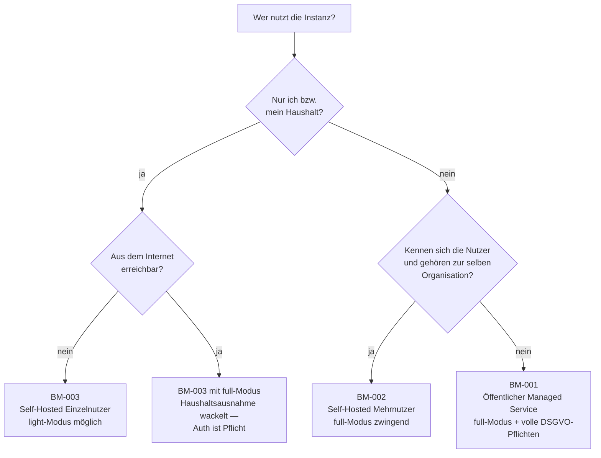

# Betriebsmodelle

Grundlagen-Definitionen: **Wer betreibt eine Kamerplanter-Instanz für wen?**

Diese Dokumente beschreiben nicht, *welche Komponenten* laufen (das ist
[Betriebsprofile](../../docs/de/deployment/betriebsprofile.md)) und nicht, *wie*
die Software konfiguriert wird (das ist die
[Konfigurationsmatrix](../../docs/de/deployment/konfigurationsmatrix.md)),
sondern **wer die Verantwortung trägt, wer die Endnutzer sind und welche
Pflichten daraus folgen**. Sie ergänzen die Zielgruppen-Dokumente
([spec/target-audiences/](../target-audiences/README.md)) um die Betreiber-Achse
und dienen als Entscheidungsgrundlage bei Anforderungs-, Architektur- und
Priorisierungsfragen.

---

## Drei Begriffe, die nicht verwechselt werden dürfen

Kamerplanter kennt drei orthogonale „Modus"-Begriffe. Sie werden in Diskussionen
regelmäßig vermischt:

| Begriff | Antwortet auf | Wo definiert | Werte |
|---|---|---|---|
| **Betriebsmodell** | Wer betreibt die Instanz für wen? Wer haftet? | *dieses Verzeichnis* | BM-001, BM-002, BM-003 |
| **Betriebsprofil** | Welche Komponenten laufen, wie viel RAM? | `docs/*/deployment/betriebsprofile.md` | Minimal, Hobby, Standard, Profi, SaaS |
| **Betriebsmodus** | Gibt es Login und Mandanten? | [REQ-027](../req/REQ-027_Light-Modus.md) | `light`, `full` (`KAMERPLANTER_MODE`) |

Ein Betriebsmodell schränkt Profil und Modus ein, legt sie aber nicht vollständig
fest: BM-003 (Einzelnutzer zu Hause) *kann* im `full`-Modus laufen, BM-002
(Gemeinschaft) *muss* es.

---

## Die drei Modelle

| ID | Kurzname | Betreiber | Endnutzer | Personalunion Betreiber/Nutzer |
|----|----------|-----------|-----------|-------------------------------|
| [BM-001](BM-001_Oeffentlicher-Managed-Service.md) | Öffentlicher Managed Service | Ein Anbieter (kommerziell oder gemeinnützig) | Fremde, registrierte Endkunden | Nein |
| [BM-002](BM-002_Self-Hosted-Mehrnutzer.md) | Self-Hosted Mehrnutzer | Eine Gemeinschaft/Organisation (Verein, Kleingartenverein, Social Club, Schule, Betrieb) | Mitglieder der Gemeinschaft | Teilweise — der Betreiber ist selbst Mitglied |
| [BM-003](BM-003_Self-Hosted-Einzelnutzer.md) | Self-Hosted Einzelnutzer | Die nutzende Person selbst | Die betreibende Person (und ihr Haushalt) | Ja |

Das **Unterscheidungsmerkmal** ist nicht die Nutzerzahl und nicht die
Infrastruktur, sondern die Frage: *Verarbeitet der Betreiber Daten über andere
Personen, die ihm ihre Daten anvertraut haben?* Aus dem Antwortpaar
(ja/nein × vertraglich/mitgliedschaftlich) folgt alles Weitere — DSGVO-Rolle,
Pflicht-Features, Support-Erwartung, Sicherheitsanforderungen.

---

## Vergleichsmatrix

| Dimension | BM-001 Managed Service | BM-002 Self-Hosted Mehrnutzer | BM-003 Self-Hosted Einzelnutzer |
|---|---|---|---|
| **Typischer Betreiber** | Anbieter mit IT-Betrieb | Vereinsvorstand, technikaffines Mitglied | Die nutzende Person |
| **Technische Kompetenz des Betreibers** | Professionell | Laie bis Hobbyist — **kritisch** | Hobbyist |
| **Betriebsmodus** | `full` (zwingend) | `full` (zwingend) | `light` (Standard) oder `full` |
| **Passende Betriebsprofile** | SaaS | Standard, Profi | Minimal, Hobby |
| **Infrastruktur** | Kubernetes, Managed DBs | Docker Compose auf VPS/NAS, kleines K8s | Raspberry Pi, NAS, alter Laptop |
| **Mandanten (Tenants)** | Viele, gegenseitig fremd | Einer bis wenige, Mitglieder kennen sich | Einer (System-Tenant im `light`-Modus) |
| **DSGVO-Rolle des Betreibers** | Verantwortlicher (Art. 4 Nr. 7) | Verantwortlicher (Art. 4 Nr. 7) | Haushaltsausnahme (Art. 2 Abs. 2 lit. c) |
| **Consent-Management (REQ-025)** | Pflicht | Pflicht | Entfällt |
| **Betroffenenrechte-Self-Service** | Pflicht, mit SLA | Pflicht, ohne SLA | Entfällt |
| **Mandantentrennung sicherheitskritisch?** | Ja — Datenleck zwischen Fremden | Ja — auch innerhalb einer Gemeinschaft | Nein |
| **RBAC-Durchsetzung sicherheitskritisch?** | Ja | **Ja** — Beobachter dürfen nicht schreiben, Gärtner nicht löschen, Technik nicht verwalten | Nein |
| **Öffentlich aus dem Internet erreichbar?** | Ja | Meist ja | Nein (LAN/VPN) |
| **Cloud-KI-Provider zulässig?** | Ja, mit Transparenz- und Transferpflichten | Betreiberentscheidung, Mitglieder müssen informiert werden | Ja, aber im `light`-Modus **gesperrt** (REQ-027 §6.1) |
| **Backup/Update-Verantwortung** | Anbieter, vertraglich | Betreiber, ohne Vertrag — häufigster Ausfallgrund | Nutzer selbst, Datenverlust ist sein Risiko |
| **Support-Erwartung der Endnutzer** | Hoch (bezahlte Leistung) | Mittel (Erwartung an „den, der's aufgesetzt hat") | Keine (Selbsthilfe, Doku, Community) |
| **Datenverlust-Toleranz** | Sehr gering | Gering | Mittel |
| **Zielgruppen** | UZG-001, ZG-003, ZG-002 | ZG-004, ZG-005, UZG-003, UZG-002 | ZG-001, ZG-002, ZG-003, ZG-006, UZG-001, UZG-004 |

---

## Entscheidungshilfe

**Drei Prüffragen, die den Fall entscheiden:**

1. **Verarbeite ich Daten von Personen, die nicht zu meinem Haushalt gehören?**
   Wenn ja, entfällt die DSGVO-Haushaltsausnahme und damit der `light`-Modus —
   unabhängig davon, ob Geld fließt oder ob es ein Verein ist.
2. **Können sich die Nutzer gegenseitig schaden, wenn die Rechtedurchsetzung
   versagt?** Wenn ja, ist die RBAC-Durchsetzung (REQ-024) ein
   Sicherheits-Feature, kein Komfort-Feature.
3. **Wer wird angerufen, wenn die Instanz um 22 Uhr nicht erreichbar ist?** Die
   Antwort benennt den Betreiber — und damit das Modell.

---

## Konsequenzen für die Anforderungsarbeit

Die Betriebsmodelle sind kein Selbstzweck. Sie beantworten wiederkehrende Fragen:

- **Priorisierung** — Ein Feature, das nur in BM-001 relevant ist (z. B.
  mandantenübergreifende Abrechnung), rangiert hinter einem, das BM-002 und
  BM-003 gleichermaßen betrifft.
- **Sicherheitsbewertung** — Eine fehlende Autorisierungsprüfung ist in BM-003
  folgenlos, in BM-002 ein Vertrauensbruch unter Vereinsmitgliedern und in
  BM-001 ein meldepflichtiger Datenschutzvorfall (Art. 33 DSGVO). Die Schwere
  eines Findings ergibt sich erst aus dem Modell.
- **Default-Wahl** — Defaults sollen für das *häufigste* Modell sicher sein und
  für die anderen nicht gefährlich. Beispiel: `KAMERPLANTER_MODE` hat keinen
  stillen Default, der versehentlich `light` im Vereinsbetrieb aktiviert.
- **Doku-Zuschnitt** — Betreiber-Doku adressiert in BM-002 einen technischen
  Laien mit rechtlicher Verantwortung. Das ist ein anderer Leser als der
  Self-Hoster aus `AUDIENCES.md`.
- **Konfigurationsebene externer Dienste** — [REQ-049](../req/REQ-049_Rollenmodell-und-Vokabular.md)
  P5 ordnet jeden externen Dienst danach ein, wem er *gehört*: Betreiberdienste
  werden global vom Plattform-Admin konfiguriert, Mandantendienste pro Mandant
  über die Zusatzberechtigung Technik. Diese Zuordnung ist keine reine
  Rechtefrage, sondern folgt dem Betriebsmodell — in BM-003 fallen beide Ebenen
  in derselben Person zusammen, in BM-002 trennen sie Betreiber und Technikwart,
  in BM-001 trennen sie Anbieter und Kunde samt Kostenträgerschaft.

---

## Abgrenzung zur Mission — offener Punkt

`project/mission.md` und `project/goals.md` definieren Kamerplanter derzeit als
**„selbst-gehostet … vollständig in eigener Hand betreibbar"**. BM-001
(öffentlicher Managed Service) ist damit **technisch vorgesehen, aber
produktstrategisch nicht verankert**: Das SaaS-Betriebsprofil existiert in der
Deployment-Doku, es gibt aber kein Outcome in `project/goals.md` und keine
Audience in `AUDIENCES.md`, die einen Managed-Service-Kunden benennen.

BM-001 ist hier vollständig beschrieben, damit die Konsequenzen einer solchen
Entscheidung sichtbar sind — **nicht** als Beleg dafür, dass das Angebot
verfolgt wird. Wer BM-001 zum Produktziel machen will, muss zuvor
`project/mission.md`, `project/goals.md` und `AUDIENCES.md` erweitern.

---

## Dokumentstruktur

Jedes BM-Dokument folgt derselben Gliederung:

1. **Definition und Abgrenzung** — woran das Modell erkannt wird
2. **Beteiligte Rollen** — Betreiber, Administrator, Endnutzer und ihre Überlappung
3. **Endnutzer** — Verweis auf die Zielgruppen-Dokumente
4. **Technische Ausprägung** — Modus, Profil, Infrastruktur
5. **Verantwortungsverteilung** — wer schuldet Betrieb, Backup, Update, Support
6. **Rechtlicher Rahmen** — DSGVO-Rolle und branchenspezifische Pflichten
7. **Konsequenzen für Anforderungen** — welche REQs Pflicht, optional, irrelevant sind
8. **Entscheidungshilfe** — wann dieses Modell passt und wann nicht
9. **Risiken und offene Punkte**

## Verwandte Dokumente

- [spec/target-audiences/](../target-audiences/README.md) — wer die Endnutzer inhaltlich sind
- [REQ-023](../req/REQ-023_Benutzerverwaltung-Authentifizierung.md) — Authentifizierung, Service Accounts
- [REQ-024](../req/REQ-024_Mandantenverwaltung-Gemeinschaftsgaerten.md) — Mandanten, Permission-Matrix
- [REQ-049](../req/REQ-049_Rollenmodell-und-Vokabular.md) — **verbindliches Rollenvokabular**; die BM-Dokumente benutzen dessen Begriffe
- [REQ-025](../req/REQ-025_Datenschutz-Betroffenenrechte.md) — DSGVO-Betroffenenrechte
- [REQ-027](../req/REQ-027_Light-Modus.md) — `light`/`full`-Betriebsmodus
- [NFR-011](../nfr/NFR-011_Vorratsdatenspeicherung-Aufbewahrungsfristen.md) — Aufbewahrungsfristen
- [NFR-012](../nfr/NFR-012_Cloud-Provider-Enterprise-Skalierung.md) — Cloud-Skalierung
- `docs/de/deployment/betriebsprofile.md` — Komponenten-Bündel
- `docs/de/deployment/konfigurationsmatrix.md` — Feature-für-Feature-Referenz
- `docs/de/reference/roles-and-permissions.md` — Endnutzer-Sicht auf Rollen und Sichtbarkeit
