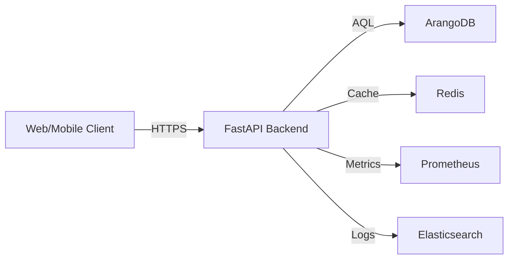
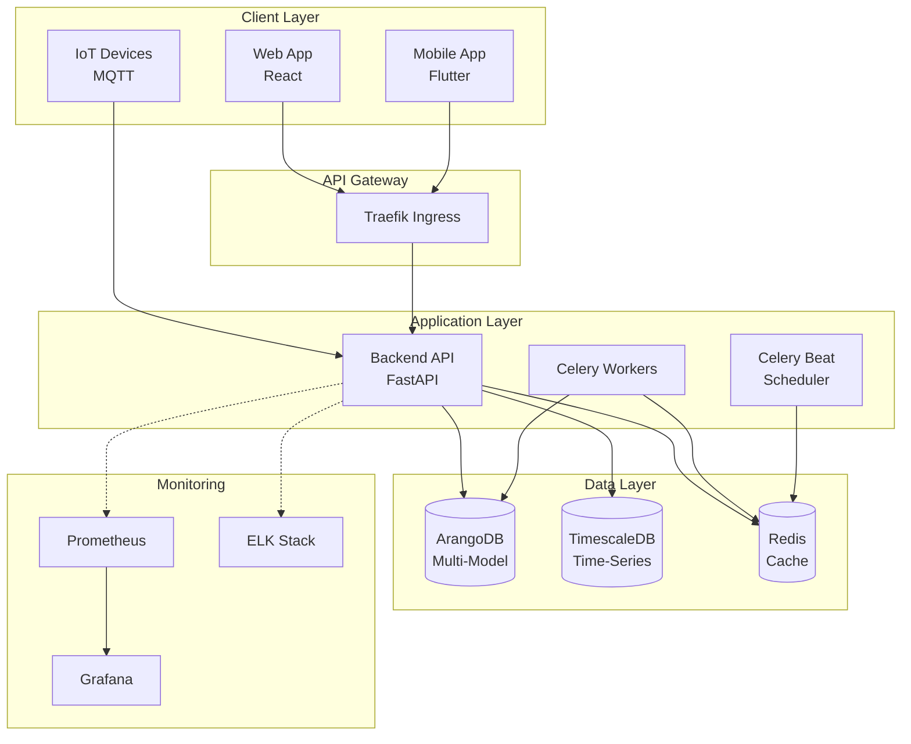
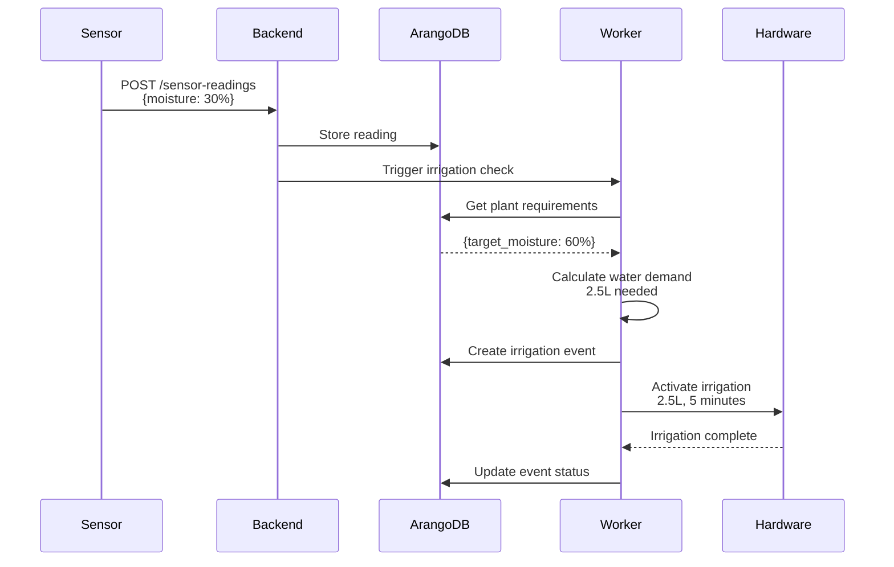
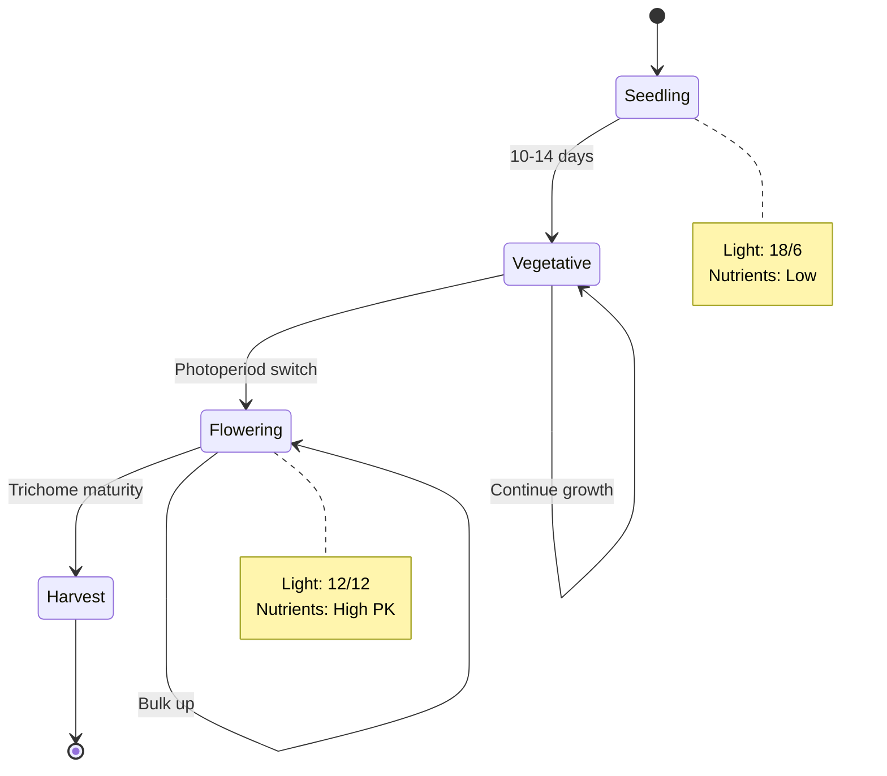

# NFR-005: Technische Dokumentation mit MkDocs Material

## 1. Business Case

### 1.1 User Stories

**Als** Entwickler  
**möchte ich** eine zentrale, durchsuchbare Dokumentation  
**um** schnell Antworten auf technische Fragen zu finden ohne Kollegen zu fragen.

**Als** Tech Lead  
**möchte ich** dass Dokumentation automatisch aus Code generiert wird (API Docs, Schemas)  
**um** sicherzustellen dass Docs immer aktuell sind.

**Als** neuer Entwickler  
**möchte ich** interaktive Tutorials und Code-Beispiele  
**um** schnell produktiv zu werden (< 2 Tage Onboarding).

**Als** DevOps Engineer  
**möchte ich** dass Dokumentation versioniert ist und mit Code deployed wird  
**um** sicherzustellen dass Docs zur jeweiligen Release-Version passen.

**Als** Product Owner  
**möchte ich** dass technische Architektur-Entscheidungen dokumentiert sind  
**um** Kontext für zukünftige Entscheidungen zu haben.

### 1.2 Geschäftliche Motivation

**Produktivitätssteigerung**:
- Reduzierung von "Wie funktioniert X?"-Fragen um 70%
- Onboarding-Zeit: 1 Woche → 2 Tage
- Weniger Context-Switching (Docs statt Slack-Fragen)

**Wissenserhalt**:
- Dokumentiertes Wissen überlebt Mitarbeiter-Fluktuation
- Architektur-Entscheidungen nachvollziehbar
- Vermeidung von wiederholten Diskussionen

**Qualitätssicherung**:
- Code-Review: "Dokumentation aktualisiert?" als Checklist-Item
- API-Breaking-Changes werden dokumentiert
- Migration-Guides für Major-Releases

### 1.3 Fachliche Beschreibung

**Problem ohne strukturierte Dokumentation**:

```
Entwickler hat Frage zu GDD-Berechnung
  → Fragt im Slack
    → Kollege antwortet (10 Min später)
      → Antwort ist veraltet (Code hat sich geändert)
        → Entwickler probiert selbst
          → Macht Fehler
            → Bug in Production
```

**Lösung mit MkDocs**:

```
Entwickler hat Frage zu GDD-Berechnung
  → Sucht in Docs (docs.agrotech.local)
    → Findet aktuellen Artikel "GDD Calculation"
      → Mit Code-Beispiel und API-Referenz
        → Problem gelöst (2 Minuten)
```

---

## 2. MkDocs Architektur & Konzepte

### 2.1 Dokumentations-Struktur

```
docs/
├── index.md                      # Landing Page
├── getting-started/
│   ├── installation.md
│   ├── quickstart.md
│   └── first-deployment.md
├── architecture/
│   ├── overview.md
│   ├── backend.md
│   ├── database.md
│   └── infrastructure.md
├── development/
│   ├── local-setup.md            # Kind + Skaffold
│   ├── code-standards.md         # NFR-003
│   ├── testing.md
│   └── debugging.md
├── api/
│   ├── overview.md
│   ├── authentication.md
│   ├── plants.md
│   ├── irrigation.md
│   └── harvest.md
├── deployment/
│   ├── kubernetes.md
│   ├── helm.md
│   └── ci-cd.md
├── guides/
│   ├── gdd-calculation.md
│   ├── vpd-optimization.md
│   └── irrigation-logic.md
├── reference/
│   ├── api-reference.md          # Auto-generiert
│   ├── schemas.md                # Pydantic Models
│   └── database-schema.md        # ArangoDB Collections
├── adr/                          # Architecture Decision Records
│   ├── 001-arangodb-vs-neo4j.md
│   ├── 002-python-3.14.md
│   └── 003-kind-vs-minikube.md
└── changelog/
    ├── v1.0.0.md
    ├── v1.1.0.md
    └── unreleased.md
```

### 2.2 MkDocs Material Features

```
┌─────────────────────────────────────────────────────────────┐
│                    MKDOCS MATERIAL                          │
│                                                             │
│  ┌────────────┐  ┌────────────┐  ┌────────────┐           │
│  │   Search   │  │ Navigation │  │  Versioning│           │
│  │  (Instant) │  │   Sidebar  │  │   (mike)   │           │
│  └────────────┘  └────────────┘  └────────────┘           │
│                                                             │
│  ┌────────────┐  ┌────────────┐  ┌────────────┐           │
│  │Code Blocks │  │  Diagrams  │  │   Tabs     │           │
│  │(Highlight) │  │ (Mermaid)  │  │(Content)   │           │
│  └────────────┘  └────────────┘  └────────────┘           │
│                                                             │
│  ┌────────────┐  ┌────────────┐  ┌────────────┐           │
│  │  Admonit.  │  │   Tables   │  │Dark/Light  │           │
│  │  (Callout) │  │(Sortable)  │  │   Mode     │           │
│  └────────────┘  └────────────┘  └────────────┘           │
└─────────────────────────────────────────────────────────────┘
```

### 2.3 Dokumentations-Workflow

```
┌─────────────────────────────────────────────────────────────┐
│                    DEVELOPER WORKFLOW                       │
└─────────────────────┬───────────────────────────────────────┘
                      │
          ┌───────────▼──────────┐
          │  Code ändern in      │
          │  backend/service.py  │
          └───────────┬──────────┘
                      │
          ┌───────────▼──────────┐
          │  Docstring updated?  │
          │  (Pre-Commit Check)  │
          └───────────┬──────────┘
                      │
          ┌───────────▼──────────┐
          │  API-Docs auto-gen   │
          │  (mkdocstrings)      │
          └───────────┬──────────┘
                      │
          ┌───────────▼──────────┐
          │  mkdocs build        │
          │  (CI/CD)             │
          └───────────┬──────────┘
                      │
          ┌───────────▼──────────┐
          │  Deploy zu           │
          │  docs.agrotech.local │
          └──────────────────────┘
```

---

## 3. MkDocs Konfiguration

### 3.1 Projekt-Setup

**Installation**:

```bash
# MkDocs + Material Theme + Plugins
pip install mkdocs-material \
  mkdocstrings[python] \
  mkdocs-mermaid2-plugin \
  mkdocs-git-revision-date-localized-plugin \
  mkdocs-awesome-pages-plugin \
  mkdocs-minify-plugin \
  mkdocs-redirects \
  pymdown-extensions

# Oder via requirements.txt
cat > docs/requirements.txt <<EOF
mkdocs>=1.5.3
mkdocs-material>=9.5.0
mkdocstrings[python]>=0.24.0
mkdocs-mermaid2-plugin>=1.1.0
mkdocs-git-revision-date-localized-plugin>=1.2.0
mkdocs-awesome-pages-plugin>=2.9.0
mkdocs-minify-plugin>=0.7.0
mkdocs-redirects>=1.2.0
pymdown-extensions>=10.5
EOF

pip install -r docs/requirements.txt
```

### 3.2 mkdocs.yml (Vollständige Konfiguration)

```yaml
# mkdocs.yml
site_name: Agrotech Platform Documentation
site_url: https://docs.agrotech.example.com
site_description: Technical documentation for the Agrotech plant care platform
site_author: Agrotech Development Team

# Repository
repo_url: https://github.com/agrotech/backend
repo_name: agrotech/backend
edit_uri: edit/main/docs/

# Copyright
copyright: Copyright &copy; 2026 Agrotech

# Theme
theme:
  name: material
  language: en
  
  # Color Scheme
  palette:
    # Light Mode
    - media: "(prefers-color-scheme: light)"
      scheme: default
      primary: green
      accent: light green
      toggle:
        icon: material/brightness-7
        name: Switch to dark mode
    
    # Dark Mode
    - media: "(prefers-color-scheme: dark)"
      scheme: slate
      primary: green
      accent: light green
      toggle:
        icon: material/brightness-4
        name: Switch to light mode
  
  # Font
  font:
    text: Roboto
    code: Roboto Mono
  
  # Logo & Favicon
  logo: assets/logo.png
  favicon: assets/favicon.png
  
  # Features
  features:
    # Navigation
    - navigation.instant        # Instant loading (SPA-like)
    - navigation.instant.prefetch
    - navigation.instant.progress
    - navigation.tracking       # URL updates on scroll
    - navigation.tabs           # Top-level tabs
    - navigation.tabs.sticky    # Sticky tabs
    - navigation.sections       # Section index pages
    - navigation.expand         # Expand sections by default
    - navigation.path           # Breadcrumbs
    - navigation.indexes        # Section index pages
    - navigation.top            # Back-to-top button
    
    # Search
    - search.suggest            # Search suggestions
    - search.highlight          # Highlight search terms
    - search.share              # Share search URL
    
    # Header
    - header.autohide           # Hide header on scroll
    
    # Table of Contents
    - toc.follow                # TOC follows scroll
    - toc.integrate             # TOC in navigation
    
    # Code
    - content.code.copy         # Copy button for code blocks
    - content.code.annotate     # Annotations in code
    
    # Tabs
    - content.tabs.link         # Link content tabs
    
    # Actions
    - content.action.edit       # Edit this page
    - content.action.view       # View source
  
  # Custom CSS/JS
  extra_css:
    - stylesheets/extra.css
  
  extra_javascript:
    - javascripts/extra.js

# Plugins
plugins:
  # Search
  - search:
      lang: en
      separator: '[\s\-,:!=\[\]()"/]+|(?!\b)(?=[A-Z][a-z])|\.(?!\d)|&[lg]t;'
  
  # API Documentation (Auto-generate from docstrings)
  - mkdocstrings:
      enabled: true
      default_handler: python
      handlers:
        python:
          paths: [../backend/src]
          options:
            docstring_style: google
            docstring_section_style: table
            show_root_heading: true
            show_root_full_path: false
            show_object_full_path: false
            show_category_heading: true
            show_if_no_docstring: false
            show_signature: true
            show_signature_annotations: true
            show_source: true
            show_bases: true
            show_submodules: false
            members_order: source
            heading_level: 2
  
  # Diagrams (Mermaid)
  - mermaid2:
      version: 10.6.1
  
  # Git Info
  - git-revision-date-localized:
      enable_creation_date: true
      type: timeago
  
  # Page Organization
  - awesome-pages:
      collapse_single_pages: true
  
  # Minify HTML/CSS/JS
  - minify:
      minify_html: true
      minify_js: true
      minify_css: true
      htmlmin_opts:
        remove_comments: true
      js_files:
        - javascripts/extra.js
      css_files:
        - stylesheets/extra.css
  
  # Redirects (for moved pages)
  - redirects:
      redirect_maps:
        'old-page.md': 'new-page.md'

# Markdown Extensions
markdown_extensions:
  # Python Markdown
  - abbr
  - admonition
  - attr_list
  - def_list
  - footnotes
  - md_in_html
  - tables
  - toc:
      permalink: true
      toc_depth: 3
  
  # PyMdown Extensions
  - pymdownx.arithmatex:
      generic: true
  - pymdownx.betterem:
      smart_enable: all
  - pymdownx.caret
  - pymdownx.details
  - pymdownx.emoji:
      emoji_index: !!python/name:material.extensions.emoji.twemoji
      emoji_generator: !!python/name:material.extensions.emoji.to_svg
  - pymdownx.highlight:
      anchor_linenums: true
      line_spans: __span
      pygments_lang_class: true
  - pymdownx.inlinehilite
  - pymdownx.keys
  - pymdownx.mark
  - pymdownx.smartsymbols
  - pymdownx.snippets:
      auto_append:
        - includes/abbreviations.md
  - pymdownx.superfences:
      custom_fences:
        - name: mermaid
          class: mermaid
          format: !!python/name:pymdownx.superfences.fence_code_format
  - pymdownx.tabbed:
      alternate_style: true
  - pymdownx.tasklist:
      custom_checkbox: true
  - pymdownx.tilde

# Extra
extra:
  # Version Selector
  version:
    provider: mike
    default: stable
  
  # Social Links
  social:
    - icon: fontawesome/brands/github
      link: https://github.com/agrotech
    - icon: fontawesome/brands/slack
      link: https://agrotech.slack.com
    - icon: fontawesome/brands/docker
      link: https://hub.docker.com/u/agrotech
  
  # Analytics (optional)
  analytics:
    provider: google
    property: G-XXXXXXXXXX
  
  # Consent (GDPR)
  consent:
    title: Cookie consent
    description: >-
      We use cookies to recognize your repeated visits and preferences, as well
      as to measure the effectiveness of our documentation and whether users
      find what they're searching for.

# Navigation
nav:
  - Home: index.md
  
  - Getting Started:
    - getting-started/index.md
    - Installation: getting-started/installation.md
    - Quickstart: getting-started/quickstart.md
    - First Deployment: getting-started/first-deployment.md
  
  - Architecture:
    - architecture/index.md
    - Overview: architecture/overview.md
    - Backend: architecture/backend.md
    - Database: architecture/database.md
    - Infrastructure: architecture/infrastructure.md
  
  - Development:
    - development/index.md
    - Local Setup: development/local-setup.md
    - Code Standards: development/code-standards.md
    - Testing: development/testing.md
    - Debugging: development/debugging.md
  
  - API:
    - api/index.md
    - Overview: api/overview.md
    - Authentication: api/authentication.md
    - Plants: api/plants.md
    - Irrigation: api/irrigation.md
    - Harvest: api/harvest.md
  
  - Deployment:
    - deployment/index.md
    - Kubernetes: deployment/kubernetes.md
    - Helm Charts: deployment/helm.md
    - CI/CD: deployment/ci-cd.md
  
  - Guides:
    - guides/index.md
    - GDD Calculation: guides/gdd-calculation.md
    - VPD Optimization: guides/vpd-optimization.md
    - Irrigation Logic: guides/irrigation-logic.md
  
  - Reference:
    - reference/index.md
    - API Reference: reference/api-reference.md
    - Database Schema: reference/database-schema.md
    - Environment Variables: reference/environment-variables.md
  
  - ADR:
    - adr/index.md
    - ArangoDB vs Neo4j: adr/001-arangodb-vs-neo4j.md
    - Python 3.14: adr/002-python-3.14.md
    - Kind vs Minikube: adr/003-kind-vs-minikube.md
  
  - Changelog:
    - changelog/index.md
    - Unreleased: changelog/unreleased.md
    - v1.1.0: changelog/v1.1.0.md
    - v1.0.0: changelog/v1.0.0.md
```

### 3.3 Verzeichnis-Struktur

```bash
# Projekt-Root
agrotech/
├── backend/
│   └── src/
│       └── agrotech/
│           ├── api/
│           ├── services/
│           └── models/
├── docs/
│   ├── mkdocs.yml              # MkDocs Config
│   ├── requirements.txt        # Python Dependencies
│   ├── index.md                # Landing Page
│   ├── getting-started/
│   ├── architecture/
│   ├── development/
│   ├── api/
│   ├── deployment/
│   ├── guides/
│   ├── reference/
│   ├── adr/
│   ├── changelog/
│   ├── assets/
│   │   ├── logo.png
│   │   ├── favicon.png
│   │   └── images/
│   ├── stylesheets/
│   │   └── extra.css
│   ├── javascripts/
│   │   └── extra.js
│   └── includes/
│       └── abbreviations.md
└── site/                       # Generated (gitignored)
```

---

## 4. Dokumentations-Komponenten

### 4.1 Landing Page

**docs/index.md**:

```markdown
---
template: home.html
title: Agrotech Platform Documentation
---

# Agrotech Platform Documentation

Welcome to the technical documentation for the Agrotech plant care and harvest management platform.

<div class="grid cards" markdown>

-   :material-clock-fast:{ .lg .middle } __Quick Start__

    ---

    Get up and running in under 10 minutes

    [:octicons-arrow-right-24: Installation](getting-started/installation.md)
    [:octicons-arrow-right-24: Quickstart](getting-started/quickstart.md)

-   :material-code-braces:{ .lg .middle } __API Reference__

    ---

    Complete API documentation with examples

    [:octicons-arrow-right-24: API Docs](api/overview.md)
    [:octicons-arrow-right-24: Authentication](api/authentication.md)

-   :material-kubernetes:{ .lg .middle } __Deployment__

    ---

    Deploy to Kubernetes with Helm

    [:octicons-arrow-right-24: Kubernetes](deployment/kubernetes.md)
    [:octicons-arrow-right-24: CI/CD](deployment/ci-cd.md)

-   :material-github:{ .lg .middle } __Open Source__

    ---

    View source code and contribute

    [:octicons-arrow-right-24: GitHub](https://github.com/agrotech/backend)

</div>

## Features

- **🌱 Plant Lifecycle Management** - Track plants from seed to harvest
- **💧 Automated Irrigation** - Smart watering based on VPD and soil moisture
- **🌡️ Climate Monitoring** - Real-time temperature, humidity, and PPFD tracking
- **🐛 Pest Management** - Integrated Pest Management (IPM) system
- **📊 Analytics** - GDD calculations, harvest predictions, yield analysis

## Architecture Overview



## Quick Links

- [Local Development Setup](development/local-setup.md)
- [Code Standards](development/code-standards.md)
- [Architecture Overview](architecture/overview.md)
- [Troubleshooting](guides/troubleshooting.md)

---

!!! info "Need Help?"
    - **Slack**: [#agrotech-dev](https://agrotech.slack.com)
    - **Email**: dev@agrotech.example.com
    - **Issues**: [GitHub Issues](https://github.com/agrotech/backend/issues)
```

### 4.2 API Documentation (Auto-Generated)

**docs/reference/api-reference.md**:

```markdown
# API Reference

This page is automatically generated from Python docstrings using mkdocstrings.

## Services

### Irrigation Service

::: agrotech.services.irrigation.IrrigationService
    options:
      show_root_heading: true
      show_source: true
      heading_level: 3

### GDD Calculator

::: agrotech.services.gdd.GDDCalculator
    options:
      show_root_heading: true
      show_source: true
      heading_level: 3

## Models

### Plant Models

::: agrotech.models.plant
    options:
      show_root_heading: true
      show_source: false
      heading_level: 3
      members:
        - PlantCreate
        - PlantResponse
        - PlantUpdate

## API Endpoints

### Plants API

::: agrotech.api.v1.plants
    options:
      show_root_heading: true
      show_source: true
      heading_level: 3
```

**Backend Docstring (Google Style)**:

```python
# backend/src/agrotech/services/irrigation.py
class IrrigationService:
    """
    Service for managing automated irrigation scheduling.
    
    This service coordinates between sensor readings, plant water requirements,
    and irrigation hardware to ensure optimal watering schedules.
    
    Attributes:
        db: ArangoDB connection for plant data
        redis: Redis client for caching schedules
        scheduler: Celery scheduler for automated tasks
    
    Example:
        >>> service = IrrigationService(db_conn, redis_conn)
        >>> result = service.schedule_irrigation("greenhouse-a")
        >>> print(result)
        {'scheduled_plants': 12, 'total_water_liters': 45.5}
    """
    
    def calculate_water_demand(
        self,
        plant_id: str,
        substrate_moisture: float,
        target_moisture: float
    ) -> float:
        """
        Calculate required irrigation amount to reach target moisture.
        
        This function considers substrate type, plant water requirements,
        and current moisture levels to determine optimal irrigation volume.
        
        Args:
            plant_id: UUID of the plant to irrigate
            substrate_moisture: Current substrate moisture in percent (0-100)
            target_moisture: Desired substrate moisture in percent (0-100)
        
        Returns:
            Required irrigation volume in liters
        
        Raises:
            ValueError: If moisture values are outside valid range (0-100)
            PlantNotFoundError: If plant_id does not exist
        
        Example:
            >>> service = IrrigationService()
            >>> volume = service.calculate_water_demand(
            ...     "plant-123",
            ...     substrate_moisture=30.0,
            ...     target_moisture=60.0
            ... )
            >>> print(f"Need {volume}L water")
            Need 2.5L water
        
        Note:
            This function assumes substrate field capacity is 80%.
            For hydroponic systems, use `calculate_reservoir_refill()` instead.
        """
        # Implementation...
```

### 4.3 Code Examples mit Tabs

**docs/guides/gdd-calculation.md**:

```markdown
# GDD Calculation Guide

Growing Degree Days (GDD) is a heat accumulation metric used to predict plant development.

## Formula

The standard GDD formula is:

$$
GDD = \max\left(0, \frac{T_{min} + T_{max}}{2} - T_{base}\right)
$$

Where:
- $T_{min}$ = Daily minimum temperature (°C)
- $T_{max}$ = Daily maximum temperature (°C)
- $T_{base}$ = Base temperature for the plant species (°C)

## Implementation

=== "Python"

    ```python
    def calculate_gdd(
        temp_min: float,
        temp_max: float,
        base_temp: float
    ) -> float:
        """Calculate Growing Degree Days (GDD)."""
        avg_temp = (temp_min + temp_max) / 2
        return max(0, avg_temp - base_temp)
    
    # Example
    gdd = calculate_gdd(
        temp_min=15.0,
        temp_max=25.0,
        base_temp=10.0
    )
    print(f"GDD: {gdd}")  # Output: GDD: 10.0
    ```

=== "TypeScript"

    ```typescript
    function calculateGdd(
      tempMin: number,
      tempMax: number,
      baseTemp: number
    ): number {
      const avgTemp = (tempMin + tempMax) / 2;
      return Math.max(0, avgTemp - baseTemp);
    }
    
    // Example
    const gdd = calculateGdd(15.0, 25.0, 10.0);
    console.log(`GDD: ${gdd}`);  // Output: GDD: 10
    ```

=== "curl"

    ```bash
    curl -X POST https://api.agrotech.example.com/api/v1/gdd/calculate \
      -H "Authorization: Bearer $TOKEN" \
      -H "Content-Type: application/json" \
      -d '{
        "plant_id": "plant-123",
        "temp_min": 15.0,
        "temp_max": 25.0
      }'
    ```

## Interactive Example

Try it yourself:

<div class="gdd-calculator">
  <input type="number" id="temp-min" placeholder="Min Temp (°C)">
  <input type="number" id="temp-max" placeholder="Max Temp (°C)">
  <input type="number" id="base-temp" placeholder="Base Temp (°C)">
  <button onclick="calculateGDD()">Calculate</button>
  <p>GDD: <span id="result">-</span></p>
</div>

## Common Base Temperatures

| Plant Species | Base Temperature (°C) |
|---------------|----------------------|
| Tomato | 10 |
| Corn | 10 |
| Wheat | 0 |
| Cannabis | 10 |

!!! tip "Pro Tip"
    For more accurate predictions, use Modified GDD with upper thresholds.
```

### 4.4 Admonitions (Callouts)

```markdown
# Irrigation Best Practices

!!! note "Information"
    This guide covers automated irrigation scheduling.

!!! tip "Pro Tip"
    Use VPD-based irrigation for optimal results.

!!! warning "Important"
    Never irrigate during lights-off period for photoperiodic plants.

!!! danger "Critical"
    Over-watering can cause root rot. Monitor substrate moisture closely.

!!! example "Example"
    For a tomato plant in coco coir, target 60-70% substrate moisture.

!!! quote "Research"
    "VPD-based irrigation increased yields by 23%" - Smith et al. 2024

??? note "Expandable Section (Collapsed by Default)"
    This content is hidden until clicked.
    
    - Detail 1
    - Detail 2

!!! success "Success"
    Irrigation schedule created successfully!

!!! failure "Error"
    Failed to calculate water demand: Invalid plant_id

!!! bug "Known Issue"
    Sensor readings may be inaccurate below 5°C.
```

### 4.5 Mermaid Diagrams

**docs/architecture/overview.md**:

```markdown
# Architecture Overview

## System Architecture



## Data Flow: Irrigation Cycle



## State Machine: Plant Phases


```

---

## 5. Versionierung mit Mike

### 5.1 Mike Setup

**Installation**:

```bash
pip install mike
```

**Deployment-Workflow**:

```bash
# Initial Version
mike deploy --push --update-aliases 1.0 latest
mike set-default --push latest

# New Version
mike deploy --push --update-aliases 1.1 latest

# List Versions
mike list

# Delete Version
mike delete 1.0

# Serve locally
mike serve
```

### 5.2 Version Selector

**mkdocs.yml**:

```yaml
extra:
  version:
    provider: mike
    default: stable
    alias: true
```

**Versions anzeigen**:

```
┌─────────────────────────────────────┐
│  Agrotech Docs          [v1.1 ▼]  │
├─────────────────────────────────────┤
│  Versions:                          │
│  • 1.1 (latest)                     │
│  • 1.0                              │
│  • 0.9                              │
│  • dev (unstable)                   │
└─────────────────────────────────────┘
```

---

## 6. CI/CD Integration

### 6.1 GitHub Actions Workflow

**.github/workflows/docs.yml**:

```yaml
name: Deploy Documentation

on:
  push:
    branches:
      - main
    paths:
      - 'docs/**'
      - 'mkdocs.yml'
      - '.github/workflows/docs.yml'
  
  pull_request:
    branches:
      - main
    paths:
      - 'docs/**'

jobs:
  build:
    runs-on: ubuntu-latest
    
    steps:
      - uses: actions/checkout@v4
        with:
          fetch-depth: 0  # Für git-revision-date-localized
      
      - name: Setup Python
        uses: actions/setup-python@v5
        with:
          python-version: '3.14'
      
      - name: Cache dependencies
        uses: actions/cache@v3
        with:
          path: ~/.cache/pip
          key: ${{ runner.os }}-pip-${{ hashFiles('docs/requirements.txt') }}
      
      - name: Install dependencies
        run: |
          pip install -r docs/requirements.txt
      
      - name: Build docs
        run: |
          cd docs
          mkdocs build --strict
      
      - name: Check links
        run: |
          pip install linkchecker
          linkchecker --check-extern site/
      
      - name: Upload artifact
        uses: actions/upload-artifact@v3
        with:
          name: documentation
          path: site/
  
  deploy:
    needs: build
    runs-on: ubuntu-latest
    if: github.ref == 'refs/heads/main'
    
    steps:
      - uses: actions/checkout@v4
        with:
          fetch-depth: 0
      
      - name: Setup Python
        uses: actions/setup-python@v5
        with:
          python-version: '3.14'
      
      - name: Install dependencies
        run: |
          pip install -r docs/requirements.txt
          pip install mike
      
      - name: Configure Git
        run: |
          git config user.name github-actions
          git config user.email github-actions@github.com
      
      - name: Deploy with Mike
        run: |
          VERSION=$(cat VERSION)
          mike deploy --push --update-aliases $VERSION latest
          mike set-default --push latest
      
      - name: Deploy to GitHub Pages (Alternative)
        uses: peaceiris/actions-gh-pages@v3
        with:
          github_token: ${{ secrets.GITHUB_TOKEN }}
          publish_dir: ./site
          cname: docs.agrotech.example.com
```

### 6.2 Pre-Commit Hook

**.pre-commit-config.yaml**:

```yaml
repos:
  - repo: local
    hooks:
      - id: mkdocs-build
        name: Build MkDocs
        entry: mkdocs build --strict
        language: system
        pass_filenames: false
        always_run: true
```

---

## 7. Custom Styling

### 7.1 Custom CSS

**docs/stylesheets/extra.css**:

```css
/* Custom Color Scheme */
:root {
  --md-primary-fg-color: #4caf50;
  --md-accent-fg-color: #8bc34a;
}

/* Custom Card Styling */
.md-typeset .grid.cards > ul > li {
  border-radius: 8px;
  transition: transform 0.2s ease, box-shadow 0.2s ease;
}

.md-typeset .grid.cards > ul > li:hover {
  transform: translateY(-4px);
  box-shadow: 0 8px 16px rgba(0,0,0,0.1);
}

/* Code Block Enhancements */
.md-typeset code {
  padding: 0.2em 0.4em;
  border-radius: 3px;
  background-color: rgba(76, 175, 80, 0.1);
}

/* Mermaid Diagram Styling */
.mermaid {
  background-color: transparent !important;
}

/* API Reference Styling */
.doc-heading {
  border-left: 4px solid var(--md-primary-fg-color);
  padding-left: 1rem;
}

/* Interactive Elements */
.gdd-calculator {
  padding: 1rem;
  background: var(--md-code-bg-color);
  border-radius: 8px;
  margin: 1rem 0;
}

.gdd-calculator input {
  margin: 0.5rem;
  padding: 0.5rem;
  border: 1px solid var(--md-default-fg-color--light);
  border-radius: 4px;
}

.gdd-calculator button {
  background: var(--md-primary-fg-color);
  color: white;
  border: none;
  padding: 0.5rem 1rem;
  border-radius: 4px;
  cursor: pointer;
}

.gdd-calculator button:hover {
  opacity: 0.9;
}
```

### 7.2 Custom JavaScript

**docs/javascripts/extra.js**:

```javascript
// Interactive GDD Calculator
function calculateGDD() {
  const tempMin = parseFloat(document.getElementById('temp-min').value);
  const tempMax = parseFloat(document.getElementById('temp-max').value);
  const baseTemp = parseFloat(document.getElementById('base-temp').value);
  
  if (isNaN(tempMin) || isNaN(tempMax) || isNaN(baseTemp)) {
    document.getElementById('result').textContent = 'Invalid input';
    return;
  }
  
  const avgTemp = (tempMin + tempMax) / 2;
  const gdd = Math.max(0, avgTemp - baseTemp);
  
  document.getElementById('result').textContent = gdd.toFixed(2);
}

// Copy code button enhancement
document.querySelectorAll('pre code').forEach((block) => {
  const button = document.createElement('button');
  button.textContent = 'Copied!';
  button.style.display = 'none';
  block.parentNode.appendChild(button);
});

// Analytics event tracking
document.addEventListener('DOMContentLoaded', function() {
  // Track search usage
  const searchInput = document.querySelector('.md-search__input');
  if (searchInput) {
    searchInput.addEventListener('input', function() {
      if (window.gtag) {
        gtag('event', 'search', {
          search_term: this.value
        });
      }
    });
  }
  
  // Track external link clicks
  document.querySelectorAll('a[href^="http"]').forEach(link => {
    link.addEventListener('click', function() {
      if (window.gtag) {
        gtag('event', 'click', {
          event_category: 'outbound',
          event_label: this.href
        });
      }
    });
  });
});
```

---

## 8. Architecture Decision Records (ADR)

### 8.1 ADR Template

**docs/adr/template.md**:

```markdown
# ADR-XXX: [Title]

- **Status**: Proposed | Accepted | Deprecated | Superseded
- **Date**: YYYY-MM-DD
- **Decision Maker(s)**: [Names]
- **Tags**: [tech-stack, architecture, etc.]

## Context

What is the issue that we're seeing that is motivating this decision or change?

## Decision

What is the change that we're proposing and/or doing?

## Consequences

### Positive

- Benefit 1
- Benefit 2

### Negative

- Drawback 1
- Drawback 2

### Neutral

- Change 1
- Change 2

## Alternatives Considered

### Alternative 1: [Name]

- **Pros**: 
  - Pro 1
- **Cons**:
  - Con 1
- **Why rejected**: Reason

### Alternative 2: [Name]

...

## Implementation

- [ ] Task 1
- [ ] Task 2

## Related

- [ADR-001](./001-example.md)
- [Issue #123](https://github.com/agrotech/backend/issues/123)

## References

- [External Link](https://example.com)
```

### 8.2 Beispiel-ADR

**docs/adr/003-kind-vs-minikube.md**:

```markdown
# ADR-003: Kind vs Minikube for Local Development

- **Status**: Accepted
- **Date**: 2026-02-25
- **Decision Maker(s)**: Tech Lead, DevOps Team
- **Tags**: developer-experience, infrastructure

## Context

Developers need a local Kubernetes environment for testing. The choice between
Kind and Minikube impacts:

- Setup time for new developers
- Development feedback loop speed
- CI/CD integration complexity
- Resource consumption

## Decision

We will use **Kind (Kubernetes in Docker)** as the primary local development cluster.

## Consequences

### Positive

- **Fast startup**: 1-2 minutes vs 3-5 minutes (Minikube)
- **CI/CD friendly**: Same tool in GitHub Actions
- **Multi-node**: Easy multi-node clusters for testing
- **Resource efficient**: Uses Docker directly, no VM overhead
- **Port mapping**: Native support via `extraPortMappings`

### Negative

- **No built-in dashboard**: Must install separately
- **No addons system**: Manual installation of components
- **Less mature**: Smaller community than Minikube

### Neutral

- **Docker dependency**: Requires Docker (already required)
- **Learning curve**: Developers need to learn Kind-specific commands

## Alternatives Considered

### Alternative 1: Minikube

- **Pros**: 
  - Mature, stable
  - Built-in dashboard
  - Easy addon system
- **Cons**:
  - Slower startup (VM-based)
  - More resource-intensive
  - Harder multi-node setup
- **Why rejected**: Performance and CI/CD integration issues

### Alternative 2: Docker Desktop K8s

- **Pros**:
  - Built into Docker Desktop
  - Zero setup
- **Cons**:
  - Mac/Windows only
  - Single-node only
  - Slow
- **Why rejected**: Platform limitation, poor performance

## Implementation

- [x] Update NFR-004 documentation
- [x] Create kind-config.yaml
- [x] Update dev-setup.sh script
- [x] Train team on Kind commands
- [ ] Create troubleshooting guide

## Related

- [NFR-004: Skaffold Development](../nfr/004-skaffold.md)
- [Issue #45: Local dev performance](https://github.com/agrotech/backend/issues/45)

## References

- [Kind Documentation](https://kind.sigs.k8s.io/)
- [Kind vs Minikube Comparison](https://brennerm.github.io/posts/minikube-vs-kind-vs-k3s.html)
```

---

## 9. Deployment

### 9.1 Kubernetes Deployment

**k8s/docs/deployment.yaml**:

```yaml
apiVersion: apps/v1
kind: Deployment
metadata:
  name: docs
  namespace: agrotech-prod
spec:
  replicas: 2
  selector:
    matchLabels:
      app: docs
  template:
    metadata:
      labels:
        app: docs
    spec:
      containers:
      - name: nginx
        image: nginx:alpine
        ports:
        - containerPort: 80
        volumeMounts:
        - name: docs
          mountPath: /usr/share/nginx/html
          readOnly: true
        - name: nginx-config
          mountPath: /etc/nginx/conf.d
        resources:
          requests:
            cpu: 50m
            memory: 64Mi
          limits:
            cpu: 100m
            memory: 128Mi
      volumes:
      - name: docs
        persistentVolumeClaim:
          claimName: docs-pvc
      - name: nginx-config
        configMap:
          name: docs-nginx-config
---
apiVersion: v1
kind: Service
metadata:
  name: docs
  namespace: agrotech-prod
spec:
  selector:
    app: docs
  ports:
  - port: 80
    targetPort: 80
---
apiVersion: networking.k8s.io/v1
kind: Ingress
metadata:
  name: docs
  namespace: agrotech-prod
  annotations:
    cert-manager.io/cluster-issuer: letsencrypt-prod
spec:
  ingressClassName: traefik
  tls:
  - hosts:
    - docs.agrotech.example.com
    secretName: docs-tls
  rules:
  - host: docs.agrotech.example.com
    http:
      paths:
      - path: /
        pathType: Prefix
        backend:
          service:
            name: docs
            port:
              number: 80
```

### 9.2 Nginx Configuration

**k8s/docs/nginx-config.yaml**:

```yaml
apiVersion: v1
kind: ConfigMap
metadata:
  name: docs-nginx-config
  namespace: agrotech-prod
data:
  default.conf: |
    server {
        listen 80;
        server_name docs.agrotech.example.com;
        root /usr/share/nginx/html;
        index index.html;
        
        # Gzip compression
        gzip on;
        gzip_vary on;
        gzip_min_length 1024;
        gzip_types text/plain text/css text/xml text/javascript application/x-javascript application/xml+rss application/json;
        
        # Security headers
        add_header X-Frame-Options "SAMEORIGIN" always;
        add_header X-Content-Type-Options "nosniff" always;
        add_header X-XSS-Protection "1; mode=block" always;
        
        # Cache static assets
        location ~* \.(js|css|png|jpg|jpeg|gif|ico|svg|woff|woff2|ttf|eot)$ {
            expires 1y;
            add_header Cache-Control "public, immutable";
        }
        
        # SPA routing (for version selector)
        location / {
            try_files $uri $uri/ /index.html;
        }
        
        # Health check
        location /health {
            access_log off;
            return 200 "healthy\n";
            add_header Content-Type text/plain;
        }
    }
```

---

## 10. Akzeptanzkriterien

### Definition of Done

- [ ] **MkDocs Setup**
  - [ ] mkdocs.yml konfiguriert
  - [ ] Material Theme installiert
  - [ ] Alle Plugins aktiv (mkdocstrings, mermaid2, etc.)

- [ ] **Dokumentations-Struktur**
  - [ ] Landing Page mit Grid Cards
  - [ ] Getting Started Guide
  - [ ] Architecture Documentation
  - [ ] API Reference (auto-generiert)
  - [ ] Development Guides
  - [ ] ADR Section

- [ ] **Features**
  - [ ] Search funktioniert (instant)
  - [ ] Dark/Light Mode
  - [ ] Code Highlighting
  - [ ] Mermaid Diagrams rendern
  - [ ] Version Selector (mike)
  - [ ] Mobile-Responsive

- [ ] **CI/CD**
  - [ ] GitHub Actions Workflow
  - [ ] Automatisches Deployment bei Push
  - [ ] Link Checking
  - [ ] Build Validation

- [ ] **Deployment**
  - [ ] Kubernetes Deployment
  - [ ] Ingress mit TLS
  - [ ] Nginx Konfiguration
  - [ ] Health Checks

- [ ] **Qualität**
  - [ ] Alle Code-Beispiele getestet
  - [ ] Keine toten Links
  - [ ] Screenshots aktuell
  - [ ] Mindestens 80% Coverage (Docs für Public APIs)

### Testszenarien

#### Szenario 1: Developer findet API-Docs

```bash
# User Journey
1. Developer öffnet https://docs.agrotech.example.com
2. Klickt auf "API Reference"
3. Sucht nach "irrigation"
4. Findet IrrigationService.calculate_water_demand()
5. Sieht Docstring, Parameter, Return Type
6. Kopiert Code-Beispiel

# Erwartung:
- < 30 Sekunden vom Landing Page zu Code-Beispiel
- Code-Beispiel funktioniert copy-paste
```

#### Szenario 2: Search funktioniert

```bash
# User Journey
1. Öffnet Docs
2. Drückt "/" (Search Shortcut)
3. Tippt "gdd calculation"
4. Sieht Autocomplete-Vorschläge
5. Wählt "GDD Calculation Guide"

# Erwartung:
- Instant Search (< 100ms)
- Relevante Ergebnisse
- Highlighted Search Terms
```

#### Szenario 3: Mobile-Ansicht

```bash
# User Journey
1. Öffnet Docs auf iPhone
2. Navigation via Hamburger Menu
3. Code-Beispiele scrollen horizontal
4. Diagrams sind lesbar

# Erwartung:
- Responsive Layout
- Touch-freundliche Navigation
- Keine horizontal Scrollbars (außer Code)
```

#### Szenario 4: Version Switching

```bash
# User Journey
1. Öffnet Docs (v1.1)
2. Klickt auf Version Selector
3. Wählt v1.0
4. Sieht Docs für v1.0

# Erwartung:
- Version Selector in Header
- URLs: /1.1/, /1.0/, /latest/
- Nahtloser Wechsel ohne Reload
```

---

## 11. Wartung & Best Practices

### 11.1 Dokumentations-Checkliste (PR)

```markdown
## Documentation Checklist

- [ ] API changes documented in reference/api-reference.md
- [ ] Breaking changes noted in changelog/unreleased.md
- [ ] Code examples tested and working
- [ ] Screenshots updated (if UI changed)
- [ ] Links checked (no 404s)
- [ ] Docstrings follow Google style
- [ ] ADR created for architecture decisions
- [ ] Migration guide provided (if breaking change)
```

### 11.2 Regelmäßige Reviews

```bash
# Monatlicher Docs-Health-Check
1. Run linkchecker
2. Check analytics (most/least viewed pages)
3. Review open doc-related issues
4. Update outdated screenshots
5. Archive deprecated versions
```

### 11.3 Style Guide

**Ton & Voice**:
- ✅ **Klar & Direkt**: "Install MkDocs" statt "You might want to consider installing"
- ✅ **Aktiv**: "Run the command" statt "The command should be run"
- ✅ **Präzise**: "Set replicas to 3" statt "Use a few replicas"
- ❌ **Vermeiden**: Passive Voice, vage Begriffe ("might", "could", "some")

**Formatierung**:
- **Commands**: \`kubectl get pods\`
- **File Paths**: \`/etc/config.yaml\`
- **UI Elements**: **Bold** (z.B., "Click **Save**")
- **Variablen**: \`<your-value>\` (z.B., \`<api-key>\`)

---

## Anhang A: MkDocs Cheat Sheet

### Grundlegende Commands

```bash
# Neue Docs erstellen
mkdocs new my-project

# Development Server (mit Live-Reload)
mkdocs serve

# Build (generiert site/ Verzeichnis)
mkdocs build

# Build mit Strict Mode (fail on warnings)
mkdocs build --strict

# Deploy zu GitHub Pages
mkdocs gh-deploy

# Hilfe
mkdocs --help
```

### Markdown-Extensions Beispiele

```markdown
<!-- Abbreviations -->
The HTML specification is maintained by the W3C.

*[HTML]: Hyper Text Markup Language
*[W3C]: World Wide Web Consortium

<!-- Footnotes -->
This is some text[^1]

[^1]: This is the footnote

<!-- Keys -->
Press ++ctrl+alt+del++ to restart

<!-- Math (KaTeX) -->
$$
\frac{n!}{k!(n-k)!} = \binom{n}{k}
$$

<!-- Task Lists -->
- [x] Completed task
- [ ] Incomplete task

<!-- Definition Lists -->
Term
:   Definition
```

---

**Dokumenten-Ende**

**Version**: 1.0 (Vollständig)  
**Status**: Produktionsreif  
**Letzte Aktualisierung**: 2026-02-25  
**Review**: Pending  
**Genehmigung**: Pending